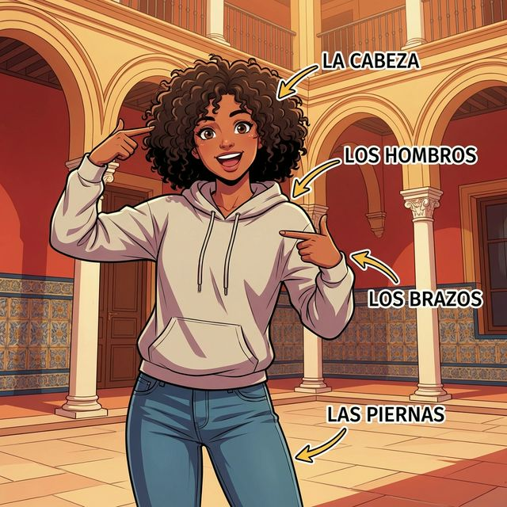

# Chapter 1: Mi cuerpo y salud (A1)

## 1. Opener
¡Bienvenidos! Nuestra primera parada es el cuerpo humano. ¿Sabías que el español y el inglés comparten muchísimas palabras para describir la salud? Aprenderemos a nombrar las partes de nuestro cuerpo y a expresar cómo nos sentimos físicamente.

**학습 목표**:
- 신체 부위 명칭 익히기 (head to toe)
- `tener` 동사를 활용한 기본적인 신체 상태 표현하기
- 스페인의 의료 문화 엿보기

> [!TIP]
> **¿Sabías que...?**
> 스페인 사람들은 인사할 때 양 볼에 키스를 하는 'Dos Besos' 문화가 있습니다. 이는 단순한 신체 접촉을 넘어 친밀감과 환영의 표시입니다.

---

## 2. Vocabulario Esencial

| Spanish | English Bridge | Korean Tip |
| :--- | :--- | :--- |
| la **cabeza** | **Capital** (top of a column/city) | 머리를 뜻하며, 영어의 capital과 어원이 같습니다. |
| el **brazo** | **Embrace** (to hold in arms) ✅ | '포옹하다'는 뜻의 embrace를 떠올려보세요. |
| la **mano** | **Manual** (done by hand) ✅ | 수동을 뜻하는 manual은 '손'에서 왔습니다. |
| la **pierna** | — | 다리를 뜻합니다. |
| el **pie** | **Pedal** (foot lever) ✅ | 자전거 페달처럼 발로 밟는 것을 생각하세요. |
| el **ojo** | **Ocular** (eye-related) ✅ | 안과적인 것을 뜻하는 ocular와 어원이 같습니다. |
| la **nariz** | **Nasal** (nose-related) ✅ | 코와 관련된 형용사 nasal을 기억하세요. |
| la **boca** | — | 입을 뜻합니다. |
| el **estómago** | **Stomach** ✅ (Perfect Cognate) | 복잡한 철자지만 발음은 비슷합니다. |
| **hospital** | **Hospital** ✅ (Perfect Cognate) | 'h'는 언제나 묵음입니다. [오스피탈] |
| **doctor / doctora**| **Doctor** ✅ (Perfect Cognate) | 성별에 따라 o/a로 구분합니다. |

✅ 표시가 있는 단어는 영어 단어와 어원이 매우 유사하여 기억하기 쉽습니다.

---

## 3. Expresiones Útiles
신체 상태를 말할 때는 영어의 "I am hungry"와 달리 "I have hunger" 스타일로 `tener` 동사를 자주 사용합니다.

- **Tener sueño**: To have sleepiness (졸리다)
- **Tener sed**: To have thirst (목마르다)
- **Tener frío**: To have cold (춥다)
- **Tener calor**: To have heat (덥다)
- **Tener hambre**: To have hunger (배고프다)

**예문**:
- ES: Tengo mucho sueño ahora. (지금 너무 졸려요.)
- EN: I am very sleepy now.

---

## 4. Gramática Esencial: El verbo TENER (to have)

스페인어에서 가장 중요한 불규칙 동사 중 하나인 `tener`입니다. 소유뿐만 아니라 나이, 신체 상태 표현에도 쓰입니다.

### 전 인칭 변화 테이블
| 주어 | 변화형 |
| :--- | :--- |
| yo | **tengo** |
| tú | **tienes** |
| él / ella / usted | **tiene** |
| nosotros / nosotras | **tenemos** |
| vosotros / vosotras | **tenéis** |
| ellos / ellas / ustedes | **tienen** |

> [!NOTE]
> **Korean Tip**
> `tengo`는 1인칭 단수에서만 g가 붙는 특이한 불규칙입니다. 나머지에서는 e가 ie로 변하는 'boot verb' 형태를 보입니다.

---

## 5. Cultura Viva: El Sistema de Salud en España
스페인의 공공 의료 시스템(Seguridad Social)은 세계적으로 매우 높은 평가를 받습니다. 스페인 시민과 거주자에게는 기본적으로 무상 의료가 제공되며, 동네마다 있는 'Centro de Salud'(보건소 개념)가 1차 진료를 담당합니다. 스페인 사람들의 높은 기대 수명은 이러한 훌륭한 의료 시스템과 지중해식 식단 덕분이라고 합니다.

---

## 6. Práctica

### A. Match the word
보이지 않는 테이블을 사용하여 선택지를 정렬합니다.

| ES 단어 | 선택지 |
| :--- | :--- |
| 1. Cabeza | a) Foot |
| 2. Brazo | b) Eye |
| 3. Ojo | c) Head |
| 4. Pie | d) Arm |
| 5. Mano | e) Hand |

### B. Fill in the blanks
빈칸에 알맞은 `tener` 동사 변화형을 적으세요.

1. Yo ................... hambre.
2. Nosotros ................... mucho sueño.
3. ¿Tú ................... frío?
4. Ella ................... sed.
5. Ellos ................... calor.

### C. 번역 연습
다음 문장을 스페인어로 번역하세요.

1. 나는 머리가 아프다. (Use: Tengo dolor de...)
2. 당신(usted)은 배가 고픈가요?
3. 우리는 목이 마릅니다.
4. 그들은 덥습니다.
5. 너는 손이 있니?

---

## 7. Lectura 📖
Hola, me llamo Ana. Hoy estoy muy cansada. Tengo mucho sueño porque estudio mucho. También tengo hambre. Quiero comer algo bueno para mi estómago. Mi brazo está bien, pero mi pierna está un poco cansada de caminar. ¡Mañana estaré mejor!

**한국어 번역**:
안녕, 내 이름은 Ana야. 오늘 나는 매우 피곤해. 공부를 많이 해서 아주 졸려. 또한 배도 고파. 내 위를 위해 맛있는 것을 먹고 싶어. 내 팔은 괜찮지만, 내 다리는 걷느라 조금 피곤해. 내일은 더 나아질 거야!

---

## 8. Diálogo

| Spanish | Korean |
| :--- | :--- |
| **Ana**: Hola, Pedro. ¿Cómo estás? | **Ana**: 안녕, Pedro. 어떻게 지내? |
| **Pedro**: Hola, Ana. No estoy muy bien. | **Pedro**: 안녕, Ana. 별로 안 좋아. |
| **Ana**: ¿Qué tienes? | **Ana**: 어디가 안 좋아? |
| **Pedro**: Tengo dolor de estómago. | **Pedro**: 배가 아파. |
| **Ana**: ¿Tienes hambre? | **Ana**: 배고프니? |
| **Pedro**: No, no tengo hambre. | **Pedro**: 아니, 배 안 고파. |
| **Ana**: Tienes que ir al hospital. | **Ana**: 병원에 가야 해. |
| **Pedro**: Sí, voy ahora con la doctora. | **Pedro**: 응, 지금 의사 선생님께 갈 거야. |

---

## 9. Repaso
- [ ] 신체 부위 10개 이상을 말할 수 있나요?
- [ ] `tener` 동사의 전 인칭 변화를 외웠나요?
- [ ] `tener`를 사용한 신체 상태 표현 5개를 알고 있나요?

---

## 10. Cierre
오늘 우리는 우리 자신을 표현하는 가장 기초적인 도구인 '신체'와 '상태'에 대해 배웠습니다. `tener` 동사 하나만 잘 활용해도 일상에서 겪는 많은 감각을 스페인어로 전달할 수 있습니다. 수고하셨습니다! ¡Buen trabajo!

---

## 11. Soluciones

**6. Práctica A**: 1-c, 2-d, 3-b, 4-a, 5-e
**6. Práctica B**: 1. tengo, 2. tenemos, 3. tienes, 4. tiene, 5. tienen
**6. Práctica C**: 1. Tengo dolor de cabeza. 2. ¿Tiene usted hambre? 3. Tenemos sed. 4. Ellos tienen calor. 5. ¿Tienes una mano? (또는 ¿Tienes manos?)
