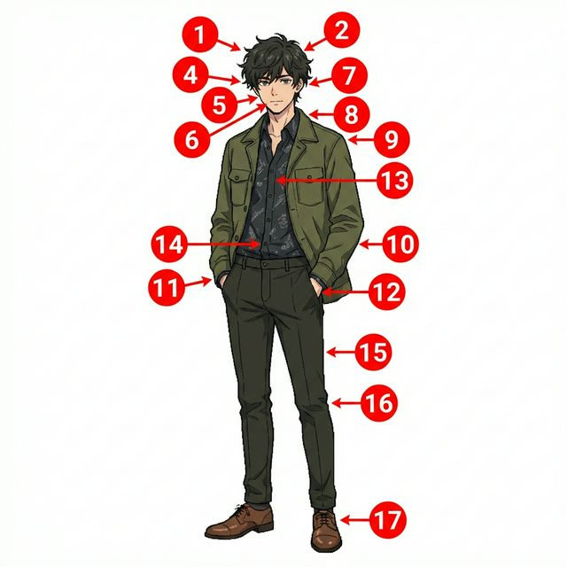

# Chapter 1: Mi cuerpo y salud (A1)

Cervantes: §1 Identidad (신체 특징), §13 Salud (신체 부위별 명칭 및 기초 건강 상태 표현)

## 1. Opener
**학습 목표**:
- 머리부터 발끝까지 15개 이상의 신체 부위를 식별하고 이름을 말할 수 있습니다.
- 신체적 감각과 소유를 표현하기 위한 불규칙 동사 `tener`(가지다)의 활용을 마스터합니다.
- 스페인의 공공 의료 시스템과 건강한 생활 습관에 대한 문화적 배경을 이해합니다.
- 기본적인 건강 상태를 표현하고 아픔을 전달하는 방법을 배웁니다.

**¿Sabías que...? (알고 계셨나요?)**
스페인 사람들은 인사를 할 때 양쪽 볼에 키스를 하는 'Dos Besos' 관습이 있습니다. 하지만 처음 보는 사이나 공식적인 자리에서는 악수를 하는 것이 일반적입니다. 신체 접촉에 대한 문화적 차이를 이해하는 것은 스페인어 학습의 첫걸음입니다!

---

## 2. Vocabulario Esencial: El Cuerpo Humano
신체 부위를 나타내는 필수 어휘입니다. 아래 일러스트의 번호와 매칭하여 학습해보세요.

| 번호 | Spanish | English Bridge | Korean Tip |
|:---:|:---|:---|:---|
| 1 | la cabeza | Cephalic (→ head) | '까베사'라고 발음하세요. |
| 2 | el pelo | — | 머리카락을 뜻합니다. |
| 3 | la cara | — | 얼굴입니다. |
| 4 | el ojo | Ocular (→ eye) | '오호'라고 발음하며 항상 성수 일치에 주의하세요. |
| 5 | la nariz | Nasal ✅ | 코입니다. |
| 6 | la boca | Vocal (→ mouth-related) | 입입니다. |
| 7 | la oreja | Aural (→ ear-related) | 귀(겉부분)를 뜻합니다. |
| 8 | el cuello | — | 목입니다. |
| 9 | el hombro | — | 어깨입니다. |
| 10 | el brazo | Brace (→ support for arm) | 팔입니다. |
| 11 | la mano | Manual ✅ | 손입니다. (여성 명사임에 주의: la mano) |
| 12 | el dedo | Digit (→ finger/toe) | 손가락 또는 발가락입니다. |
| 13 | el pecho | Pectoral ✅ | 가슴입니다. |
| 14 | el estómago | Stomach ✅ | 배, 위장입니다. |
| 15 | la pierna | — | 다리입니다. |
| 16 | la rodilla | — | 무릎입니다. |
| 17 | el pie | Pedal (→ foot-related) | 발입니다. |

✅ **범례**: ✅ 표시된 단어는 영어와 어원이 같거나 매우 유사한 'Cognates'입니다.

---

## 3. Expresiones Útiles
실생활에서 자주 사용하는 유용한 표현들입니다.

**A. 건강 상태 묻고 답하기**
- **¿Cómo estás?** (How are you? / 어떻게 지내니?)
- **Estoy bien, gracias.** (I'm well, thanks. / 잘 지내요, 감사합니다.)
- **Me siento mal.** (I feel bad. / 기분이 안 좋아요/몸이 안 좋아요.)
- **Estoy resfriado/a.** (I have a cold. / 감기에 걸렸어요.)

**B. 신체적 감수 표현 (Tener + 명사)**
- **Tengo calor.** (I'm hot. / 더워요.)
- **Tengo frío.** (I'm cold. / 추워요.)
- **Tengo hambre.** (I'm hungry. / 배고파요.)
- **Tengo sed.** (I'm thirsty. / 목말라요.)
- **Tengo sueño.** (I'm sleepy. / 졸려요.)

---

## 4. Gramática Esencial: El verbo TENER (가지다)

`tener` 동사는 스페인어에서 가장 중요한 불규칙 동사 중 하나입니다. 소유(possession)뿐만 아니라 나이, 신체적 상태, 그리고 의무를 표현할 때 필수적으로 사용됩니다.

### A. 현재 시제 변화
`tener`는 1인칭 단수형이 불규칙하게 변하며, 2인칭과 3인칭에서는 어간 모음이 변하는(e -> ie) 특징이 있습니다.

| 주어 | 동사 변화 | 주어 | 동사 변화 |
|:---|:---|:---|:---|
| **yo** | tengo | **nosotros/as** | tenemos |
| **tú** | tienes | **vosotros/as** | tenéis |
| **él/ella/usted** | tiene | **ellos/ellas/ustedes** | tienen |

### B. 주요 용법
1. **소유**: "나는 책을 한 권 가지고 있다." -> *Yo tengo un libro.*
2. **나이**: 스페인어에서는 나이를 "가지고 있다"라고 표현합니다. -> *Tengo 20 años.* (I am 20 years old.)
3. **신체적/생리적 상태**: 영어의 "I am + 형용사" 표현 중 상당수가 스페인어에서는 "Tener + 명사"로 바뀝니다.
   - *Tengo hambre.* (I have hunger -> I am hungry)
   - *Tengo sed.* (I have thirst -> I am thirsty)

**Korean Tip!**
한국어에서는 "배고프다", "목마르다"를 형용사처럼 사용하지만, 스페인어에서는 "배고픔을 가지고 있다"는 식으로 명사를 목적어로 취한다는 점을 기억하세요. 그래서 '매우 배고프다'라고 할 때는 형용사인 *muy*가 아니라 명사를 수식하는 *mucho*를 사용합니다. (예: *Tengo mucho hambre.*)

---

## 5. Cultura Viva: El Sistema de Salud en España

España cuenta con uno de los sistemas de salud pública más eficientes del mundo, conocido como **Seguridad Social**. Este sistema garantiza el acceso universal a la atención médica para todos los ciudadanos y residentes.

Cada barrio tiene su propio **Centro de Salud**, donde los médicos de cabecera atienden las consultas generales. La medicina preventiva y la cultura de la **Dieta Mediterránea** son pilares fundamentales de la longevidad en España. Además, las **Farmacias** son fácilmente identificables por su cruz verde luminosa y ofrecen asesoramiento profesional constante. Es común que los españoles caminen mucho a diario, lo que contribuye a mantener una buena salud física general.

**[한국어 번역]**
스페인은 **사회 보장(Seguridad Social)** 제도로 알려진 세계에서 가장 효율적인 공공 의료 시스템 중 하나를 보유하고 있습니다. 이 시스템은 모든 시민과 거주자에게 보편적인 의료 서비스를 보장합니다.

동네마다 **보건소(Centro de Salud)**가 있어 주치의가 일반적인 진료를 담당합니다. 예방 의학과 **지중해식 식단** 문화는 스페인 장수의 핵심 요소입니다. 또한, **약국(Farmacias)**은 밝게 빛나는 초록색 십자가 모양으로 쉽게 찾을 수 있으며 상시 전문적인 상담을 제공합니다. 스페인 사람들이 매일 많이 걷는 습관 또한 전반적인 신체 건강을 유지하는 데 기여합니다.

---

## 6. Práctica

**A. Match the word (알맞은 단어를 연결하세요)**

| Spanish | English / Korean |
|:---|:---|
| 1. Cabeza | a. Eye |
| 2. Mano | b. Foot |
| 3. Ojo | c. Hand |
| 4. Pie | d. Head |
| 5. Nariz | e. Nose |

**B. Fill in the blanks with the correct form of TENER (빈칸에 tener 동사의 알맞은 형태를 쓰세요)**

1. Yo ............................. mucho calor hoy.
2. ¿Tú ............................. hambre ahora?
3. Nosotros ............................. tres gatos.
4. Ella ............................. veinticinco años.
5. Vosotros ............................. sed.

**C. 번역 연습 (스페인어로 번역하세요)**

1. 나는 졸려요.
   (............................................................)
2. 우리들은 목말라요.
   (............................................................)
3. 너는 차를 가지고 있니?
   (............................................................)
4. 그들은 배고프지 않아요.
   (............................................................)
5. 제 이름은 루시아이고 19살입니다.
   (............................................................)

---

## 7. Lectura 📖
**Mi rutina de salud (나의 건강 루틴)**

Hola, me llamo Carlos. Yo cuido mucho mi cuerpo. Todos los días camino por el parque. A veces tengo dolor de espalda, pero hago ejercicio. Bebo mucha agua porque siempre tengo sed después de correr. Mi hermana Sofía tiene una dieta sana; ella come muchas frutas y verduras. Nosotros tenemos suerte de vivir cerca de un Centro de Salud.

**Questions:**
1. ¿Qué hace Carlos todos los días? (카를로는 매일 무엇을 하나요?)
   - ............................................................
2. ¿Por qué Carlos bebe mucha agua? (카를로는 왜 물을 많이 마시나요?)
   - ............................................................

**[한국어 번역]**
안녕하세요, 제 이름은 카를로스입니다. 저는 제 몸을 아주 소중히 여깁니다. 매일 공원을 산책합니다. 가끔 등 통증이 있지만 운동을 합니다. 달리기 후에는 항상 목이 말라서 물을 많이 마십니다. 제 여동생 소피아는 건강한 식단을 가지고 있습니다. 그녀는 과일과 채소를 많이 먹습니다. 우리는 보건소 근처에 살아서 운이 좋습니다.

---

## 8. Diálogo
**En el médico (의사 진찰)**

**Situación:** Pedro visita al doctor en un Centro de Salud en Madrid porque no se siente bien. El doctor le hace preguntas básicas sobre sus síntomas físicos para diagnosticar su malestar.  
**상황:** 페드로는 몸이 좋지 않아 마드리드의 보건소(Centro de Salud)에서 의사 선생님을 만납니다. 의사 선생님은 그의 상태를 진단하기 위해 신체적 증상에 대한 기본적인 질문을 합니다.

| Spanish | Korean |
| :--- | :--- |
| **Doctor:** Buenos días, Pedro. ¿Cómo estás hoy? | **의사:** 좋은 아침입니다, 페드로. 오늘 어떠신가요? |
| **Pedro:** Buenos días, doctor. Me siento un poco mal. | **페드로:** 좋은 아침입니다, 선생님. 몸이 좀 안 좋아요. |
| **Doctor:** ¿Qué tienes? ¿Te duele la cabeza? | **의사:** 어디가 아픈가요? 머리가 아픈가요? |
| **Pedro:** Sí, me duele mucho la cabeza y tengo calor. | **페드로:** 네, 머리가 아주 많이 아프고 열이 나요(더워요). |
| **Doctor:** Entiendo. ¿Tienes tos o dolor de garganta? | **의사:** 알겠습니다. 기침이나 목 통증이 있나요? |
| **Pedro:** No tengo tos, pero tengo mucho sueño. | **페드로:** 기침은 없는데, 잠이 너무 많이 와요. |
| **Doctor:** Tienes un resfriado. Necesitas beber agua y descansar. | **의사:** 감기에 걸리셨네요. 물을 마시고 쉬어야 합니다. |
| **Pedro:** Muchas gracias, doctor. Hasta luego. | **페드로:** 정말 감사합니다, 선생님. 안녕히 계세요. |
| **Doctor:** Hasta luego, Pedro. ¡Cuídate! | **의사:** 안녕히 가세요, 페드로. 몸조리 잘하세요! |

---

## 9. Repaso
이번 장에서 배운 핵심 내용을 확인해보세요.

- [ ] 머리, 눈, 코, 입, 손, 발 등 15개 이상의 신체 부위 명칭을 외웠나요?
- [ ] `tener` 동사의 불규칙 변화(tengo, tienes, tiene...)를 정확히 쓸 수 있나요?
- [ ] '배고프다', '목마르다', '덥다' 등 신체적 상태를 `tener` 동사로 표현할 수 있나요?
- [ ] 스페인의 공공 의료 시스템인 'Seguridad Social'의 특징을 이해하셨나요?

---

## 10. Cierre
축하합니다! 첫 번째 장을 성공적으로 마쳤습니다. 우리 몸의 소중함을 알고 이를 스페인어로 표현하는 것은 매우 기초적이면서도 중요한 과정입니다. 특히 `tener` 동사는 앞으로도 정말 많이 쓰일 예정이니 입에 착 붙을 때까지 연습해보세요. 다음 장에서는 우리의 성격과 성정에 대해 이야기해보겠습니다. ¡Ánimo! (힘내세요!)

---

## 11. Soluciones

**6. Práctica - A. Match the word**
1-d, 2-c, 3-a, 4-b, 5-e

**6. Práctica - B. Fill in the blanks**
1. tengo, 2. tienes, 3. tenemos, 4. tiene, 5. tenéis

**6. Práctica - C. 번역 연습**
1. Tengo sueño.
2. Tenemos sed.
3. ¿Tienes (un) coche?
4. (Ellos) No tienen hambre.
5. Me llamo Lucía y tengo 19 años.

**7. Lectura Questions**
1. Carlos camina por el parque todos los días.
2. Porque siempre tiene sed después de correr.
