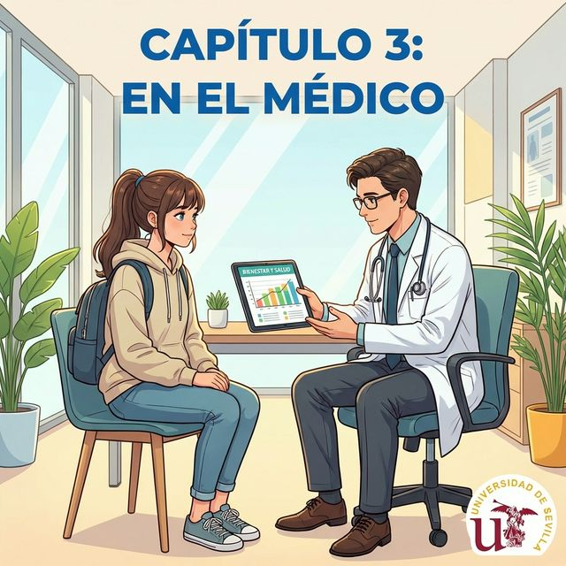

# Chapter 1: Mi cuerpo y salud (A2)

## 1. Opener
¡Hola de nuevo! En el nivel A1 aprendimos lo básico. Ahora, vamos a profundizar en cómo cuidar nuestro cuerpo y qué hacer cuando no estamos al cien por cien. La salud es lo más importante, ¿verdad?

**학습 목표**:
- 건강 관련 세부 증상 및 질병 표현하기
- `doler` (to hurt) 동사의 특수 구조 마스터하기
- 지중해식 식단과 장수 비결 이해하기

> [!TIP]
> **¿Sabías que...?**
> 스페인은 세계에서 장기 기증률이 가장 높은 국가 중 하나입니다. 건강과 생명 나눔에 대한 높은 사회적 인식을 보여주는 대목입니다.

---

## 2. Vocabulario Esencial

| Spanish | English Bridge | Korean Tip |
| :--- | :--- | :--- |
| la **salud** | **Salute** (wishing health) ✅ | 인사를 뜻하는 salute는 원래 '건강을 빌다'에서 왔습니다. |
| la **gripe** | **Grip** (to seize) | 몸을 꽉 쥐는 듯한 통증을 유발하는 '독감'입니다. |
| la **fiebre** | **Febrile** (feverish) ✅ | 열을 뜻하며, 영어의 fever와 어원이 같습니다. |
| la **tos** | — | 기침을 뜻합니다. |
| la **receta** | **Receipt / Recipe** ✅ | 약국에 제출하는 '처방전' 혹은 요리 '레시피'입니다. |
| la **farmacia** | **Pharmacy** ✅ (Perfect Cognate) | 스페인 거리에 'F' 모양 초록 간판이 보인다면 이곳입니다. |
| **urgencias** | **Urgency** ✅ | 응급실을 뜻하며, 긴급함을 나타냅니다. |
| **paciente** | **Patient** ✅ (Perfect Cognate) | 환자를 뜻하지만 '인내심 있는'이라는 뜻도 공유합니다. |
| **medicina** | **Medicine** ✅ (Perfect Cognate) | 약 혹은 의학을 뜻합니다. |
| **enfermo / enferma**| **Infirm** (weak/sick) ✅ | 아픈 사람을 뜻하며, '인펌'이라는 영어 단어를 떠올려보세요. |

✅ 표시가 있는 단어는 영어 단어와 어원이 매우 유사합니다.

---

## 3. Expresiones Útiles
단순히 "I have pain"을 넘어, 특정 부위가 아픔을 나타내는 동사 `doler`를 상황별로 사용해봅시다.

- **¡Cuídate!**: Take care of yourself! (몸 조리 잘해!)
- **Estar resfriado/a**: To have a cold (감기 걸리다)
- **Pedir cita**: To make an appointment (진료 예약을 하다)
- **Tomar la temperatura**: To take the temperature (열을 재다)

**예문**:
- ES: Me duele mucho la espalda tras el trabajo. (일하고 나서 등이 너무 아파요.)
- EN: My back hurts a lot after work.

---

## 4. Gramática Esencial: El verbo DOLER (to hurt)

`doler`는 주어가 '나'가 아닌 '아픈 부위'가 되는 특수한 구조를 가집니다. 영어의 "It hurts me"와 구조가 비슷합니다.

### 전 인칭 구조 테이블
| 주어 (간접목적어) | 부위가 단수일 때 | 부위가 복수일 때 |
| :--- | :--- | :--- |
| me (나에게) | **duele** | **duelen** |
| te (너에게) | **duele** | **duelen** |
| le (그/그녀/당신에게) | **duele** | **duelen** |
| nos (우리에게) | **duele** | **duelen** |
| os (너희에게) | **duele** | **duelen** |
| les (그들/당신들에게) | **duele** | **duelen** |

> [!NOTE]
> **Korean Tip**
> `doler`는 `gustar` 동사와 어순이 같습니다. 내가 부위를 아프게 하는 것이 아니라, '부위(주어)'가 나에게 '통증(동사)'을 주는 것입니다.

---

## 5. Cultura Viva: La Dieta Mediterránea
지중해식 식단은 단순히 음식이 아니라 유네스코 무형 문화유산으로 등재된 생활 방식입니다. 올리브유, 신선한 야채, 생선 중심의 식단은 스페인 사람들이 건강을 유지하는 핵심 비결입니다. 또한 '시에스타(Siesta)'라고 불리는 낮잠 문화도 뇌 건강과 심혈관 질환 예방에 긍정적인 영향을 준다고 알려져 있습니다.

---

## 6. Práctica

### A. Match the word
보이지 않는 테이블을 사용하여 선택지를 정렬합니다.

| ES 단어 | 선택지 |
| :--- | :--- |
| 1. Fiebre | a) Recipe / Prescription |
| 2. Gripe | b) Sick / Ill |
| 3. Receta | c) Pharmacy |
| 4. Farmacia | d) Fever |
| 5. Enfermo | e) Flu |

### B. Fill in the blanks
문맥에 맞게 `doler` 동사(duele/duelen)와 간접목적대명사를 넣으세요.

1. (I) ................... la cabeza.
2. (You, informal) ................... los ojos.
3. (We) ................... la garganta (목구멍).
4. (She) ................... los pies.
5. (They) ................... la espalda.

### C. 번역 연습
다음 문장을 스페인어로 번역하세요.

1. 너는 감기에 걸렸니? (Use: estar resfriado)
2. 내일 진료 예약을 해야 합니다.
3. 열을 재 보세요.
4. 우리는 건강에 대해 이야기합니다.
5. 처방전을 약국에 가져가세요.

---

## 7. Lectura 📖
Estimado doctor García, le escribo porque no me siento bien. Desde ayer tengo mucha gripe y una fiebre alta. Me duelen todos los músculos del cuerpo y tengo una tos constante. Mañana iré a su clínica para pedir una receta y comprar medicinas en la farmacia. Muchas gracias por su atención. Atentamente, Juan.

**한국어 번역**:
존경하는 García 의사 선생님께, 몸 상태가 좋지 않아 글을 씁니다. 어제부터 독감이 심하고 열이 높습니다. 몸의 모든 근육이 아프고 기침이 끊이지 않습니다. 내일 선생님의 병원에 가서 처방전을 받고 약국에서 약을 사려고 합니다. 신경 써 주셔서 감사합니다. Juan 올림.

---

## 8. Diálogo

| Spanish | Korean |
| :--- | :--- |
| **Doctor**: Buenos días, Pedro. ¿Qué le pasa? | **Doctor**: 안녕하세요, Pedro. 어디가 불편하신가요? |
| **Pedro**: Buenos días, doctor. Me duele mucho la garganta. | **Pedro**: 안녕하세요, 선생님. 목이 너무 아파요. |
| **Doctor**: ¿Tiene usted fiebre? | **Doctor**: 열이 있으신가요? |
| **Pedro**: Sí, tengo 38 grados. | **Pedro**: 네, 38도입니다. |
| **Doctor**: Parece que está usted resfriado. | **Doctor**: 감기에 걸리신 것 같군요. |
| **Pedro**: ¿Necesito medicinas? | **Pedro**: 약이 필요한가요? |
| **Doctor**: Sí, aquí tiene la receta para la farmacia. | **Doctor**: 네, 여기 약국에 가져갈 처방전입니다. |
| **Pedro**: Muchas gracias, doctor. ¡Cuídate! | **Pedro**: 정말 감사합니다, 선생님. 건강하세요! |

---

## 9. Repaso
- [ ] `doler` 동사를 사용하여 아픈 부위를 표현할 수 있나요?
- [ ] 건강 관련 필수 어휘 10개를 설명할 수 있나요?
- [ ] 지중해식 식단의 특징을 알고 있나요?

---

## 10. Cierre
A2 레벨에서는 증상을 구체적으로 말하고 대처방법을 논의하는 단계까지 왔습니다. 몸이 아플 때 자신의 상태를 정확히 언어로 표현하는 것은 생존과 직결된 중요한 기술입니다. 다음 장은 더욱 흥미로운 주제로 찾아오겠습니다. ¡Ánimo!

---

## 11. Soluciones

**6. Práctica A**: 1-d, 2-e, 3-a, 4-c, 5-b
**6. Práctica B**: 1. Me duele, 2. Te duelen, 3. Nos duele, 4. Le duelen, 5. Les duele
**6. Práctica C**: 1. ¿Estás resfriado? 2. Tengo que pedir cita para mañana. 3. Tome la temperatura. 4. Hablamos de la salud. 5. Lleve la receta a la farmacia.
