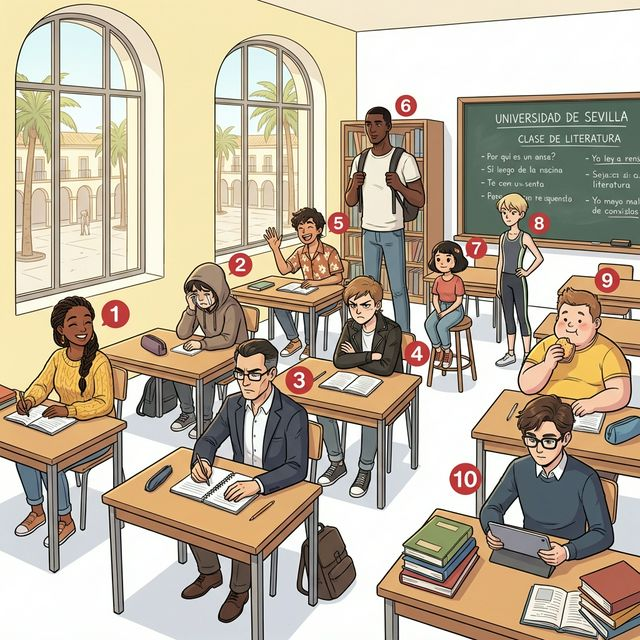

# Chapter 2: ¿Cómo soy? (A1)

Cervantes: §2 Persona: 신체적 외모 기술 및 기본적인 성격, 기분 상태 표현

## 1. Opener

**¿Cómo eres tú?**
이 장에서는 나와 주변 사람들의 성격, 외모, 그리고 현재의 기분과 감정을 묘사하는 방법을 배웁니다. 스페인어에서 가장 중요한 두 동사, **ser**와 **estar**의 결전이 시작됩니다!

**학습 목표**

- 성격과 외모를 나타내는 핵심 형용사 10개 이상 습득
- '본질'을 나타내는 ser 동사와 '상태'를 나타내는 estar 동사의 완벽 구분
- 긍정형과 부정형을 사용한 자기소개 및 타인 묘사
- 스페인의 인사 문화(Dos besos) 이해

> [!TIP]
> **¿Sabías que...?** 스페인 사람들은 처음 만났을 때나 인사를 할 때 양쪽 볼에 가볍게 키스를 하는 'Dos besos' 문화를 가지고 있습니다. 이건 연인 사이뿐만 아니라 친구, 가족, 심지어 처음 본 사이에서도 흔히 일어나는 친근함의 표시랍니다!

---

## 2. Vocabulario Esencial

아래 삽화 속 인물들의 특징을 살펴보며 필수 형용사를 익혀보세요. 삽화의 번호(①~⑩)가 아래 어휘 표와 정확히 대응됩니다.

| 번호 | Spanish | English Bridge | Korean Tip |
|:---:|:---|:---|:---|
| 1 | alegre | Cheerful / Allegro (mus.) ✅ | 활기찬 느낌 |
| 2 | triste | Triste (fr.) → Sad | '트리스테'라고 발음 |
| 3 | serio / seria | Serious ✅ | -o/-a 성수 변화 주의 |
| 4 | antipático / -a | Antipathy → Unpleasant | '비호감인' 느낌 |
| 5 | simpático / -a | Sympathetic → Nice / Friendly | '호감가는' 느낌 |
| 6 | alto / alta | Altitude → Tall ✅ | 높은 곳을 상상하세요 |
| 7 | bajo / baja | Base → Short / Low | 낮은 곳을 상상하세요 |
| 8 | delgado / -a | — (Thin / Slender) | '델가도' |
| 9 | gordo / gorda | — (Fat / Chubby) | '고르도' |
| 10 | inteligente | Intelligent ✅ | 완벽한 인지어 |

✅ 표시된 단어는 영어와 어원이 같거나 매우 유사한 'Cognates'입니다.

---

## 3. Expresiones Útiles

일상에서 나를 표현하거나 남을 물어볼 때 사용하는 핵심 문장들입니다.

**A. 성격/외모 묻고 답하기 (Ser)**

- **¿Cómo eres?** (What are you like? / 너는 어떤 사람이니?) — 성격/외모
- **Soy una persona alegre.** (I am a cheerful person. / 나는 밝은 사람이야.)
- **Mi amigo es muy simpático.** (My friend is very friendly. / 내 친구는 정말 성격이 좋아.)
  - 💡 **English Bridge**: "Simpático" looks like "sympathetic" but means "friendly/nice" — a **False Friend** to watch!

**B. 기분/상태 묻고 답하기 (Estar)**

- **¿Cómo estás?** (How are you? / 지금 기분 어때?) — 상태/기분
- **Estoy un poco cansado.** (I am a bit tired. / 나는 좀 피곤해.)
- **Ella está muy feliz hoy.** (She is very happy today. / 그녀는 오늘 아주 행복해 보여.)

---

## 4. Gramática Esencial

### Ser vs. Estar: '본질(Essence)'과 '상태(State)'의 구분

스페인어의 'be 동사'는 두 가지로 나뉩니다. 이를 구분하는 것이 초급 단계의 가장 큰 산입니다.

### 어근/어미 변화 분석 (Stem & Ending Analysis)

**English Bridge**: English has **one** "to be" verb. Spanish splits it into **two**: **ser** (permanent) and **estar** (temporary). Think of it as:

- **SER** = "I am *who* I am" (identity, origin, personality, appearance)
- **ESTAR** = "I am *how/where* I am" (mood, health, location)

### 1. Ser 동사 (본질, 정체성, 지속적 특성) — Presente

`ser`는 완전 불규칙 동사로 어근 자체가 인칭마다 변합니다.

<table class="conjugation-table">
  <thead>
    <tr>
      <th>주어 (Subject)</th>
      <th>ser</th>
      <th>English</th>
    </tr>
  </thead>
  <tbody>
    <tr>
      <td>yo</td>
      <td><strong>soy</strong></td>
      <td>I am</td>
    </tr>
    <tr>
      <td>tú</td>
      <td><strong>eres</strong></td>
      <td>you are</td>
    </tr>
    <tr>
      <td>él/ella/usted</td>
      <td><strong>es</strong></td>
      <td>he/she is, you (formal) are</td>
    </tr>
    <tr>
      <td>nosotros/as</td>
      <td><strong>somos</strong></td>
      <td>we are</td>
    </tr>
    <tr>
      <td>vosotros/as</td>
      <td><strong>sois</strong></td>
      <td>you all are</td>
    </tr>
    <tr>
      <td>ellos/ellas/ustedes</td>
      <td><strong>son</strong></td>
      <td>they are, you all (formal) are</td>
    </tr>
  </tbody>
</table>

> 💡 **Tip**: `ser`는 영어의 "am/are/is"처럼 인칭마다 완전히 다른 형태를 갖습니다. 이것은 외울 수밖에 없으니, 반복 연습이 유일한 방법입니다!

### 2. Estar 동사 (상태, 위치, 일시적 기분) — Presente

`estar`는 1인칭을 제외하면 규칙적인 패턴을 보이며, 강세 기호(accent)에 주의가 필요합니다.

<table class="conjugation-table">
  <thead>
    <tr>
      <th>주어 (Subject)</th>
      <th>estar</th>
      <th>English</th>
    </tr>
  </thead>
  <tbody>
    <tr>
      <td>yo</td>
      <td>est<strong>oy</strong></td>
      <td>I am</td>
    </tr>
    <tr>
      <td>tú</td>
      <td>est<strong>ás</strong></td>
      <td>you are</td>
    </tr>
    <tr>
      <td>él/ella/usted</td>
      <td>est<strong>á</strong></td>
      <td>he/she is, you (formal) are</td>
    </tr>
    <tr>
      <td>nosotros/as</td>
      <td>est<strong>amos</strong></td>
      <td>we are</td>
    </tr>
    <tr>
      <td>vosotros/as</td>
      <td>est<strong>áis</strong></td>
      <td>you all are</td>
    </tr>
    <tr>
      <td>ellos/ellas/ustedes</td>
      <td>est<strong>án</strong></td>
      <td>they are, you all (formal) are</td>
    </tr>
  </tbody>
</table>

> 💡 **English Bridge Tip**: Notice that `estar` has a consistent stem `est-` (think of "state" → est-**a**do = state). The endings follow -AR verb patterns with accents: -**oy**, -**ás**, -**á**, -**amos**, -**áis**, -**án**.

> [!IMPORTANT]
> **Korean Tip**: 한국어로는 둘 다 "~이다/있다"로 번역되지만, **"내 친구는 친절하다(Ser)"**와 **"내 친구는 지금 화가 났다(Estar)"**의 차이를 생각하면 이해가 빠릅니다. 성격은 Ser, 기분은 Estar입니다!

---

## 5. Cultura Viva: Dos Besos 💋

스페인 사람들의 따뜻한 인사법을 알아볼까요?

**¡Dos besos para todos!**

En España, la forma más común de saludar, especialmente entre mujeres o entre un hombre y una mujer, es dándose dos besos en las mejillas. No son besos reales con los labios, sino un ligero contacto de mejilla con mejilla mientras se hace el sonido del beso. Se empieza siempre por la mejilla derecha.

Este gesto refleja la calidez y la naturaleza social de la cultura española. A diferencia de otras culturas donde se mantiene una distancia física, en España el contacto cercano es una señal de confianza y amistad. Incluso en entornos profesionales menos formales, los dos besos son normales para saludar a colegas o conocidos. Entre hombres que no son familiares cercanos, lo habitual suele ser un apretón de manos o un abrazo corto si hay mucha confianza.

**[한국어 번역]**
스페인에서 가장 일반적인 인사법은, 특히 여성 사이나 남성과 여성 사이에서, 양쪽 볼에 두 번의 키스를 하는 것입니다. 이는 입술을 직접 대는 실제 키스가 아니라, 볼과 볼을 가볍게 맞대며 입으로 키스 소리를 내는 방식입니다. 항상 오른쪽 볼부터 시작합니다.

이 제스처는 스페인 문화 특유의 따뜻함과 사회성을 잘 보여줍니다. 신체적 거리를 유지하는 다른 문화권과 달리, 스페인에서는 가까운 접촉이 신뢰와 우정의 표시입니다. 심지어 격식이 덜한 전문적인 환경에서도 동료나 지인을 만날 때 두 번의 키스로 인사하는 것이 일반적입니다. 가족 관계가 아닌 남성들 사이에서는 보통 악수를 하거나, 아주 친한 경우에는 가벼운 포옹을 합니다.

---

## 6. Práctica

**A. Match the word (알맞은 보기를 연결하세요)**

1. alegre (Cheerful)
2. alto (Tall)
3. serio (Serious)
4. simpático (Friendly)
5. delgado (Thin)

(Options: a. serious / b. friendly / c. cheerful / d. thin / e. tall)

**B. Completa con 'ser' o 'estar' (알맞은 동사를 빈칸에 쓰세요)**

1. Yo ______________________ de Corea del Sur. (본질: 국적)
2. Mi hermano ______________________ muy alto. (본질: 외모)
3. Hoy nosotros ______________________ muy felices. (상태: 기분)
4. ¿Cómo ______________________ tú hoy? (상태: 안부)
5. Elena ______________________ en la biblioteca. (상태: 위치)

**C. 번역 연습 (스페인어로 옮겨보세요)**

1. 나는 똑똑한 사람이야.
   (............................................................)
2. 너는 오늘 슬프니?
   (............................................................)
3. 페드로는 정말 성격이 좋아(simpático).
   (............................................................)
4. 우리는 지금 피곤해(cansados).
   (............................................................)
5. 그녀는 아주 예쁘다.
   (............................................................)

---

## 7. Lectura 📖

**Mi familia es especial**

Hola, me llamo Sofía. En mi familia somos cuatro personas. Mi padre es muy alto y serio, pero muy inteligente. Mi madre es alegre y siempre está feliz. Mi hermano menor, Pablo, es un poco bajo y muy simpático. Yo soy una persona tranquila y hoy estoy muy contenta porque es mi cumpleaños. ¡Somos una familia muy unida!

**Preguntas (질문):**

1. ¿Cómo es el padre de Sofía? (소피아의 아버지는 어떤 분인가요? — 성격과 외모)
2. ¿Cómo es Pablo? (파블로는 어떤 사람인가요?)
3. ¿Por qué Sofía está contenta hoy? (소피아가 오늘 기분이 좋은 이유는 무엇인가요?)

**[한국어 번역]**
**우리 가족은 특별해요**
안녕, 내 이름은 소피아야. 우리 가족은 네 명이야. 우리 아버지는 키가 매우 크고 진지하시지만, 정말 똑똑하셔. 우리 어머니는 밝으시고 항상 행복해하셔. 내 남동생 파블로는 키가 좀 작고 정말 성격이 좋아. 나는 차분한 사람이고, 오늘은 내 생일이라서 정말 기뻐. 우리는 정말 화목한 가족이야!

---

## 8. Diálogo

**¿Cómo estás hoy? (오늘 기분 어때?)**

**Situación:** Pedro se encuentra con su amiga Lucía en la universidad. Pedro nota que Lucía se ve un poco diferente hoy y le pregunta por su estado de ánimo y su salud.

**상황:** 페드로는 대학교에서 친구 루시아를 만납니다. 페드로는 오늘 루시아의 모습이 평소와 조금 다르다는 것을 느끼고, 그녀의 기분과 건강 상태에 대해 묻습니다.

<table class="dialogue-table">
  <thead>
    <tr>
      <th>🇪🇸 Español</th>
      <th>🇰🇷 한국어</th>
    </tr>
  </thead>
  <tbody>
    <tr>
      <td><strong>Pedro:</strong> ¡Hola, Lucía! ¿Cómo estás hoy?</td>
      <td><strong>페드로:</strong> 안녕, 루시아! 오늘 기분 어때?</td>
    </tr>
    <tr>
      <td><strong>Lucía:</strong> Hola, Pedro. Estoy un poco cansada.</td>
      <td><strong>루시아:</strong> 안녕, 페드로. 좀 피곤해.</td>
    </tr>
    <tr>
      <td><strong>Pedro:</strong> ¿Por qué? ¿Estás enferma?</td>
      <td><strong>페드로:</strong> 왜? 어디 아파?</td>
    </tr>
    <tr>
      <td><strong>Lucía:</strong> No, no estoy enferma, pero tengo mucho trabajo.</td>
      <td><strong>루시아:</strong> 아니, 아픈 건 아닌데 일이 너무 많아.</td>
    </tr>
    <tr>
      <td><strong>Pedro:</strong> ¡Qué pena! Pero hoy estás muy guapa.</td>
      <td><strong>페드로:</strong> 안타깝네! 근데 너 오늘 되게 예쁘다.</td>
    </tr>
    <tr>
      <td><strong>Lucía:</strong> Gracias. Eres muy amable.</td>
      <td><strong>루시아:</strong> 고마워. 넌 참 친절하구나.</td>
    </tr>
    <tr>
      <td><strong>Pedro:</strong> ¿Y tu hermano? ¿Cómo está él?</td>
      <td><strong>페드로:</strong> 네 남동생은? 그는 어떻게 지내?</td>
    </tr>
    <tr>
      <td><strong>Lucía:</strong> Él está muy alegre porque tiene un perro nuevo.</td>
      <td><strong>루시아:</strong> 그는 새 강아지가 생겨서 아주 기분이 좋아.</td>
    </tr>
  </tbody>
</table>

---

## 9. Repaso

이 장에서 배운 내용을 확인해 보세요:

- [ ] 사람의 외모와 성격을 묘사하는 형용사 **10개 이상**을 알고 있다.
- [ ] **Ser** 동사와 **Estar** 동사의 변화형을 모두 외웠다.
- [ ] 언제 **Ser**(본질/정체성)를 쓰고 언제 **Estar**(상태/위치)를 쓰는지 명확히 구분할 수 있다.
- [ ] `estar`의 어간 `est-` + 강세 어미 패턴(-oy, -ás, -á, -amos, -áis, -án)을 이해했다.
- [ ] 스페인의 인사 문화 '**Dos besos**'의 특징을 설명할 수 있다.

---

## 10. Cierre

¡Buen trabajo! 🎉 성격과 외모를 표현하는 법을 배우면서 여러분은 이제 자신을 스페인어로 소개할 수 있게 되었습니다.

성격은 '**본질(Ser)**', 기분은 '**상태(Estar)**'라는 핵심 원칙만 기억한다면 여러분의 스페인어 실력은 한 단계 더 도약할 것입니다. 이 두 동사의 구분은 영어에는 없는 스페인어 고유의 특성이므로, 다양한 예문을 통해 꾸준히 연습하는 것이 중요합니다.

다음 장에서는 우리의 '**정체성**'과 '**국적**'에 대해 더 자세히 알아보겠습니다. ¡Hasta pronto!

---

## 11. Soluciones

**6. Práctica - A. Match the word**

1. 1-c (alegre - cheerful)
2. 2-e (alto - tall)
3. 3-a (serio - serious)
4. 4-b (simpático - friendly)
5. 5-d (delgado - thin)

**6. Práctica - B. Completa con 'ser' o 'estar'**

1. soy
2. es
3. estamos
4. estás
5. está

**6. Práctica - C. 번역 연습**

1. Soy una persona inteligente.
2. ¿Estás triste hoy?
3. Pedro es muy simpático.
4. (Nosotros) estamos cansados ahora.
5. Ella es muy guapa.
