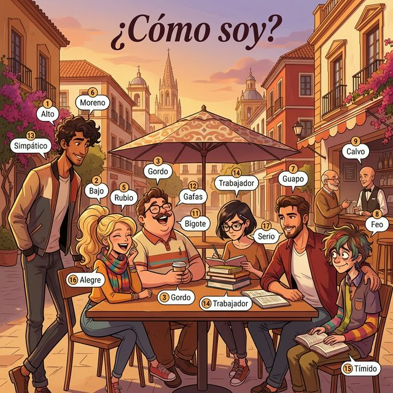

# Chapter 2: ¿Cómo soy? (A1)

## 1. Opener
Who are you? How do you describe your personality and your physical appearance to a new friend? In this chapter, we explore the vibrant language of identity. We will move beyond just naming colors and shapes to describing characters—all while leveraging the English vocabulary you already know.

**한국어 번역:**
여러분은 누구인가요? 새로운 친구에게 여러분의 성격과 외모를 어떻게 설명하시겠습니까? 이 장에서는 정체성을 묘사하는 생동감 넘치는 언어를 탐구합니다. 단순히 색상과 모양의 이름을 익히는 것을 넘어, 여러분이 이미 알고 있는 영어 어휘를 활용하여 인물의 특징을 설명하는 법을 배울 것입니다.

**학습 목표**:
- 15개 이상의 외모 및 성격 형용사를 사용하여 자신과 타인을 묘사합니다.
- 성질(본질)을 나타내는 **Ser**와 상태를 나타내는 **Estar**의 차이를 구분하여 사용합니다.
- 형용사의 성과 수 일치 규칙을 올바르게 적용합니다.
- 스페인과 중남미 인사의 문화적 차이와 뉘앙스를 이해합니다.

> [!TIP]
> **¿Sabías que...? (Did you know?)**
> In Spanish, telling someone they are "salado/a" (salty) actually means they are witty, funny, or charming. It’s a compliment! Personality is often described using food metaphors, showing how central culinary culture is to the Spanish identity.

**한국어 번역:**
스페인어로 누군가에게 '살라도/아(salado/a, 짠)'라고 말하는 것은 사실 그 사람이 재치 있고 재미있거나 매력적이라는 뜻입니다. 이는 칭찬입니다! 성격은 종종 음식 비유를 통해 묘사되곤 하는데, 이는 스페인 정체성에서 음식 문화가 얼마나 중심적인지를 잘 보여줍니다.

---

## 2. Vocabulario Esencial
Aprenderemos los términos clave para describir a las personas físicamente y su carácter.

**한국어 번역:**
사람들의 외모와 성격을 묘사하는 핵심 단어들을 배워보겠습니다.

Spanish adjectives often share roots with English academic or descriptive terms. Use these links to build your vocabulary faster!

| # | Spanish | English Bridge | Korean Tip |
| :--- | :--- | :--- | :--- |
| 1 | el **alto** | **Altitude** (height) ✅ | 고도를 뜻하는 altitude처럼 '키가 큰'을 의미합니다. |
| 2 | el **bajo** | **Base** (bottom/low) | '낮은' 혹은 '키가 작은'을 뜻합니다. 베이스 기타를 떠올려보세요. |
| 3 | el **gordo** | — | '뚱뚱한' 혹은 '살집이 있는'을 뜻합니다. (친한 사이엔 애칭으로도 쓰임) |
| 4 | el **delgado** | **Delicate** (slender) | '날씬한' 혹은 '마른'을 뜻합니다. |
| 5 | el **rubio** | **Ruby** (shining/reddish-gold) | '금발의'를 의미하며, 빛나는 보석 루비와 어원이 비슷합니다. |
| 6 | el **moreno** | **Moor** (dark-skinned) | '검은 머리(피부)의'를 뜻하며, 역사적 맥락의 Moor와 연결됩니다. |
| 7 | el **guapo** | — | '잘생긴' 혹은 '예쁜'을 뜻합니다. |
| 8 | el **feo** | — | '못생긴'을 뜻합니다. |
| 9 | el **calvo** | — | '대머리의'를 뜻합니다. |
| 10 | la **barba** | **Barber** (one who cuts beards) ✅ | 이발사를 뜻하는 barber의 어원인 '수염'입니다. |
| 11 | el **bigote** | — | '콧수염'을 뜻합니다. |
| 12 | las **gafas** | — | '안경'을 뜻합니다. (중남미에선 lentes/anteojos 도 사용) |
| 13 | **simpático/a** | **Sympathetic** (friendly/likable) ✅ | 단순히 동정하는 게 아니라 '성격이 좋은', '친절한' 뜻입니다. |
| 14 | **trabajador/a** | — | '일꾼'이라는 뜻에서 온 '근면한/열심히 일하는'입니다. |
| 15 | **tímido/a** | **Timid** ✅ (Perfect Cognate) | '내성적인' 혹은 '부끄러움을 타는' 뜻입니다. |
| 16 | **alegre** | **Allergretto** (lively music tempo) | '명랑한' 혹은 '즐거운' 뜻으로, 음악 용어와 어원이 같습니다. |
| 17 | **serio/a** | **Serious** ✅ (Perfect Cognate) | '진지한' 혹은 '엄격한' 뜻입니다. |

✅ 표시가 있는 단어는 영어 단어와 어원이 매우 유사하여 기억하기 쉽습니다.

---

## 3. Expresiones Útiles
Describing people isn't just about adjectives. It's about combining them with verbs to paint a picture.
(사람을 묘사하는 것은 단순히 형용사만을 사용하는 것이 아닙니다. 동사와 결합하여 한 폭의 그림을 그리듯 묘사하는 법을 배워봅시다.)

- **¿Cómo eres?**: What are you like? (너는 어떤 사람이니?)
- **Soy una persona alegre**: I am a cheerful person. (나는 명랑한 사람이에요.)
- **Eres muy simpático**: You are very friendly. (너는 정말 친절해.)
- **Él tiene barba y bigote**: He has a beard and mustache. (그는 수염과 콧수염이 있어요.)
- **Ella lleva gafas**: She wears glasses. (그녀는 안경을 썼어요.)
- **No soy tímido**: I am not shy. (나는 수줍음을 타지 않아요.)

**실전 예문 (Practical Examples)**:
- ES: Mi hermano es muy alto y trabajador. (제 형은 키가 아주 크고 부지런해요.)
- EN: My brother is very tall and hardworking.
- ES: ¿Eres rubio o moreno? (너는 금발이니 아니면 검은 머리니?)
- EN: Are you blonde or dark-haired?

---

## 4. Gramática Esencial: SER vs ESTAR (두 가지 'be' 동사)

영어에는 "be" 동사가 하나뿐이지만, 스페인어에는 **SER**와 **ESTAR** 두 가지가 존재합니다. 이 둘의 가장 큰 차이점은 '영속성'과 '상태'입니다. 

### 형용사의 성·수 일치 (Adjective Agreement)
스페인어에서 형용사는 수식하는 명사의 성(남성/여성)과 수(단수/복수)에 반드시 일치해야 합니다. 주어가 바뀌면 형용사의 어미도 함께 변한다는 점을 꼭 기억하세요.
- 남성: El chico **alto** (키가 큰 소년)
- 여성: La chica **alta** (키가 큰 소녀)
- 복수: Los chicos **altos** / Las chicas **altas** (키가 큰 소년들 / 소녀들)

### 전 인칭 SER 변화 (Essential Recap)
| 주어 (Subject) | SER (Permanent Traits) |
| :--- | :--- |
| yo | **soy** |
| tú | **eres** |
| él / ella / usted | **es** |
| nosotros / nosotras | **somos** |
| vosotros / vosotras | **sois** |
| ellos / ellas / ustedes | **son** |

> [!NOTE]
> **Korean Tip**
> 키, 성격, 눈 색깔처럼 쉽게 변하지 않는 '본질'은 **SER**를 씁니다. 반면, 기분(happy, sad)이나 일시적인 상태(sick, tired)는 나중에 배울 **ESTAR**를 사용합니다. "I am tall"은 평생의 특징이므로 `Soy alto`가 맞습니다!

---

## 5. Cultura Viva: Saludos en el Mundo Hispano

Los saludos son el espejo de la personalidad en el mundo hispanohablante. En España, el saludo estándar entre un hombre y una mujer, o entre dos mujeres, son los **'Dos Besos'**—dos ligeros contactos en las mejillas empezando por la derecha. Entre dos hombres, es común un apretón de manos firme o un breve abrazo.

En Latinoamérica, sin embargo, el **'Un Beso'** es más común en muchas regiones. La gente es generalmente muy expresiva; "simpático" no es solo una palabra, ¡es un estilo de vida! Incluso al conocerse por primera vez, las personas pueden usar términos cariñosos, lo que refleja un rasgo de personalidad "abierto" y "caluroso".

**한국어 번역:**
인사는 스페인어권 세계에서 성격을 비추는 거울과 같습니다. 스페인에서는 보편적인 인사법으로 남성과 여성 사이, 또는 여성들 사이에서 '도스 베소스(Dos Besos)'를 합니다. 오른쪽 볼부터 시작해 양 볼에 가볍게 맞추는 방식입니다. 남성들 사이에서는 강한 악수나 짧은 포옹이 흔합니다. 반면 라틴 아메리카의 많은 지역에서는 '운 베소(Un Beso, 한 번의 키스)'가 더 일반적입니다. 사람들은 대체로 표현이 매우 풍부합니다. '심파티코(simpático)'는 단순한 단어가 아니라 하나의 라이프스타일입니다! 처음 만났을 때도 친근한 애칭을 사용할 수 있는데, 이는 '아비에르토(abierto, 개방적인)'하고 '카루로소(caluroso, 따뜻한)'한 성격적 특징을 반영합니다.

---

## 6. Práctica

### A. Match the word
깔끔한 정렬을 위해 아래 표를 참조하여 알맞은 번호와 알파벳을 연결하세요.

| ES 단어 (Spanish) | 선택지 (Selection) |
| :--- | :--- |
| 1. Delgado | a. Hardworking |
| 2. Trabajador | b. Thin / Slender |
| 3. Gafas | c. Friendly / Likable |
| 4. Simpático | d. Shy |
| 5. Tímido | e. Glasses |

### B. Fill in the blanks
주어에 맞는 `ser` 동사 변화형을 넣으세요.

1. Yo ................ bajo. (I am short.)
2. Tú ................ muy simpática. (You are very friendly.)
3. Nosotros ................ altos. (We are tall.)
4. Ella ................ rubia. (She is blonde.)
5. Ellos ................ serios. (They are serious.)

### C. 번역 연습 (Translation)
다음 문장을 스페인어로 번역하세요.

1. I am hardworking.
2. My brother is handsome.
3. She has a beard. (Wait, use 'Él' for 'He'!) -> He has a beard.
4. We are cheerful.
5. Are you shy? (singular/informal)

---

## 7. Lectura 📖

### Mi mejor amigo, Carlos
Carlos es mi mejor amigo. Él es de Madrid, pero vive en Barcelona. Carlos es un chico **alto** y **moreno**. Él es 매우 **simpático** y 항상 **alegre**. No es **tímido**; le gusta hablar con todo el mundo. Él es 아주 **trabajador**; estudia medicina en la universidad. También lleva **gafas** y tiene una pequeña **barba**. ¡Es un buen amigo!

**한국어 번역**:
카를로스는 나의 가장 친한 친구입니다. 그는 마드리드 출신이지만 바르셀로나에 삽니다. 카를로스는 키가 크고 검은 머리의 소년입니다. 그는 매우 친절하고 항상 명랑합니다. 그는 수줍음을 타지 않으며, 모든 사람과 이야기하는 것을 좋아합니다. 그는 매우 부지런하며 대학에서 의학을 공부합니다. 또한 그는 안경을 쓰고 짧은 수염을 가지고 있습니다. 그는 참 좋은 친구입니다!

**Questions**:
1. ¿Cómo es Carlos físicamente? (Carlos의 외모는 어떤가요?)
2. ¿Qué estudia Carlos? (Carlos는 무엇을 공부하나요?)
3. ¿Dónde vive Carlos? (Carlos는 어디에 사나요?)
4. ¿Es Carlos una persona tímida? (Carlos는 내성적인 사람인가요?)
5. ¿Qué lleva Carlos en la cara? (Carlos는 얼굴에 무엇을 착용하고 있나요?)

---

## 8. Diálogo

### ¿Cómo es tu nueva profesora?
이 대화는 대학교 캠퍼스에서 두 친구가 새로운 교수에 대해 이야기하는 상황입니다.

| Spanish (ES) | Korean (KO) |
| :--- | :--- |
| **Juan**: ¡Hola, Ana! ¿Qué tal tu nueva clase de español? | **Juan**: 안녕, Ana! 새로운 스페인어 수업은 어때? |
| **Ana**: Muy bien. La profesora es fantástica. | **Ana**: 아주 좋아. 교수님이 정말 멋져. |
| **Juan**: ¿Ah, sí? ¿Cómo es ella? | **Juan**: 아, 그래? 그녀는 어떤 분이니? |
| **Ana**: Es una mujer muy **simpática** y **alegre**. | **Ana**: 아주 친절하고 명랑한 분이야. |
| **Juan**: ¿Es **alta** 또는 **baja**? | **Juan**: 키가 크셔 아니면 작으셔? |
| **Ana**: Es un poco **baja** y lleva **gafas**. Tiene el pelo **rubio**. | **Ana**: 조금 작으시고 안경을 쓰셨어. 금발 머리야. |
| **Juan**: ¿Es **seria** en clase? | **Juan**: 수업 시간에 엄격하시니? |
| **Ana**: Un poco, 코라고는 하지만 아주 **trabajadora**. | **Ana**: 약간은, 하지만 정말 열정적이셔(부지런하셔). |
| **Juan**: ¡Qué bien! Yo quiero esa clase también. | **Juan**: 잘됐다! 나도 그 수업 듣고 싶어. |

---

## 9. Repaso
- **Vocabulario**: Adjectives for height (alto/bajo), hair (rubio/moreno), and personality (simpático/serio).
- **English Bridge**: Recognizing cognates like `música` and `gafas` (okay, maybe not glasses, but `manual` for `mano`!).
- **Grammar**: Using `SER` for identifying people and describing permanent traits. Adjective matching with gender/number.

**Checklist**:
- [ ] Can I name 3 physical traits and 3 personality traits?
- [ ] Do I know the full conjugation of `SER`?
- [ ] Can I use the English Bridge to remember `simpático`?

---

## 10. Cierre
¡Buen trabajo! Ahora tienes las herramientas básicas para describir a las personas, tanto física como psicológicamente. La capacidad de observar y describir es fundamental para la comunicación. En el próximo capítulo, exploraremos cómo presentarnos formalmente y hablar de nuestra identidad personal. ¡Nos vemos!

**한국어 번역:**
잘하셨습니다! 이제 사람들을 신체적, 심리적으로 묘사할 수 있는 기본적인 도구를 갖추게 되었습니다. 관찰하고 묘사하는 능력은 의사소통의 기초입니다. 다음 장에서는 공식적으로 자기소개를 하고 개인의 정체성에 대해 이야기하는 법을 탐구해 보겠습니다. 다음에 만나요!

---

## 11. Soluciones

### A. Match the word
1-b, 2-a, 3-e, 4-c, 5-d

### B. Fill in the blanks
1. soy, 2. eres, 3. somos, 4. es, 5. son

### C. 번역 연습
1. Soy trabajador.
2. Mi hermano es guapo.
3. Él tiene barba.
4. Somos alegres.
5. ¿Eres tímido / tímida?

### 7. Lectura Questions (독해 정답)
1. Es alto, moreno, lleva gafas y tiene barba. (그는 키가 크고 검은 머리이며 안경을 쓰고 수염이 있습니다.)
2. Estudia medicina. (의학을 공부합니다.)
3. Vive en Barcelona. (바르셀로나에 삽니다.)
4. No, no es tímido; es alegre y le gusta hablar con todo el mundo. (아니요, 내성적이지 않습니다. 그는 명랑하며 모든 사람과 이야기하는 것을 좋아합니다.)
5. Lleva gafas. (안경을 쓰고 있습니다.)
