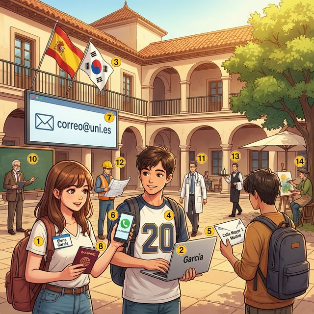

# 3. Mi identidad

## 1. Opener
**Objetivos de aprendizaje:**
- Presentarse formal e informalmente.
- Indicar el nombre, la edad, la nacionalidad y la profesión.
- Entender el sistema de nombres y el documento de identidad en España.

**¿Sabías que...?**
En España y en muchos países hispanohablantes, las personas tienen **dos apellidos**. El primero es el del padre y el segundo es el de la madre. Por ejemplo, si Juan García López y María Martínez Ruiz tienen una hija llamada Ana, su nombre completo será Ana García Martínez. ¡Es una excelente manera de mantener vivo el linaje de ambos padres!

---

## 2. Vocabulario Esencial
En esta sección aprenderemos las palabras fundamentales para hablar de nuestra identidad personal.

| # | Spanish | English Bridge | Korean Tip |
|:---:|:--- |:--- |:--- |
| 1 | nombre | Name ✅ | 'n' 발음 주의 |
| 2 | apellido | Appellation (→ surname) | 'll'은 'y'처럼 발음 |
| 3 | nacionalidad | Nationality ✅ | '-dad'는 여성 명사 |
| 4 | edad | Age (cf. Eternal → Etad) | 나이를 물을 때 사용 |
| 5 | dirección | Direction → Address | 주소를 나타냄 |
| 6 | teléfono | Telephone ✅ | 강세(é) 주의 |
| 7 | correo electrónico | Electronic Mail ✅ | 'email'로도 통함 |
| 8 | pasaporte | Passport ✅ | 's'가 하나임 |
| 9 | estudiante | Student ✅ | '-e'로 끝나 성별 동일 |
| 10 | profesor | Professor ✅ | 직업 앞 관사 생략 |
| 11 | médico | Medical → Doctor | 강세(é) 주의 |
| 12 | ingeniero | Engineer ✅ | 'g'는 'h' 발음 |
| 13 | camarero | Camera? No! → Waiter | '방'을 뜻하는 càmera에서 유래 |
| 14 | artista | Artist ✅ | '-ista'는 성별 동일 |

✅ 기호가 표시된 단어는 영어와 스펠링이 비슷하거나 의미가 같은 'Cognate'입니다.

---

## 3. Expresiones Útiles
Aquí tienes las frases clave para presentarte y preguntar por la identidad de otros.

- **¿Cómo te llamas?** (Informal) / **¿Cómo se llama usted?** (Formal)
  - What is your name?
- **Me llamo...** / **Mi nombre es...**
  - My name is...
- **¿De dónde eres?** / **¿De dónde es usted?**
  - Where are you from?
- **Soy de Corea del Sur.** / **Soy coreano.**
  - I am from South Korea. / I am Korean.
- **¿Cuántos años tienes?**
  - How old are you? (Literal: How many years do you have?)
- **Tengo veinticinco años.**
  - I am 25 years old.
- **¿A qué te dedicas?** / **¿Cuál es tu profesión?**
  - What do you do? / What is your profession?

---

## 4. Gramática Esencial

### 4.1 El verbo SER (to be)
Usamos **SER** para identificar a las personas, indicar la nacionalidad y la profesión (aspectos permanentes).

| 주어 | SER (현재형) | English Mapping |
|:--- |:--- |:--- |
| **yo** | soy | I am |
| **tú** | eres | you are (inf.) |
| **él / ella / usted** | es | he/she/it is, you are (fml.) |
| **nosotros / nosotras** | somos | we are |
| **vosotros / vosotras** | sois | you are (pl. inf.) |
| **ellos / ellas / ustedes** | son | they are, you are (pl. fml.) |

### 4.2 Nacionalidades y Género
Los adjetivos de nacionalidad cambian según el género.

- **Terminados en -o/-a:** coreano / coreana, mexicano / mexicana.
- **Terminados en consonante (+a):** español / española, alemán / alemana.
- **Terminados en -ense 또는 -í:** estadounidense, marroquí (igual para ambos).

**Korean Tip:** 스페인어에서 직업을 말할 때는 영어와 달리 부정관사(un/una)를 쓰지 않습니다. 예: "Soy profesor" (o) / "Soy un profesor" (x - 강조할 때만 사용).

---

## 5. Cultura Viva: El DNI y los Nombres
En España, el **DNI** (Documento Nacional de Identidad) es obligatorio a partir de los 14 años. Es una tarjeta inteligente que contiene tus datos y una foto.
Como mencionamos, los españoles tienen dos apellidos. En documentos oficiales, siempre verás: **Nombre + Primer Apellido + Segundo Apellido**.
- Ejemplo: *Pedro Almodóvar Caballero* (Almodóvar es el del padre, Caballero el de la madre).
Cuando se casan, las mujeres **no cambian su apellido** por el del marido, a diferencia de la cultura anglosajona.

**한국어 번역:**
스페인에서 DNI(국가 신분증)는 14세부터 의무적으로 소지해야 합니다. 이는 데이터와 사진이 포함된 스마트 카드입니다. 앞서 언급했듯이, 스페인 사람들은 두 개의 성을 가집니다. 공식 문서에서는 항상 '이름 + 첫 번째 성(부계) + 두 번째 성(모계)'의 순서로 표기됩니다. (예: 페드로 알모도바르 카바예로). 결혼하더라도 여성은 영미권 문화와 달리 남편의 성으로 바꾸지 않습니다.

---

## 6. Práctica

### A. Match the word
Match the Spanish word with its English equivalent.

| Spanish | English |
| :--- | :--- |
| 1. Apellido | a) Age |
| 2. Edad | b) Waiter |
| 3. Dirección | c) Surname |
| 4. Pasaporte | d) Address |
| 5. Camarero | e) Passport |

### B. Complete the sentences
Fill in the blanks with the correct form of the verb **SER**.

1. Yo ................ de Seúl.
2. ¿De dónde ................ tú?
3. Nosotros ................ estudiantes de español.
4. Ella ................ médica en un hospital grande.
5. Ellos ................ de España.

### C. 번역 연습
다음 문장을 스페인어로 번역하세요.

1. 제 이름은 마리아입니다.
2. 당신은 무엇을 합니까? (직업이 무엇입니까?)
3. 저는 20살입니다.
4. 우리는 한국인입니다.
5. 그는 엔지니어입니다.

---

## 7. Lectura 📖
**Mi nueva vida en Madrid**

Hola, me llamo Minho y soy de Corea del Sur. Ahora vivo en Madrid porque soy estudiante de intercambio en la universidad. Tengo veintiún años. Mi dirección en Madrid es Calle Mayor, número 10. Mi correo electrónico es minho@uni.es. En mi clase hay personas de muchas nacionalidades: una chica es de Francia y un chico es de Italia. ¡Madrid es una ciudad muy internacional!

**Preguntas:**
1. ¿De dónde es Minho?
2. ¿Qué hace Minho en Madrid?
3. ¿Cuántos años tiene?
4. ¿Cuál es su dirección?
5. ¿Hay personas de otras nacionalidades en su clase?

**한국어 번역:**
안녕하세요, 제 이름은 민호이고 한국 출신입니다. 저는 지금 대학 교환학생이라서 마드리드에 살고 있습니다. 저는 21살입니다. 마드리드 제 주소는 마요르 거리 10번지입니다. 제 이메일은 minho@uni.es입니다. 제 수업에는 프랑스에서 온 여학생과 이탈리아에서 온 남학생 등 다양한 국적의 사람들이 있습니다. 마드리드는 정말 국제적인 도시입니다!

---

## 8. Diálogo
**En la oficina de registro**

| Personaje | 스페인어 (ES) | 한국어 (KO) |
|:--- |:--- |:--- |
| **Empleado** | Buenos días. ¿Cuál es su nombre, por favor? | 좋은 아침입니다. 성함이 어떻게 되시나요? |
| **Sara** | Me llamo Sara García. | 사라 가르시아입니다. |
| **Empleado** | ¿Cuál es su primer apellido y su segundo apellido? | 첫 번째 성과 두 번째 성은 무엇인가요? |
| **Sara** | Mi primer apellido es García y el segundo es Martínez. | 첫 번째 성은 가르시아이고, 두 번째는 마르티네스입니다. |
| **Empleado** | Entiendo. ¿Cuántos años tiene usted? | 알겠습니다. 몇 살이신가요? |
| **Sara** | Tengo treinta años. | 30살입니다. |
| **Empleado** | ¿Y cuál es su nacionalidad? | 그리고 국적은 무엇인가요? |
| **Sara** | Soy mexicana. | 멕시코인입니다. |
| **Empleado** | Muy bien. Necesito su pasaporte, por favor. | 아주 좋습니다. 여권이 필요합니다. 부탁드려요. |
| **Sara** | Aquí tiene. | 여기 있습니다. |

---

## 9. Repaso
- [x] 'SER' 동사 변화를 완벽하게 외웠나요? (soy, eres, es, somos, sois, son)
- [x] 이름, 성, 나이, 국적을 묻고 답할 수 있나요?
- [x] 스페인의 '두 개의 성' 문화와 DNI의 개념을 이해했나요?
- [x] 직업 앞에 관사가 붙지 않는 규칙을 기억하나요?

---

## 10. Cierre
¡Felicidades! Ahora ya sabes cómo definir quién eres en español. La identidad es el primer paso para conectar con los demás. En el próximo capítulo, conoceremos a la familia y a los amigos para seguir ampliando tu mundo. ¡Sigue así!

---

## 11. Soluciones

**A. Match the word**
1-c, 2-a, 3-d, 4-e, 5-b

**B. Complete the sentences**
1. soy, 2. eres, 3. somos, 4. es, 5. son

**C. 번역 연습**
1. Me llamo María. / Mi nombre es María.
2. ¿A qué te dedicas? / ¿Cuál es tu profesión?
3. Tengo veinte años.
4. Somos coreanos.
5. Él es ingeniero.
