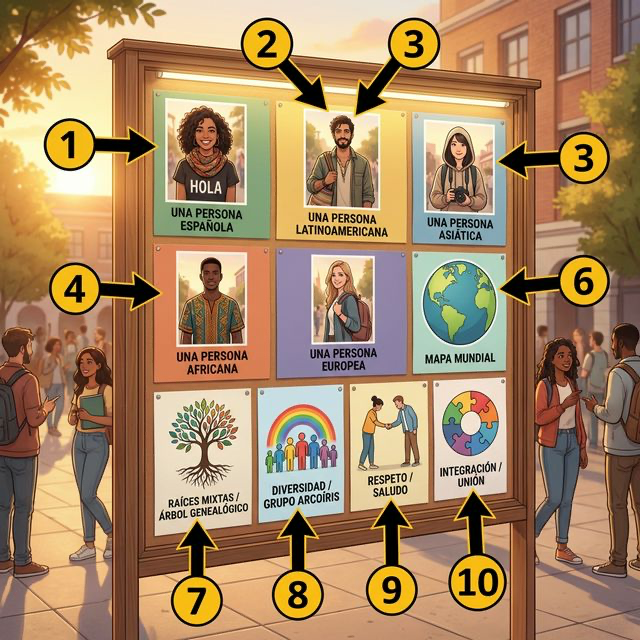
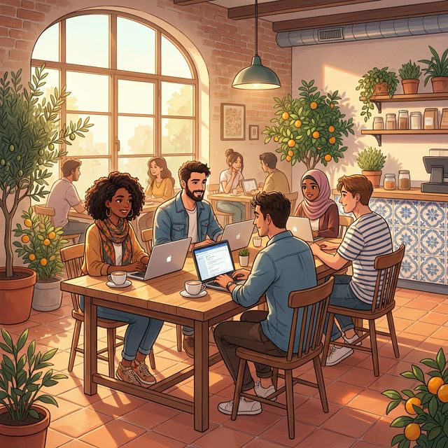

# Chapter 3: Mi identidad (A2)

Cervantes: §1 Identidad: datos personales (Nivel A2) - 이 장에서는 개인의 정체성을 구성하는 기본적인 정보들을 스페인어로 표현하는 방법을 학습합니다. 이름, 국적, 출신지 등 자신을 소개하는 데 필요한 핵심 어휘와 문법을 다룹니다.

## 1. Opener

**Identidades múltiples (다양한 정체성)**
A1에서 기본적인 이름과 국적을 배웠다면, A2에서는 더 나아가 우리의 배경과 뿌리, 그리고 현대 사회의 다문화적 정체성에 대해 다룹니다. 또한, 출신뿐만 아니라 과거의 배경을 설명하기 위한 'Ser' 동사의 과거형과 'Estar' 동사의 심화된 쓰임을 배웁니다.

### 학습 목표

- 다문화 및 인종, 배경 관련 고급 어휘 10개 습득
- 과거의 정체성을 표현하는 용법 (Ser - Imperfecto 기초)
- 'Ser' 동사와 'Origen(출처)' 표현의 심화
- 스페인의 다문화 사회와 이주민 문화 이해

> [!TIP]
> **¿Sabías que...?** 스페인은 역사적으로 다양한 문화(로마, 아랍, 유대 등)가 융합된 나라이며, 오늘날에는 중남미, 유럽, 아시아 등지에서 온 이민자들과 함께 더욱 다채로운 다문화 사회를 형성하고 있습니다.

---

## 2. Vocabulario Esencial

정체성의 다양성을 표현하기 위한 어휘들입니다. 삽화의 번호(①~⑩)가 아래 어휘 표와 정확히 대응됩니다.

| 번호 | Spanish | English Bridge | Korean Tip |
|:---:|:---|:---|:---|
| 1 | español / -a | Spanish ✅ | 기본 국적 |
| 2 | latinoamericano / -a | Latin American ✅ | '라티노'의 공식 명칭 |
| 3 | asiático / -a | Asian ✅ | '아시아티코' |
| 4 | africano / -a | African ✅ | '아프리카노' |
| 5 | europeo / -a | European ✅ | '에우로페오' |
| 6 | el mapa del mundo | World Map | 세상을 보는 창 |
| 7 | las raíces mixtas | Mixed Roots | Raíz(뿌리)에서 유래 |
| 8 | la diversidad | Diversity ✅ | 다양성이란 가치 |
| 9 | el respeto | Respect ✅ | 존중의 아이콘 |
| 10 | la integración | Integration ✅ | 함께 어우러짐 |

✅ 표시된 단어는 영어와 거의 동일하거나 어원이 같아 기억하기 쉬운 어휘입니다.

---

## 3. Expresiones Útiles

나와 타인의 배경에 대해 더 깊이 있게 질문하고 답하는 표현들입니다.

### A. 배경/뿌리 표현

- **Mis padres son de origen peruano.** (My parents are of Peruvian origin. / 부모님의 뿌리는 페루예요.)
- **Tengo doble nacionalidad.** (I have dual nationality. / 저는 이중 국적입니다.)
  - 💡 **English Bridge**: "Doble" = Double ✅, "Nacionalidad" = Nationality ✅ — perfect cognates!

### B. 감정/자부심 표현

- **Me siento orgulloso de mis raíces.** (I feel proud of my roots. / 저는 제 뿌리가 자랑스러워요.)
- **España es un país multicultural.** (Spain is a multicultural country. / 스페인은 다문화 국가입니다.)
- **Él se ha integrado muy bien.** (He has integrated very well. / 그는 매우 잘 적응했어요.)

### C. 출신 질문하기

- **¿Cuáles son tus orígenes?** (What are your origins? / 당신의 뿌리는 무엇인가요?)

---

## 4. Gramática Esencial

### 1. Ser 동사와 출신(Origen)의 심화 표현

단순히 "어디 출신이다"를 넘어, 배경을 설명할 때 사용하는 구조입니다.

**English Bridge**: English uses "from" for origin — "I am **from** Seoul." Spanish has **three levels** of expressing origin, from simple to nuanced:

- **Ser de + [Country/City]**: *Soy de Seúl.* (가장 기본 — I am from Seoul.)
- **Ser de origen + [Adjective]**: *Ella es de origen árabe.* (그녀는 아랍계이다 — She is of Arab origin.)
- **Tener raíces en + [Place]**: *Tengo raíces en Galicia.* (내 뿌리는 갈리시아에 있다 — I have roots in Galicia.)

### 2. 과거의 정체성 표현: Ser 동사 불완료 과거 (Imperfecto)

과거에 내가 누구였는지, 어떤 사람이었는지 묘사할 때 사용합니다.

**English Bridge**: English uses "was/were" for past states — "I **was** shy." Spanish Imperfecto works similarly: it describes **ongoing past states**, not completed events.

<table class="conjugation-table">
  <thead>
    <tr>
      <th>주어 (Subject)</th>
      <th>ser (Imperfecto)</th>
      <th>English</th>
    </tr>
  </thead>
  <tbody>
    <tr>
      <td>yo</td>
      <td><strong>era</strong></td>
      <td>I was / used to be</td>
    </tr>
    <tr>
      <td>tú</td>
      <td><strong>eras</strong></td>
      <td>you were</td>
    </tr>
    <tr>
      <td>él/ella/usted</td>
      <td><strong>era</strong></td>
      <td>he/she was</td>
    </tr>
    <tr>
      <td>nosotros/as</td>
      <td><strong>éramos</strong></td>
      <td>we were</td>
    </tr>
    <tr>
      <td>vosotros/as</td>
      <td><strong>erais</strong></td>
      <td>you all were</td>
    </tr>
    <tr>
      <td>ellos/ellas/ustedes</td>
      <td><strong>eran</strong></td>
      <td>they were</td>
    </tr>
  </tbody>
</table>

> 💡 **Pattern**: `ser` Imperfecto is irregular — the stem `er-` is completely different from Presente `so-/s-`. Note that **yo** and **él/ella** share the same form: **era**.

### 3. 현재 시제 (Presente) 필수 불규칙 동사

정체성을 표현할 때 자주 쓰이는 현재 시제 불규칙 동사들입니다.

<table class="conjugation-table">
  <thead>
    <tr>
      <th>주어</th>
      <th>saber (알다)</th>
      <th>poder (수있다)</th>
      <th>tender (경향있다)</th>
    </tr>
  </thead>
  <tbody>
    <tr>
      <td>yo</td>
      <td><strong>sé</strong></td>
      <td><strong>puedo</strong></td>
      <td><strong>tiendo</strong></td>
    </tr>
    <tr>
      <td>tú</td>
      <td>sabes</td>
      <td>puedes</td>
      <td>tiendes</td>
    </tr>
    <tr>
      <td>él/ella/ud.</td>
      <td>sabe</td>
      <td>puede</td>
      <td>tiende</td>
    </tr>
    <tr>
      <td>nosotros/as</td>
      <td>sabemos</td>
      <td>podemos</td>
      <td>tendemos</td>
    </tr>
    <tr>
      <td>vosotros/as</td>
      <td>sabéis</td>
      <td>podéis</td>
      <td>tendéis</td>
    </tr>
    <tr>
      <td>ellos/ellas/uds.</td>
      <td>saben</td>
      <td>pueden</td>
      <td>tienden</td>
    </tr>
  </tbody>
</table>

### 4. 과거 분사 (Participio) 필수 불규칙

현재 완료나 수동적 의미로 쓰이는 필수 과거 분사 불규칙 8선입니다.

<table class="conjugation-table">
  <thead>
    <tr>
      <th>동사 원형</th>
      <th>과거 분사</th>
      <th>동사 원형</th>
      <th>과거 분사</th>
    </tr>
  </thead>
  <tbody>
    <tr>
      <td>hacer (하다)</td>
      <td><strong>hecho</strong></td>
      <td>poner (두다)</td>
      <td><strong>puesto</strong></td>
    </tr>
    <tr>
      <td>escribir (쓰다)</td>
      <td><strong>escrito</strong></td>
      <td>decir (말하다)</td>
      <td><strong>dicho</strong></td>
    </tr>
    <tr>
      <td>volver (돌아오다)</td>
      <td><strong>vuelto</strong></td>
      <td>abrir (열다)</td>
      <td><strong>abierto</strong></td>
    </tr>
    <tr>
      <td>leer (읽다)</td>
      <td><strong>leído</strong></td>
      <td>romper (깨다)</td>
      <td><strong>roto</strong></td>
    </tr>
  </tbody>
</table>

> [!IMPORTANT]
> **Korean Tip**: "나는 어릴 때 부끄러움이 많았어(Cuando **era** pequeño, **era** tímido)"처럼 과거의 나를 묘사할 때 'era'를 사용합니다. 현재의 'soy'와 대조하며 연습해 보세요.

---

## 5. Cultura Viva: Los "Expats" y la diversidad en España 🌍

스페인의 다문화적 변화와 그 안에서 살아가는 외국인들에 대해 알아봅시다.

### España: Un crisol de culturas (스페인: 문화의 용광로)

En los últimos veinte años, España ha cambiado mucho. El país ha pasado de ser un lugar de donde la gente salía para trabajar a ser un destino muy popular para personas de todo el mundo. Hoy en día, ciudades como Madrid, Barcelona, Valencia y Málaga son centros internacionales. Los "expats" (extranjeros que trabajan fuera de su país) eligen España por su calidad de vida, su clima y su gente abierta.

Esto ha creado una sociedad donde la **diversidad** es la norma. Es muy común encontrar niños con **raíces mixtas** en las escuelas o barrios donde se hablan muchos idiomas diferentes. La **integración** es un proceso importante y, aunque a veces es difícil, los españoles valoran mucho el **respeto** y la convivencia. Muchos latinoamericanos se sienten como en casa por el idioma, mientras que europeos y otros prefieren el estilo de vida mediterráneo.

**[한국어 번역]**
지난 20년 동안 스페인은 많이 변했습니다. 스페인은 사람들이 일자리를 찾아 떠나던 나라에서 이제는 전 세계 사람들이 모여드는 매우 인기 있는 목적지가 되었습니다. 오늘날 마드리드, 바르셀로나, 발렌시아, 말라가 같은 도시들은 세계적인 중심지가 되었습니다. "Expats(국외 거주자)"들은 삶의 질, 기후, 그리고 개방적인 사람들 때문에 스페인을 선택합니다.

이로 인해 **다양성이(diversidad)** 일상이 된 사회가 만들어졌습니다. 학교에서 **다양한 뿌리를(raíces mixtas)** 가진 아이들을 만나거나, 여러 언어가 들리는 동네를 보는 것은 매우 흔한 일입니다. **통합은(integración)** 중요한 과정이며 때로는 어렵기도 하지만, 스페인 사람들은 **존중과(respeto)** 공존을 매우 가치 있게 여깁니다.

---

## 6. Práctica

### A. ¿Soy o Era? (문맥에 맞게 현재 또는 과거형을 선택하세요)

1. Ahora (soy / era) estudiante de medicina en Madrid.
2. Cuando (soy / era) pequeño, (soy / era) muy bajo.
3. Mi padre (es / era) profesor de historia antes de jubilarse.
4. Nosotros (somos / éramos) amigos desde la infancia.
5. ¿Tú (eres / eras) el chico que vivía al lado de mi casa?

### B. Origen y Nacionalidad (빈칸을 올바르게 완성하세요)

1. Mis abuelos son de origen ______________________.
2. Tengo ______________________ nacionalidad.
3. Carmen es de origen ______________________.
4. Me siento ______________________ de ser coreano.
5. En este barrio hay mucha ______________________.

### C. 번역 연습 (스페인어로 옮겨보세요)

1. 나는 어릴 때 매우 수줍음이 많았어(tímido).
   (............................................................)
2. 내 부모님은 멕시코계 배경(origen)을 가지고 계셔.
   (............................................................)
3. 스페인은 정말 다문화적인 나라야.
   (............................................................)
4. 우리는 학교에서 다른 문화권 친구들과 잘 어울려(integrarse).
   (............................................................)
5. 당신의 가족적인 뿌리(raíces)는 어디인가요?
   (............................................................)

---

## 7. Lectura 📖

### La historia de Ricardo

Me llamo Ricardo y mi historia es un poco complicada. Nací en Buenos Aires, pero mis abuelos **eran** de Italia y España. Por eso, me siento orgulloso de mis **raíces mixtas**. Ahora vivo en Valencia y trabajo como arquitecto. Me he **integrado** perfectamente en la ciudad porque la gente es muy acogedora. Para mí, la **diversidad** es una riqueza y creo que el **respeto** es la base de todo.

### Preguntas (질문)

1. ¿De dónde eran los abuelos de Ricardo? (리카르도의 조부모님은 어디 분이셨나요?)
2. ¿Cómo se siente Ricardo sobre sus raíces? (그는 자신의 뿌리에 대해 어떻게 느끼나요?)
3. ¿Por qué se ha integrado bien en Valencia? (왜 발렌시아에 잘 적응했나요?)

**[한국어 번역]**

#### 리카르도의 이야기

제 이름은 리카르도이고 제 이야기는 조금 복잡합니다. 저는 부에노스아이레스에서 태어났지만, 제 조부모님은 이탈리아와 스페인 분이셨습니다. 그래서 저는 제 **혼합된 뿌리가(raíces mixtas)** 자랑스럽습니다. 지금 저는 발렌시아에 살며 건축가로 일하고 있습니다. 사람들이 매우 친절하기 때문에 저는 이 도시에서 완벽하게 **적응했습니다(integrado)**. 저에게 **다양성은(diversidad)** 풍요로움이며, **존중이(respeto)** 모든 것의 기초라고 믿습니다.

---

## 8. Diálogo

### ¿De dónde son tus abuelos? (할아버지, 할머니는 어디 분이셔?)

**Situación:** Mateo y Sara están hablando sobre sus familias en un café. Sara nota que Mateo tiene apellidos que no suenan muy españoles y le pregunta por sus antepasados.

**상황:** 마테오와 사라는 카페에서 가족 이야기를 나누고 있습니다. 사라는 마테오의 성(apellido)이 스페인 이름처럼 들리지 않는다는 것을 알아차리고 조상들에 대해 묻습니다.

<table class="dialogue-table">
  <thead>
    <tr>
      <th>🇪🇸 Español</th>
      <th>🇰🇷 한국어</th>
    </tr>
  </thead>
  <tbody>
    <tr>
      <td><strong>Sara:</strong> Mateo, tu apellido es curioso. ¿Cuál es tu origen?</td>
      <td><strong>사라:</strong> 마테오, 네 성이 특이해. 배경이 어떻게 되니?</td>
    </tr>
    <tr>
      <td><strong>Mateo:</strong> Tienes razón. Mis antepasados <strong>eran</strong> alemanes.</td>
      <td><strong>마테오:</strong> 맞아. 내 조상들은 독일 분들이셨어.</td>
    </tr>
    <tr>
      <td><strong>Sara:</strong> ¡Qué interesante! ¿Tienes raíces alemanas entonces?</td>
      <td><strong>사라:</strong> 정말 흥미롭다! 그럼 독일인의 뿌리가 있는 거네?</td>
    </tr>
    <tr>
      <td><strong>Mateo:</strong> Sí, pero mi madre es de origen argentino.</td>
      <td><strong>마테오:</strong> 응, 하지만 우리 어머니는 아르헨티나계셔.</td>
    </tr>
    <tr>
      <td><strong>Sara:</strong> ¡Vaya! Tienes una identidad muy multicultural.</td>
      <td><strong>사라:</strong> 와! 정말 다문화적인 정체성을 가지고 있구나.</td>
    </tr>
    <tr>
      <td><strong>Mateo:</strong> Sí, me encanta la diversidad de mi familia.</td>
      <td><strong>마테오:</strong> 맞아, 우리 가족의 다양성이 정말 좋아.</td>
    </tr>
    <tr>
      <td><strong>Sara:</strong> Yo también soy de origen mixto. Mi padre es francés.</td>
      <td><strong>사라:</strong> 나도 혼혈 배경이 있어. 우리 아버지는 프랑스 분이야.</td>
    </tr>
    <tr>
      <td><strong>Mateo:</strong> ¡Genial! Al final, todos somos ciudadanos del mundo.</td>
      <td><strong>마테오:</strong> 멋지다! 결국 우리는 모두 세계 시민이네.</td>
    </tr>
  </tbody>
</table>

---

## 9. Repaso

이 장에서 배운 내용을 확인해 보세요:

- [ ] 다문화 사회와 관련된 어휘(**diversidad, integración, respeto** 등)를 안다.
- [ ] **Ser** 동사의 불완료 과거(**era, eras, era, éramos, erais, eran**)를 사용하여 과거의 상태를 묘사할 수 있다.
- [ ] '**Ser de origen**'과 '**Tener raíces en**'을 사용하여 배경을 설명한다.
- [ ] **yo**와 **él/ella** 형태가 같다는 점(**era**)을 이해했다.
- [ ] 스페인 사회의 다문화화와 **Expats**의 특징을 이해한다.

---

## 10. Cierre

¡Fantástico! 🎉 이제 여러분은 단순한 호구조사를 넘어, 한 사람의 깊은 뿌리와 정체성의 다양성까지 스페인어로 심도 있게 이야기할 수 있게 되었습니다.

정체성은 고정된 것이 아니라 과거와 현재가 섞인 '이야기'와 같다는 점을 배웠습니다. `ser` 동사가 현재형(`soy`)에서 불완료 과거(`era`)로 바뀌면 "나는 ~이다"가 "나는 ~였다"로 변한다는 것을 기억하세요.

다음 장에서는 이 정체성을 함께 공유하는 가장 소중한 사람들, '**가족과 친구들**'에 대해 배우며 풍성한 대화를 나누어 보겠습니다. ¡Hasta pronto!

---

## 11. Soluciones

### 6. Práctica - A. ¿Soy o Era?

1. 1. soy
2. 1. era, era
3. 1. era
4. 1. somos
5. 1. eras

### 6. Práctica - B. Origen y Nacionalidad

1. 1. andaluz / italiano / español
2. 1. doble
3. 1. colombiano / mexicano
4. 1. orgulloso
5. 1. diversidad

### 6. Práctica - C. 번역 연습

1. 1. Cuando era pequeño, era muy tímido.
2. 1. Mis padres son de origen mexicano.
3. 1. España es un país realmente multicultural.
4. 1. Nos integramos bien con amigos de otras culturas en la escuela.
5. 1. ¿Dónde están tus raíces familiares?

### 7. Lectura - Preguntas

1. 1. Eran de Italia y España.
2. 1. Se siente orgulloso de sus raíces mixtas.
3. 1. Porque la gente es muy acogedora.
