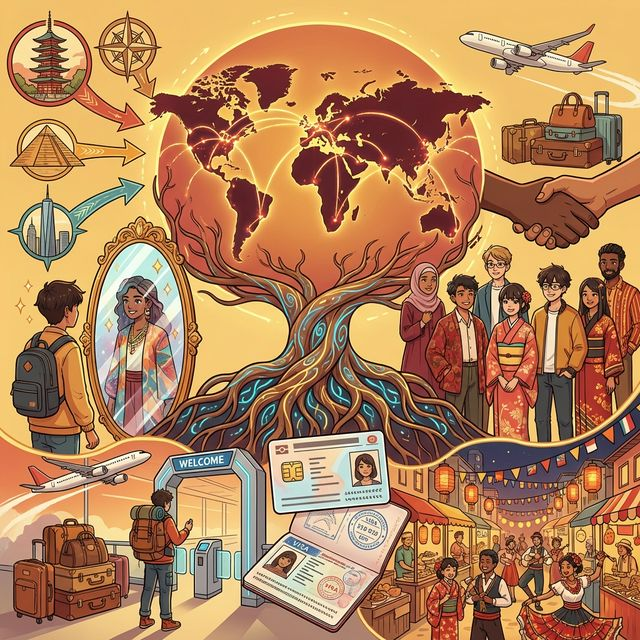
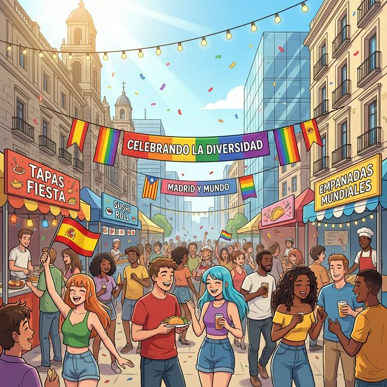

# 3. Mi identidad

## 1. Opener
**Objetivos de aprendizaje:**
- Profundizar en el concepto de identidad personal y colectiva.
- Discutir temas de inmigración, diversidad y ciudadanía.
- Explicar trayectorias personales y orígenes multiculturales.

**한국어 번역:**
- 개인적 및 집단적 정체성의 개념 심화하기.
- 이민, 다양성 및 시민권 문제 논의하기.
- 개인적인 궤적과 다문화적 기원 설명하기.

**¿Sabías que...?**
España se ha transformado en las últimas décadas en una sociedad altamente **multicultural**. Más del 12% de la población actual es de origen extranjero. Esto ha enriquecido la gastronomía, la música y la lengua, creando una identidad española moderna que es diversa y abierta al mundo.

**한국어 번역:**
스페인은 지난 수십 년 동안 고도의 다문화 사회로 변모해 왔습니다. 현재 인구의 12% 이상이 외국인 출신입니다. 이는 요리, 음악, 언어를 풍요롭게 했으며, 다양하고 세계에 열려 있는 현대 스페인 정체성을 형성했습니다.

---

## 2. Vocabulario Esencial
A nivel A2, exploramos términos más abstractos y relacionados con la integración social y la historia personal.

**한국어 번역:**
A2 단계에서는 보다 추상적이며 사회 통합 및 개인사와 관련된 용어들을 탐구합니다.

| # | Spanish | English Bridge | Korean Tip |
|:---:|:--- |:--- |:--- |
| 1 | origen | Origin ✅ | 발음(o-rí-hen) 주의 |
| 2 | identidad | Identity ✅ | '-dad' 성별 주의 |
| 3 | raíces | Roots (cf. Radical) | 정체성의 근원 |
| 4 | diversidad | Diversity ✅ | 사회적 다양성 |
| 5 | integración | Integration ✅ | 강세(ó) 필수 |
| 6 | inmigración | Immigration ✅ | 'n'이 하나임 (inmi-) |
| 7 | extranjero | Stranger? No! → Foreigner | '외부의'라는 뜻의 Extra에서 유래 |
| 8 | ciudadanía | Citizenship (cf. City → Ciudad) | 시민권 또는 시민 의식 |
| 9 | visado | Visa ✅ | '비자' 문서 |
| 10 | multicultural | Multicultural ✅ | 형용사/명사 동일 |

✅ 기호가 표시된 단어는 영어와 스펠링이 비슷하거나 의미가 같은 'Cognate'입니다.

---

## 3. Expresiones Útiles
Frases para describir tu historia y tus sentimientos hacia tu identidad.
(여러분의 역사와 정체성에 대한 감정을 설명하는 데 필요한 표현들입니다.)

- **¿Cuáles son tus raíces?**
  - What are your roots? (여러분의 뿌리는 어디인가요?)
- **Mis padres son de... pero yo nací en...**
  - My parents are from... but I was born in... (제 부모님은 ... 출신이시지만, 저는 ...에서 태어났습니다.)
- **Me siento muy integrado/a en esta cultura.**
  - I feel very integrated into this culture. (저는 이 문화에 매우 잘 통합되어 있다고 느낍니다.)
- **Solicitar el visado o la ciudadanía.**
  - To apply for a visa or citizenship. (비자 또는 시민권을 신청하다.)
- **La diversidad enriquece a la sociedad.**
  - Diversity enriches society. (다양성은 사회를 풍요롭게 합니다.)
- **Tener doble nacionalidad.**
  - To have dual nationality. (이중 국적을 가지다.)

---

## 4. Gramática Esencial

### 4.1 Repaso de Identidad y Verbos de Cambio
Para hablar de la identidad que cambia o se adquiere, usamos verbos como **Hacerse** o **Llegar a ser**.
(변하거나 획득되는 정체성에 대해 말할 때는 **Hacerse** 나 **Llegar a ser** 와 같은 동사를 사용합니다.)

| Verbo | Contexto | Ejemplo |
|:--- |:--- |:--- |
| **Hacerse** | Cambio voluntad/esfuerzo (profesión/ideología) | *Se hizo ciudadano español.* |
| **Llegar a ser** | Resultado de un proceso largo | *Llegó a ser un artista famoso.* |

### 4.2 Adjetivos Gentilicios (Gentilics)
A2 requiere conocer gentilicios más complejos o irregulares.

- **Madrid:** madrileño/a
- **Barcelona:** barcelonés/a
- **Costa Rica:** costarricense
- **EE. UU.:** estadounidense
- **Cádiz:** gaditano/a (Irregular)

**Korean Tip:** 'nacimiento'(출생)와 'origen'(기원)의 차이를 이해하는 것이 중요합니다. "Soy de Corea"는 현재의 소속을, "Mi origen es coreano"는 뿌리나 혈통을 강조할 때 더 자주 쓰입니다.

---

## 5. Cultura Viva: La España Multicultural
La inmigración en España no es un fenómeno nuevo, pero su intensidad sí lo es. Grupos procedentes de **América Latina, Marruecos y Rumanía** son los más numerosos. Esta mezcla ha dado lugar a una "identidad híbrida". Muchos jóvenes hoy se definen como "nuevos españoles", manteniendo las tradiciones de sus padres mientras participan plenamente en la vida social y política de España. La celebración del **Día de la Hispanidad** (12 de octubre) es un momento para reflexionar sobre este pasado y presente compartido.

**한국어 번역:**
스페인으로의 이민은 새로운 현상은 아니지만, 그 강도는 매우 거세졌습니다. 라틴 아메리카, 마그레브(북아프리카), 동유럽 출신 그룹이 가장 많습니다. 이러한 혼합은 '하이브리드 정체성'을 탄생시켰습니다. 오늘날 많은 젊은이들은 부모의 전통을 유지하면서도 스페인의 사회적, 정치적 삶에 완전히 참여하며 스스로를 '새로운 스페인 사람'으로 정의합니다. 10월 12일 '이스파니나드의 날(Día de la Hispanidad)'은 이러한 공유된 과거와 현재를 되새기는 시간입니다.

---

## 6. Práctica

### A. Match the word
Match the Spanish word with its English equivalent.

| Spanish | English |
| :--- | :--- |
| 1. Raíces | a) Citizenship |
| 2. Extranjero | b) Roots |
| 3. Ciudadanía | c) Visa |
| 4. Visado | d) Integration |
| 5. Integración | e) Foreigner |

### B. Complete the sentences
Fill in the blanks with the correct vocabulary word.

1. La ................ es importante para vivir en armonía con personas de otros países.
2. Él no es de aquí, es ................
3. Para viajar a algunos países necesito un ................
4. Mis ................ son coreanas, aunque vivo en Chile.
5. La ................ de una persona se forma con su cultura y sus experiencias.

### C. 번역 연습
다음 문장을 스페인어로 번역하세요.

1. 제 부모님은 멕시코 출신입니다.
2. 저는 이 나라에 매우 잘 통합되어 있다고 느낍니다.
3. 다양성은 사회를 풍요롭게 합니다.
4. 그는 스페인 시민권을 신청했습니다.
5. 저는 이중 국적을 가지고 있습니다.

---

## 7. Lectura 📖
**Identidades sin fronteras**

Elena es una joven que vive en Barcelona. Su padre es de Argentina y su madre es de Japón, pero ella nació en España. "¿Cuál es mi identidad?", se pregunta Elena a menudo. Ella habla español, japonés y catalán. En su casa, comen sushi y también asado argentino. Elena cree que su origen multicultural es una ventaja porque le permite entender diferentes puntos de vista. "No soy solo de un lugar, soy ciudadana del mundo", dice con orgullo.

**Preguntas:**
1. ¿Dónde vive Elena y cuál es el origen de sus padres?
2. ¿Qué idiomas habla ella?
3. ¿Qué comen en su casa?
4. ¿Por qué cree Elena que su origen es una ventaja?
5. ¿Cómo se define ella al final del texto?

**한국어 번역:**
바르셀로나에 사는 젊은 여성 엘레나는 아버지가 아르헨티나인이고 어머니가 일본인이지만, 본인은 스페인에서 태어났습니다. "나의 정체성은 무엇인가?"라고 엘레나는 자주 스스로에게 묻습니다. 그녀는 스페인어, 일본어, 카탈루냐어를 합니다. 그녀의 집에서는 스시와 아르헨티나식 아사도(바비큐)를 모두 먹습니다. 엘레나는 자신의 다문화적 배경이 다양한 관점을 이해할 수 있게 해주기 때문에 장점이라고 믿습니다. "나는 단지 한 곳 출신이 아니라, 세계 시민입니다"라고 그녀는 자랑스럽게 말합니다.

---

## 8. Diálogo
**Hablando de los orígenes**

| Personaje | 스페인어 (ES) | 한국어 (KO) |
|:--- |:--- |:--- |
| **Marco** | Qué nombre tan interesante tienes, Lucía. ¿De dónde es tu familia? | 루시아, 이름이 아주 흥미롭네. 가족이 어디 출신이야? |
| **Lucía** | Gracias, Marco. Mis raíces son italianas por parte de mi abuelo, pero mi madre es colombiana. | 고마워, 마르코. 할아버지 쪽 뿌리는 이탈리아인이지만, 어머니는 콜롬비아인이야. |
| **Marco** | ¡Vaya mezcla! ¿Y tú dónde naciste? | 와, 대단한 혼혈이네! 그럼 너는 어디서 태어났어? |
| **Lucía** | Yo nací en Madrid, así que tengo la ciudadanía española y también la colombiana. | 나는 마드리드에서 태어났어. 그래서 스페인 시민권과 콜롬비아 시민권을 모두 가지고 있지. |
| **Marco** | Eso es genial. ¿Te sientes más española o colombiana? | 그거 멋지다. 스페인 사람이라고 느껴, 아니면 콜롬비아 사람이라고 느껴? |
| **Lucía** | Me siento una mezcla de ambas. No puedo elegir una sola identidad. | 두 가지가 섞인 기분이야. 단 하나의 정체성만 고를 수는 없어. |

---

## 9. Repaso
- [x] 'origen', 'raíces', 'diversidad' 등 추상적인 정체성 어휘를 익혔나요?
- [x] 'hacerse'와 'llegar a ser'의 차이를 이해했나요?
- [x] 주요 Gentilicios(출신지 형용사)를 알고 있나요?
- [x] 스페인의 다문화적 사회 특성을 이해했나요?

---

## 10. Cierre
La identidad no es algo estático, sino algo que construimos cada día con nuestras acciones y relaciones. Entender tus orígenes te da la fuerza para enfrentar el futuro. En el próximo capítulo, exploraremos el núcleo de nuestra vida: la familia y los amigos. ¡Buen trabajo!

---

## 11. Soluciones

**A. Match the word**
1-b, 2-e, 3-a, 4-c, 5-d

**B. Complete the sentences**
1. integración, 2. extranjero, 3. visado, 4. raíces, 5. identidad

**C. 번역 연습**
1. Mis padres son de México. / El origen de mis padres es mexicano.
2. Me siento muy integrado/a en este país.
3. La diversidad enriquece a la sociedad.
4. Él solicitó la ciudadanía española.
5. Tengo doble nacionalidad.

**D. Lectura Questions (독해 정답)**
1. Vive en Barcelona. Su padre es de Argentina y su madre es de Japón. (바르셀로나에 삽니다. 아버지는 아르헨티나인이고 어머니는 일본인입니다.)
2. Habla español, japonés y catalán. (스페인어, 일본어, 카탈루냐어를 합니다.)
3. Comen sushi y asado argentino. (스시와 아르헨티나식 아사도(바비큐)를 먹습니다.)
4. Porque le permite entender diferentes puntos de vista. (다양한 관점을 이해할 수 있게 해주기 때문입니다.)
5. Se define como ciudadana del mundo. ('세계 시민'으로 자신을 정의합니다.)
