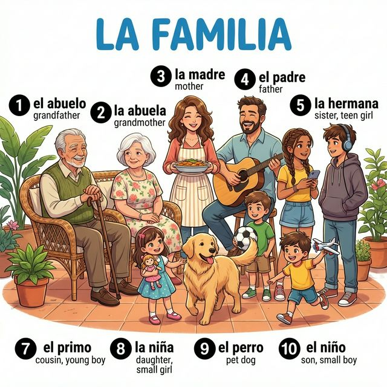
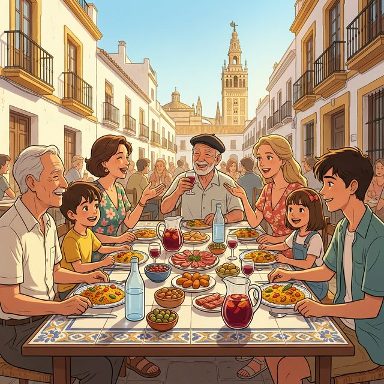

# Chapter 4: Familia y amigos (A1)

Cervantes: §4 Relaciones personales: 가족 구성원 명칭 및 기본적인 사회적 관계 표현

## 1. Opener
**La familia es lo primero (가족이 최우선입니다)**  
스페인어권 문화에서 가족은 삶의 중심이자 가장 중요한 사회적 단위입니다. 이번 장에서는 가족 구성원의 이름을 배우고, 지시사와 소유사를 활용해 나의 소중한 사람들을 소개하는 방법을 익힙니다. 또한 스페인의 특별한 일요일 가족 식사 문화인 'Comida familiar'에 대해서도 알아봅니다.

**학습 목표**
- 가족 및 친척 명칭 15개 이상 습득
- 지시형용사(este, esta 등)와 소유형용사(mi, tu 등)의 정교한 활용
- 가족의 나이와 생일을 묻고 답하기
- 스페인의 가족 중심 문화와 축제 이해

> [!TIP]
> **¿Sabías que...?** 스페인 사람들은 보통 두 개의 성(Apellido)을 가집니다. 첫 번째 성은 아버지로부터, 두 번째 성은 어머니로부터 물려받습니다. 공식 문서에서는 두 성을 모두 사용하지만, 일상에서는 주로 첫 번째 성만 부르기도 합니다.

---

## 2. Vocabulario Esencial: La Familia
따뜻한 스페인 가정의 거실 풍경입니다. 번호와 매칭되는 단어를 확인하며 가족 명칭을 익혀보세요.

| # | Spanish | English Bridge | Korean Tip |
| :--- | :--- | :--- | :--- |
| 1 | **el abuelo** | — | 할아버지 |
| 2 | **la abuela** | — | 할머니 |
| 3 | **la madre (mamá)** | **Maternal** ✅ (→ mother-related) | 어머니 (엄마) |
| 4 | **the padre (papá)** | **Paternal** ✅ (→ father-related) | 아버지 (아빠) |
| 5 | **la hermana** | — | 여자 형제 (누나/언니/여동생) |
| 6 | **el hermano** | — | 남자 형제 (형/오빠/남동생) |
| 7 | **el primo** | **Primary** (First social contact) | 사촌 (남자) |
| 8 | **la niña / la hija** | — | 소녀 / 딸 |
| 9 | **el perro** | — | 개 (강아지) - 반려 동물도 가족! |
| 10 | **el niño / el hijo** | — | 소년 / 아들 |

✅ 표시된 단어는 영어와 어원이 같거나 매우 유사한 'Cognates'입니다.

---

## 3. Expresiones Útiles
가족과 친구를 소개하고 관계를 설명할 때 사용하는 핵심 표현입니다.

**A. 가족 소개하기**
- **Este es mi padre.** (This is my father. / 이분은 나의 아버지입니다.)
- **Esta es mi madre.** (This is my mother. / 이분은 나의 어머니입니다.)
- **Estos son 내 형제들.** (These are my brothers. / 이들은 나의 형제들입니다.)
- **¿Quién은 에사 치카?** (Who is that girl? / 저 소녀는 누구니?)

**B. 나이와 관계 묻기**
- **¿Cuántos hermanos tienes?** (How many siblings do you have? / 형제가 몇 명이니?)
- **Tengo dos hermanos y una hermana.** (I have two brothers and one sister. / 나는 남동생 둘과 여동생 하나가 있어.)
- **¿Cómo se llama tu primo?** (What is your cousin's name? / 네 사촌 이름이 뭐니?)
- **Él se llama Diego.** (His name is Diego. / 그의 이름은 디에고야.)

---

## 4. Gramática Esencial
이번 장에서는 소유와 지칭을 위한 핵심 문법인 소유형용사와 지시형용사를 배웁니다.

### A. 소유형용사 (Adjetivos Posesivos) - 전치형
명사 앞에 위치하여 '나의', '너의' 등의 소유를 나타냅니다. 수식하는 명사의 **수(단수/복수)**에 따라 형태가 변하며, nosotros와 vosotros의 경우 **성(남성/여성)**까지 일치시켜야 합니다.

| 주어 | 단수 (My/Your...) | 복수 (My/Your...) |
| :--- | :--- | :--- |
| **yo** | mi | mis |
| **tú** | tu | tus |
| **él/ella/usted** | su | sus |
| **nosotros/as** | nuestro / nuestra | nuestros / nuestras |
| **vosotros/as** | vuestro / vuestra | vuestros / vuestras |
| **ellos/ellas/ustedes** | su | sus |

**Korean Tip!**
한국어에서는 "우리 엄마", "우리 집"처럼 복수형을 즐겨 쓰지만, 스페인어에서는 철저히 개별 소유를 따집니다. 나 혼자만의 어머니라면 *nuestra madre*가 아니라 *mi madre*라고 해야 합니다.

### B. 지시형용사 (Adjetivos Demostrativos)
가까이 있거나 멀리 있는 것을 가리킬 때 사용합니다. 영어의 this/that에 해당하며, 명사의 **성(남성/여성)과 수(단수/복수)**에 모두 일치해야 합니다.

| 거리 | 남성 단수 (This/That) | 여성 단수 (This/That) | 남성 복수 (These/Those) | 여성 복수 (These/Those) |
| :--- | :--- | :--- | :--- | :--- |
| **가까움 (여기)** | este | esta | estos | estas |
| **중간 (거기)** | ese | esa | esos | esas |
| **멂 (저기)** | aquel | aquella | aquellos | aquellas |

---

## 5. Cultura Viva: La Comida Familiar de Domingo
스페인에서 일요일 오후는 가족이 하나로 뭉치는 성스러운 시간입니다.

En España, la familia es el pilar de la sociedad. Una de las tradiciones más vivas es la comida familiar de los domingos. A partir de las 두 시 o 세 시 de la tarde, varias generaciones (abuelos, padres, hijos y primos) se reúnen alrededor de una mesa grande. Normalmente se sirve paella, asado o una gran variedad de tapas.

Lo más importante no es solo la comida, sino la **sobremesa**. La sobremesa es el tiempo que se pasa hablando después de comer, relajadamente, con café o postre. Puede durar horas. Es el momento de compartir noticias, reír y fortalecer los lazos familiares. Esta cultura demuestra el carácter sociable y cariñoso de los españoles.

**[한국어 번역]**
스페인에서 가족은 사회의 기둥입니다. 가장 살아있는 전통 중 하나는 일요일의 가족 식사입니다. 오후 2시나 3시부터 여러 세대(조부모, 부모, 자녀, 사촌)가 큰 탁자에 둘러앉습니다. 보통 파에야, 구이 요리 또는 다양한 타파스가 제공됩니다.

가장 중요한 것은 음식뿐만 아니라 **소브레메사(sobremesa)**입니다. 소브레메사는 식사를 마친 후 커피나 디저트를 곁들이며 여유롭게 이야기를 나누는 시간입니다. 이 시간은 몇 시간 동안 지속될 수 있습니다. 소식을 공유하고 웃으며 가족 간의 유대를 강화하는 시간입니다. 이러한 문화는 스페인 사람들의 사교적이고 다정한 성격을 잘 보여줍니다.

---

## 6. Práctica

**A. Match the word (알맞은 단어를 연결하세요)**

| Spanish | English / Korean |
| :--- | :--- |
| 1. El tío | a. Grandmother |
| 2. La abuela | b. Daughter |
| 3. El primo | c. Uncle |
| 4. La hija | d. Brother |
| 5. El hermano | e. Cousin |

**B. Fill in the blanks with the correct possessive (알맞은 소유형용사를 쓰세요)**

1. Yo tengo un perro. (...............) perro es grande.
2. Tú tienes una casa. (...............) casa es blanca.
3. Nosotros tenemos un abuelo. (...............) abuelo es alto.
4. Ella tiene dos hermanos. (...............) hermanos son simpáticos.
5. Vosotros tenéis una tía. (...............) tía vive en Madrid.

**C. 번역 연습 (스페인어로 번역하세요)**

1. 이분은 나의 할머니입니다.
   (............................................................)
2. 저 소녀는 나의 사촌(여)입니다.
   (............................................................)
3. 너의 부모님은 어디에 계시니?
   (............................................................)
4. 우리들의 아버지는 의사입니다.
   (............................................................)
5. 이 아이들은 나의 아들들입니다.
   (............................................................)

---

## 7. Lectura 📖
**La familia de Sofía (소피아의 가족)**

Hola, me llamo Sofía. Mi familia no es muy grande. Vivo con mis padres y mi hermano menor, Pablo. Mi padre es ingeniero y su nombre es Manuel. Mi madre es profesora y su nombre es Carmen. También tenemos un perro que se llama 'Sol'. Los domingos, mis abuelos vienen a nuestra casa para la comida. Mi abuelo Pedro tiene setenta años y mi abuela Rosa tiene sesenta y ocho. ¡Amo a mi familia!

**Questions:**
1. ¿Quién은 파블로인가요? (Who is Pablo?)
   - ............................................................
2. ¿Qué은 마누엘의 직업인가요? (What is Manuel's profession?)
   - ............................................................

**[한국어 번역]**
안녕하세요, 제 이름은 소피아입니다. 우리 가족은 그리 크지 않아요. 저는 부모님과 남동생 파블로와 함께 삽니다. 우리 아버지는 엔지니어이시고 성함은 마누엘입니다. 어머니는 선생님이시고 성함은 카르멘입니다. 우리는 또한 '솔'이라고 불리는 강아지도 한 마리 있어요. 일요일마다 조부모님이 식사를 하러 우리 집에 오십니다. 할아버지 페드로는 70세이시고 할머니 로사는 68세이십니다. 나는 우리 가족을 사랑해요!

---

## 8. Diálogo
**En una fiesta de cumpleaños (생일 파티에서)**

**Situación:** Lucía invita a su amigo Mark a su fiesta de cumpleaños en Barcelona. Mark conoce a los miembros de la familia de Lucía por primera vez.
**상황:** 루시아는 바르셀로나에서 열린 자신의 생일 파티에 친구 마크를 초대합니다. 마크는 루시아의 가족들을 처음으로 소개받습니다.

| Spanish | Korean |
| :--- | :--- |
| **Lucía:** ¡Hola, Mark! Gracias por venir a mi fiesta. | **루시아:** 안녕, 마크! 내 파티에 와줘서 고마워. |
| **Mark:** ¡Felicidades, Lucía! Este regalo es para ti. | **마크:** 생일 축하해, 루시아! 이 선물은 널 위한 거야. |
| **Lucía:** Muchas gracias. Mira, Mark, este es mi hermano mayor. | **루시아:** 정말 고마워. 저기 마크, 이 분은 우리 오빠야. |
| **Mark:** Hola, mucho gusto. ¿Cómo te llamas? | **마크:** 안녕하세요, 반가워요. 성함이 어떻게 되시나요? |
| **David:** Me llamo David. Encantado, Mark. | **다비드:** 내 이름은 다비드야. 반가워, 마크. |
| **Lucía:** Y aquellas personas allí son 내 조부모님. | **루시아:** 그리고 저기 계신 분들은 우리 조부모님이셔. |
| **Mark:** ¡Qué familia tan simpática tienes! | **마크:** 정말 다정한 가족을 가졌구나! |
| **Lucía:** Sí, mi abuela es muy cariñosa. | **루시아:** 응, 우리 할머니는 정말 다정하셔. |
| **David:** ¿Y tú, Mark? ¿Tienes hermanos? | **다비드:** 마크 너는? 형제가 있니? |
| **Mark:** No, soy hijo único, pero tengo muchos primos. | **마크:** 아니, 난 외동아들이야. 하지만 사촌들이 아주 많아. |

---

## 9. Repaso
이번 장의 핵심 내용을 복습해 보세요.
- [ ] 조부모, 부모, 형제 등 주요 가족 명함 10개 이상을 외웠나요?
- [ ] 소유형용사(mi, tu, su, nuestro...)를 격과 수에 맞춰 사용할 수 있나요?
- [ ] 지시형용사(este, ese, aquel)의 거리상 차이를 이해했나요?
- [ ] 스페인의 일요일 가족 식사 문화와 'sobremesa'의 의미를 알고 있나요?

---

## 10. Cierre
¡Buen trabajo! 이번 장을 통해 여러분은 스페인어로 자신의 뿌리인 가족을 소개하고 지칭하는 법을 배웠습니다. 스페인어권 사람들과 대화할 때 가족 이야기는 가장 좋은 아이스브레이킹 주제 중 하나입니다. "Mi familia es..."로 시작하는 문장들을 자주 연습해 보세요. 다음 장에서는 우리가 매일 먹고 마시는 즐거움인 '음식'의 세계로 떠나보겠습니다. ¡Hasta pronto!

---

## 11. Soluciones

**6. Práctica - A. Match the word**
1-c, 2-a, 3-e, 4-b, 5-d

**6. Práctica - B. Fill in the blanks**
1. Mi / 2. Tu / 3. Nuestro / 4. Sus / 5. Vuestra

**6. Práctica - C. 번역 연습**
1. Esta es mi abuela.
2. Aquella niña es mi prima.
3. ¿Dónde están tus padres?
4. Nuestro padre es médico.
5. Estos niños son mis hijos.

**7. Lectura Questions**
1. Pablo es el hermano menor de Sofía.
2. Manuel es ingeniero.
