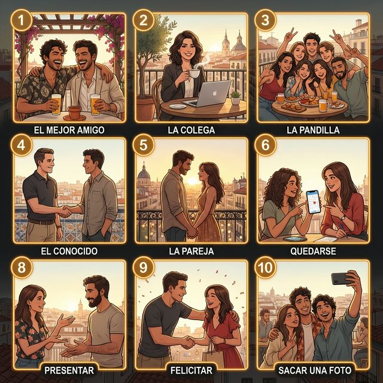
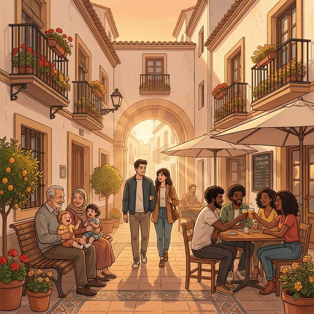

# Chapter 4: Familia y amigos (A2)

Cervantes: §4 Relaciones personales: 사회적 관계의 심화, 우정 및 현대적 가족 형태와 가치관 묘사

## 1. Opener

**Lazos que nos unen (우리를 묶어주는 유대감)**
A1에서 기본적인 가족 구성원의 명칭을 배웠다면, A2에서는 더 나아가 친구, 동료와의 사회적 유대감과 현대 사회의 다양한 가족 형태에 대해 깊이 있게 다룹니다. 또한 소유를 더 강조하는 소유형용사 후치형과 상호 재귀동사를 배웁니다.

### 학습 목표

- 사회적 관계 및 우정 관련 심화 어휘 10개 습득
- 소유형용사 후치형(mío, tuyo 등) 및 소유대명사 마스터
- 상호 재귀동사를 활용한 관계 묘사
- 스페인의 현대적 가족 가치관 및 독립 문화 이해

> [!TIP]
> **¿Sabías que...?** 스페인 젊은이들의 독립 시기는 다른 유럽 국가들에 비해 상대적으로 늦은 편입니다(평균 30세 전후). 이는 높은 주거 비용과 실업률 문제도 있지만, 가족 간의 매우 끈끈한 유대감과 일요일 식사 문화를 소중히 여기는 정서적 요인도 큽니다.

---

## 2. Vocabulario Esencial

현대적인 마드리드의 루프탑 바에서 친구들과 동료들이 어울리는 모습입니다. 삽화의 번호(①~⑩)가 아래 어휘 표와 정확히 대응됩니다.

| 번호 | Spanish | English Bridge | Korean Tip |
|:---:|:---|:---|:---|
| 1 | el mejor amigo | Major (Main friend) | 단짝 친구 |
| 2 | la colega | Colleague ✅ | 동료 (여성) |
| 3 | la pandilla | — | (자주 어울리는) 친구 무리 |
| 4 | el conocido | Recognized (Known person) | 아는 사람 (지인) |
| 5 | la pareja | Pair ✅ | 커플 / 파트너 |
| 6 | discutir | Discuss ⚠️ (False Friend!) | 토론이 아닌 '말다툼하다' |
| 7 | quedarse | — | (약속을 잡아) 만나다 / 머물다 |
| 8 | presentar | Present ✅ | 소개하다 |
| 9 | felicitar | Felicitate ✅ | 축하하다 |
| 10 | sacar una foto | — | 사진을 찍다 |

✅ 표시된 단어는 영어와 어원이 같거나 매우 유사한 'Cognates'입니다.
⚠️ 표시된 단어는 영어와 스펠링은 비슷하나 의미가 다른 'False Friends'이므로 주의하세요.

---

## 3. Expresiones Útiles

사회적 관계와 감정을 더 구체적으로 표현하는 방법입니다.

### A. 우정과 유대감 표현

- **Nos llevamos muy bien.** (We get along very well. / 우리는 사이가 아주 좋아요.)
- **Él es un amigo de toda la vida.** (He is a lifelong friend. / 그는 평생지기 친구야.)
  - 💡 **English Bridge**: "De toda la vida" = "Of all the life" — a lifelong bond
- **Confío plenamente en ti.** (I trust you completely. / 나는 너를 전적으로 신뢰해.)
  - 💡 **English Bridge**: "Confiar" → **Confide** ✅ (to trust in someone)

### B. 소유의 강조

- **Este libro es mío.** (This book is **mine**. / 이 책은 내 것이야.)
- **¿Es tuya esta maleta?** (Is this suitcase **yours**? / 이 가방 네 것이니?)
- **Lo mío es tuyo.** (What is mine is yours. / 내 것이 네 거야.)

---

## 4. Gramática Esencial

A2 수준의 정교한 표현을 위해 소유사의 후치형과 상호 재귀동사를 배웁니다.

### A. 소유형용사 후치형 (Stressed Possessive Adjectives)

명사 뒤에 위치하여 소유를 **강조**하거나, 명사 없이 '나의 것'이라는 대명사 역할을 합니다.

**English Bridge**: English uses "mine, yours, his, hers, ours, theirs" — Spanish equivalents must **match gender AND number** of the noun they describe, which English doesn't require.

<table class="conjugation-table">
  <thead>
    <tr>
      <th>주어 (Subject)</th>
      <th>남성 단수/복수</th>
      <th>여성 단수/복수</th>
    </tr>
  </thead>
  <tbody>
    <tr>
      <td>yo</td>
      <td><strong>mío</strong> / <strong>míos</strong></td>
      <td><strong>mía</strong> / <strong>mías</strong></td>
    </tr>
    <tr>
      <td>tú</td>
      <td><strong>tuyo</strong> / <strong>tuyos</strong></td>
      <td><strong>tuya</strong> / <strong>tuyas</strong></td>
    </tr>
    <tr>
      <td>él/ella/usted</td>
      <td><strong>suyo</strong> / <strong>suyos</strong></td>
      <td><strong>suya</strong> / <strong>suyas</strong></td>
    </tr>
    <tr>
      <td>nosotros/as</td>
      <td><strong>nuestro</strong> / <strong>nuestros</strong></td>
      <td><strong>nuestra</strong> / <strong>nuestras</strong></td>
    </tr>
    <tr>
      <td>vosotros/as</td>
      <td><strong>vuestro</strong> / <strong>vuestros</strong></td>
      <td><strong>vuestra</strong> / <strong>vuestras</strong></td>
    </tr>
    <tr>
      <td>ellos/ellas/ustedes</td>
      <td><strong>suyo</strong> / <strong>suyos</strong></td>
      <td><strong>suya</strong> / <strong>suyas</strong></td>
    </tr>
  </tbody>
</table>

> 💡 **Example**: *Un amigo **mío*** (A friend of **mine**) / *¡Dios **mío**!* (My God!)

### B. 상호 재귀동사 (Reciprocal Reflexive Verbs)

두 사람 이상이 '서로 ~하다'라는 의미를 나타낼 때 복수 인칭 재귀대명사(nos, os, se)와 함께 사용합니다.

**English Bridge**: English uses "each other" or "one another" — Spanish uses reflexive pronouns (**nos, os, se**) to express the same idea more concisely.

<table class="conjugation-table">
  <thead>
    <tr>
      <th>동사 (Verb)</th>
      <th>의미 (Meaning)</th>
      <th>예문 (Example)</th>
    </tr>
  </thead>
  <tbody>
    <tr>
      <td><strong>quererse</strong></td>
      <td>서로 사랑하다 (love each other)</td>
      <td><em>Se quieren mucho.</em></td>
    </tr>
    <tr>
      <td><strong>conocerse</strong></td>
      <td>서로 알다 (know each other)</td>
      <td><em>Nos conocemos desde niños.</em></td>
    </tr>
    <tr>
      <td><strong>ayudarse</strong></td>
      <td>서로 돕다 (help each other)</td>
      <td><em>Ellos se ayudan siempre.</em></td>
    </tr>
    <tr>
      <td><strong>escribirse</strong></td>
      <td>서로 연락하다 (write to each other)</td>
      <td><em>Os escribís a menudo.</em></td>
    </tr>
  </tbody>
</table>

---

## 5. Cultura Viva: Tradición vs. Modernidad 🏠

스페인의 가족 가치관은 급격한 현대화를 겪으면서도 고유의 색깔을 유지하고 있습니다.

España ha experimentado grandes cambios sociales en las últimas décadas. Aunque la familia tradicional sigue siendo muy valorada, hoy existen diversos modelos familiares: parejas de hecho, familias monoparentales o familias reconstituidas. La ley del matrimonio igualitario de 2005 fue un hito en la modernización del país.

Sin embargo, el respeto a los mayores sigue siendo fundamental. Es común ver a abuelos cuidando de sus nietos por la tarde, lo que crea un vínculo intergeneracional muy fuerte. Al mismo tiempo, los jóvenes españoles son muy sociables y consideran a sus amigos como su "familia elegida". La vida se desarrolla mucho en la calle, compartiendo tiempo con los colegas en las terrazas.

**[한국어 번역]**
스페인은 지난 수십 년 동안 큰 사회적 변화를 겪었습니다. 전통적인 가족은 여전히 높게 평가받지만, 오늘날에는 사실혼 커플, 한부모 가족 또는 재결합 가족 등 다양한 가족 모델이 존재합니다. 2005년의 동성결혼법은 국가 현대화의 이정표가 되었습니다.

그럼에도 불구하고 어르신들에 대한 존경은 여전히 핵심적입니다. 오후에 손주들을 돌보는 조부모의 모습을 흔히 볼 수 있는데, 이는 매우 강력한 세대 간 유대감을 형성합니다. 동시에 스페인 청년들은 매우 사교적이며 친구들을 자신의 "선택한 가족"으로 여깁니다.

---

## 6. Práctica

### A. Match the word (알맞은 단어를 연결하세요)

| Spanish | English / Korean |
|:---|:---|
| 1. El mejor amigo | a. To argue (False Friend) |
| 2. La pareja | b. To congratulate |
| 3. Discutir | c. Best friend |
| 4. Felicitar | d. Partner / Couple |
| 5. Quedarse | e. To meet up |

### B. Fill in the blanks with the correct long-form possessive (알맞은 소유형용사 후치형을 쓰세요)

1. Este coche es (mine - masc. sing.) ______________________
2. La culpa no es (yours - fem. sing.) ______________________
3. Esas llaves son (hers - fem. plural) ______________________
4. Un primo (of ours - masc. sing.) vive en Chile. ______________________
5. ¿Es (yours - formal sing.) este paraguas? ______________________

### C. 번역 연습 (상호 재귀동사를 사용하여 번역하세요)

1. 우리는 서로 아주 잘 알아요.
   (............................................................)
2. 디에고와 엘레나는 서로 사랑해요.
   (............................................................)
3. 너희들은 서로 자주 편지를 쓰니?
   (............................................................)
4. 좋은 친구들은 서로 도와주어야 합니다.
   (............................................................)
5. 그들은 매일 서로 전화해요.
   (............................................................)

---

## 7. Lectura 📖

### Mi familia elegida (나의 선택한 가족)

En España decimos que "los amigos son la familia que se elige". Yo tengo un grupo de amigos desde la universidad, nos llamamos 'la pandilla'. Somos cinco personas de diferentes nacionalidades. Aunque todos tenemos trabajos estresantes, nos vemos todos los viernes para cenar. Nos ayudamos en los momentos difíciles y celebramos juntos los éxitos. Mi madre siempre dice: "Hija, esos amigos tuyos son como tus hermanos". Y tiene razón. En esta sociedad moderna, el apoyo de los amigos es vital, pero nunca olvido mis raíces y el amor de mis padres.

### Preguntas (질문)

1. ¿Qué es 'la pandilla'? ('라 판디야'는 무엇인가요?)
2. ¿Qué dice la madre de la autora sobre sus amigos? (필자의 어머니는 친구들에 대해 뭐라고 하시나요?)

**[한국어 번역]**

#### 나의 선택한 가족

스페인에서는 "친구는 본인이 선택한 가족이다"라고 말합니다. 저는 대학 때부터 '라 판디야(la pandilla)'라고 부르는 친구 무리가 있습니다. 우리는 서로 국적이 다른 5명입니다. 우리 모두 스트레스 받는 직업을 가졌지만, 매주 금요일 저녁 식사를 위해 만납니다. 우리는 힘든 순간에 서로 돕고 성공을 함께 축하합니다. 어머니는 항상 말씀하세요. "딸아, 네 그 친구들은 마치 네 형제들 같구나." 어머니 말씀이 맞습니다.

---

## 8. Diálogo

### Hablando de raíces y amigos (뿌리와 친구들에 대한 대화)

**Situación:** Javier y Carmen están tomando un café en una terraza y conversan sobre sus planes para las vacaciones y la importancia de sus círculos sociales.

**상황:** 하비에르와 카르멘은 테라스에서 커피를 마시며 휴가 계획과 사회적 인맥의 중요성에 대해 대화를 나눕니다.

<table class="dialogue-table">
  <thead>
    <tr>
      <th>🇪🇸 Español</th>
      <th>🇰🇷 한국어</th>
    </tr>
  </thead>
  <tbody>
    <tr>
      <td><strong>Javier:</strong> Carmen, ¿qué planes tienes para este verano?</td>
      <td><strong>하비에르:</strong> 카르멘, 이번 여름에 무슨 계획이 있니?</td>
    </tr>
    <tr>
      <td><strong>Carmen:</strong> Voy a visitar a un primo mío que vive en México.</td>
      <td><strong>카르멘:</strong> 멕시코에 사는 내 사촌 한 명을 방문할 거야.</td>
    </tr>
    <tr>
      <td><strong>Javier:</strong> ¡Qué bien! ¿Vas sola o con tu pareja?</td>
      <td><strong>하비에르:</strong> 좋겠다! 혼자 가니, 아니면 파트너랑 가니?</td>
    </tr>
    <tr>
      <td><strong>Carmen:</strong> Voy sola. Mi pareja tiene que trabajar.</td>
      <td><strong>카르멘:</strong> 혼자 가. 내 파트너는 일을 해야 하거든.</td>
    </tr>
    <tr>
      <td><strong>Javier:</strong> Entiendo. Yo me quedo aquí con mi pandilla.</td>
      <td><strong>하비에르:</strong> 그렇구나. 난 내 친구들이랑 여기 머물 거야.</td>
    </tr>
    <tr>
      <td><strong>Carmen:</strong> Siempre te ves con ellos, ¿verdad?</td>
      <td><strong>카르멘:</strong> 넌 항상 그 친구들과 만나더라, 그렇지?</td>
    </tr>
    <tr>
      <td><strong>Javier:</strong> Sí, nos conocemos desde hace diez años.</td>
      <td><strong>하비에르:</strong> 응, 우리는 서로 안 지 10년이나 됐어.</td>
    </tr>
    <tr>
      <td><strong>Carmen:</strong> Es importante tener amigos en los que confiar.</td>
      <td><strong>카르멘:</strong> 신뢰할 수 있는 친구들을 갖는 건 중요해.</td>
    </tr>
    <tr>
      <td><strong>Javier:</strong> Tienes razón. Para mí, son como una familia.</td>
      <td><strong>하비에르:</strong> 맞아. 나에게 그들은 가족 같아.</td>
    </tr>
    <tr>
      <td><strong>Carmen:</strong> Pues, ¡disfruta mucho de tu tiempo con ellos!</td>
      <td><strong>카르멘:</strong> 그럼, 그들과 즐거운 시간 많이 보내!</td>
    </tr>
  </tbody>
</table>

---

## 9. Repaso

이 장에서 배운 내용을 확인해 보세요:

- [ ] 단짝 친구, 동료, 친구 무리 등 사회적 관계 어휘를 익혔다.
- [ ] 소유형용사 후치형(**mío, tuyo, suyo**)을 강조 표현에 사용할 수 있다.
- [ ] 후치형이 성과 수에 따라 변한다는 점을 이해했다 (**mío/mía/míos/mías**).
- [ ] 상호 재귀동사(**conocerse, ayudarse** 등)로 "서로 ~하다"를 표현할 수 있다.
- [ ] 스페인의 현대적 가족 형태와 세대 간 유대감을 이해했다.

---

## 10. Cierre

¡Enhorabuena! 🎉 A2의 이번 장을 통해 여러분은 단순한 가족 소개를 넘어, 더 깊고 복잡한 사회적 유대감을 스페인어로 표현하는 법을 배웠습니다.

'**Mío**'와 '**Tuyo**' 같은 강조 표현은 여러분의 스페인어를 훨씬 더 원어민스럽게 만들어 줄 것입니다. 또한 "**Los amigos son la familia que se elige**"(친구는 선택한 가족이다)라는 스페인의 가치관이 보여주듯, 사회적 유대와 가족의 사랑 모두를 소중히 여기는 문화를 이해하는 것도 언어 학습의 큰 재미입니다.

다음 장에서는 우리의 오감을 자극하는 '**음식**' 이야기로 돌아오겠습니다. ¡Sigue así!

---

## 11. Soluciones

### 6. Práctica - A. Match the word

1. 1-c, 2-d, 3-a, 4-b, 5-e

### 6. Práctica - B. Fill in the blanks

1. 1. mío
2. 1. tuya
3. 1. suyas
4. 1. nuestro
5. 1. suyo

### 6. Práctica - C. 번역 연습

1. 1. Nos conocemos muy bien.
2. 1. Diego y Elena se quieren.
3. 1. ¿Os escribís a menudo?
4. 1. Los buenos amigos deben ayudarse.
5. 1. Se llaman todos los días.

### 7. Lectura - Preguntas

1. 1. 대학 때부터 알고 지낸 친한 친구 무리(5명)를 의미합니다.
2. 1. 마치 필자의 형제들 같다고 매우 긍정적으로 평가하십니다.
