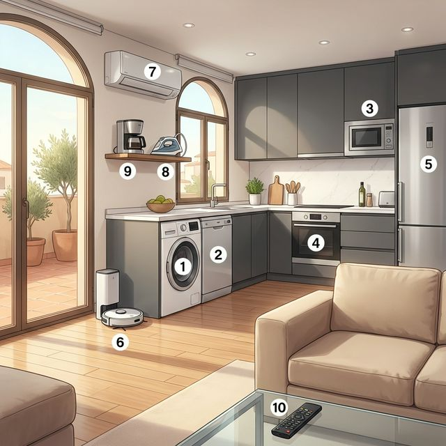

# Chapter 6: Mi casa (A2)

Cervantes: §10 Vivienda: 주거 생활 심화, 가전 제품 및 가사 활동과 부동산 관련 고도화 표현

## 1. Opener
**Vida moderna y hogar (현대적 삶과 가정)**  
A1에서 집의 구조와 기초 가구를 배웠다면, A2에서는 현대 생활에 필수적인 가전제품(Electrodomésticos)과 매일 일어나는 가사 활동(Tareas domésticas)을 구체적인 동사로 익힙니다. 또한 스페인어로 집을 구하거나 이사할 때 필요한 실무적인 표현들을 다룹니다. 관계대명사 'donde'를 활용해 장소를 더 정교하게 수식하고, 'hacer'와 'poner'가 포함된 가사 관련 관용구들을 정복해 봅시다.

**학습 목표**
- 심화 가전제품 및 가사 도구 어휘 습득
- 가사 활동 관련 동사(빨래하다, 청소하다, 다리미질하다 등) 익히기
- 관계대명사 'donde'를 활용한 장소 묘사 고도화
- 스페인 부동산(임대/매매) 광고 이해 및 관련 용어 습득

> [!TIP]
> **¿Sabías que...?** 스페인에서 집을 구할 때 'Exterior'라는 표현이 매우 중요합니다. 이는 방이 거리 쪽으로 창문이 나 있어 채광이 좋다는 뜻입니다. 반대로 'Interior'는 건물 안쪽 파티오(Patio) 쪽으로 창문이 있어 더 조용하지만 햇빛이 적을 수 있습니다.

---

## 2. Vocabulario Esencial: Electrodomésticos y Tareas
최신 시설을 갖춘 스마트 홈의 주방과 다용도실 풍경입니다. 현대인의 삶을 편리하게 해주는 가전제품과 가사 활동 명칭을 확인해 보세요.

| # | Spanish | English Bridge | Korean Tip |
| :--- | :--- | :--- | :--- |
| 1 | **la lavadora** | **Lave** (to wash) ✅ | 세탁기 |
| 2 | **el lavavajillas** | **Lave** + **Vessels** (dishes) | 식기세척기 |
| 3 | **el microondas** | **Micro-waves** ✅ | 전자레인지 |
| 4 | **el horno** | — | 오븐 |
| 5 | **la nevera / el frigorífico** | **Frigorific** (cooling) | 냉장고 |
| 6 | **la aspiradora** | **Aspirate** (to suck air) ✅ | 청소기 |
| 7 | **el aire acondicionado** | **Air conditioned** ✅ | 에어컨 |
| 8 | **la plancha** | — | 다리미 |
| 9 | **la cafetera** | **Coffee maker** ✅ | 커피 머신 |
| 10 | **el mando a distancia** | **Command** at **Distance** | 리모컨 |

✅ 표시된 단어는 영어와 어원을 공유하는 'Cognates'입니다.

---

## 3. Expresiones Útiles
가사 분담이나 부동산 관련 상담 시 사용하는 유용한 문장들입니다.

**A. 가사 활동 및 분담 (Household Chores)**
- **¿Quién va a fregar los platos hoy?** (Who is going to wash the dishes today? / 오늘은 누가 설거지할 거야?)
- **Me toca poner la lavadora.** (It's my turn to put on the laundry. / 내가 세탁기 돌릴 차례야.)
- **Tenemos que hacer la cama cada mañana.** (We have to make the bed every morning. / 우리는 매일 아침 침대를 정리해야 해.)
- **Odio planchar la ropa.** (I hate ironing clothes. / 나는 옷 다리는 게 정말 싫어.)

**B. 부동산 및 임대 문의 (Real Estate & Renting)**
- **Busco un piso compartido con otros estudiantes.** (I'm looking for a shared flat with other students. / 다른 학생들과 쉐어하는 아파트를 찾고 있어요.)
- **¿Cuánto cuesta el alquiler al mes?** (How much is the rent per month? / 한 달 월세가 얼마인가요?)
- **Los gastos de luz y agua están incluidos.** (Electricity and water expenses are included. / 전기와 수도료가 포함되어 있습니다.)
- **El piso está completamente amueblado.** (The flat is fully furnished. / 아파트는 가구가 모두 완비되어 있습니다.)

---

## 4. Gramática Esencial
이번 장에서는 장소를 수식하는 관계대명사 'donde'와 가사 관련 중요 관용구들을 정리합니다.

### A. 관계대명사 'Donde' (Where)
특정 장소를 선행사로 받아 그 장소에 대한 부가 정보를 줄 때 사용합니다. 'The place where...'에 해당합니다.

- **기본 구조**: 장소 명사 + **donde** + 문장
- **예문 1**: *Este es el barrio **donde** vivo.* (여기가 내가 사는 동네야.)
- **예문 2**: *La cocina es el lugar **donde** preparamos la cena.* (주방은 우리가 저녁을 준비하는 곳입니다.)
- **Tip**: 전치사와 함께 쓰여 더 정교한 의미를 나타내기도 합니다. (*el sofá **en el que** descanso* 대신 *el sofá **donde** descanso* 사용 가능)

### B. 가사 관련 핵심 동사 구문
'Hacer'와 'Poner'를 활용한 다양한 가사 표현들을 익혀 두면 유용합니다.

| 동사 | 구문 | 의미 |
| :--- | :--- | :--- |
| **Hacer** | Hacer la cama | 침대를 정리하다 |
| | Hacer la compra | 장을 보다 |
| | Hacer la maleta | 짐을 싸다 |
| **Poner** | Poner la mesa | 상을 차리다 |
| | Poner la lavadora / el lavavajillas | 세탁기 / 식기세척기를 돌리다 |
| | Poner el aire acondicionado | 에어컨을 켜다 |
| **Limpiar** | Limpiar el polvo | 먼지를 털다 (청소하다) |

---

## 5. Cultura Viva: El Desafío de Alquilar en España
스페인 대도시에서 집을 구하는 것은 젊은이들에게 큰 도전이자 문화입니다.

Encontrar un piso en ciudades como Madrid, Barcelona o Valencia no es fácil. Debido a los precios altos, muchos jóvenes y estudiantes prefieren **compartir piso**. Buscan una habitación en un piso grande y comparten los gastos y las zonas comunes (cocina, salón). Es una oportunidad excelente para conocer gente de todo el mundo y practicar el idioma.

Existen portales inmobiliarios muy famosos, como *Idealista* o *Fotocasa*, donde puedes filtrar por precio, número de habitaciones o si aceptan mascotas. En las fotos de los anuncios, verás términos como **terraza** (balcón grande), **ascensor** (muy importante en edificios antiguos) o **calefacción central**. Una tradición muy española es la "comunidad de vecinos", donde todos los que viven en el edificio se reúnen una vez al año para decidir sobre las reformas y el mantenimiento del bloque. ¡Es como una pequeña sociedad!

**[한국어 번역]**
마드리드, 바르셀로나 또는 세비야 같은 도시에서 아파트를 찾는 것은 쉽지 않습니다. 높은 가격 때문에 많은 젊은이들과 학생들은 **피소 공유(compartir piso)**를 선호합니다. 그들은 큰 아파트에서 방 하나를 구하고 비용과 공용 공간(주방, 거실)을 공유합니다. 이는 전 세계의 사람들을 만나고 언어를 연습할 수 있는 아주 좋은 기회입니다.

*Idealista*나 *Fotocasa*와 같은 유명한 부동산 포털이 있으며, 여기서 가격, 방 개수 또는 반려동물 허용 여부 등을 필터링할 수 있습니다. 광고 사진에서 **테라사(terraza, 큰 발코니)**, **아센소르(ascensor, 오래된 건물에서 매우 중요)** 또는 **중앙 난방(calefacción central)** 같은 용어들을 보게 될 것입니다. 매우 스페인적인 전통 중 하나는 '이웃 반상회(comunidad de vecinos)'인데, 같은 건물에 사는 모든 사람들이 일 년에 한 번 모여 건물의 개보수와 유지 관리에 대해 결정합니다. 마치 작은 사회와 같답니다!

---

## 6. Práctica

**A. Match the appliances with their functions (가전제품과 기능을 연결하세요)**

| Electrodoméstico | Función |
| :--- | :--- |
| 1. El microondas | a. Para enfriar la comida |
| 2. La lavadora | b. Para calentar platos rápido |
| 3. La aspiradora | c. Para lavar la ropa |
| 4. La nevera | d. Para hacer café |
| 5. La cafetera | e. Para limpiar el suelo |

**B. Complete with 'donde' and the correct verb form (donde와 알맞은 동사형으로 완성하세요)**

1. Esta es la habitación ............... (yo/dormir).
2. Busco un supermercado ............... (vender/ellos) productos coreanos.
3. El bar ............... (nosotros/ir) siempre está cerca.
4. ¿Conoces el restaurante ............... (trabajar/tu hermano)?
5. El pueblo ............... (vivir/mis abuelos) es muy bonito.

**C. 번역 연습 (스페인어로 번역하세요)**

1. 나는 매일 아침 침대를 정리해야 해요.
   (............................................................)
2. 내 차례야, 내가 식기세척기 돌릴게. (Me toca...)
   (............................................................)
3. 여기가 내 친구가 일하는 사무실이야. (donde 활용)
   (............................................................)
4. 월세에 수도료가 포함되어 있나요?
   (............................................................)
5. 어제 나는 하루 종일 청소기로 청소하고 옷을 다렸어.
   (............................................................)

---

## 7. Lectura 📖
**Mi primer piso compartido (나의 첫 쉐어 하우스)**

Cuando llegué a Barcelona para estudiar, decidí compartir un piso con dos chicos de Italia y una chica de Alemania. El piso está en un edificio antiguo, pero tiene **ascensor** y una **terraza** maravillosa con vistas a la ciudad. Mi habitación es pequeña, 하지만 햇빛이 잘 드는 **exterior**(거리 쪽) 방이라 마음에 들어요. En casa, tenemos un calendario de **tareas domésticas**: yo paso la **aspiradora** los sábados y mis compañeros **limpian la cocina**. Lo que más me gusta es la **sobremesa** en el salón después de cenar, **donde** hablamos de nuestras culturas y compartimos risas. A veces es difícil vivir con extraños, pero es una experiencia inolvidable.

**Questions:**
1. 글쓴이가 사는 아파트의 장점 2가지는 무엇인가요?
   - ............................................................
2. 글쓴이는 집에서 어떤 가사 활동을 담당하나요?
   - ............................................................

**[한국어 번역]**
공부를 위해 바르셀로나에 도착했을 때, 저는 이탈리아 친구 두 명과 독일 친구 한 명과 아파트를 공유하기로 결정했습니다. 아파트는 오래된 건물에 있지만 엘리베이터가 있고 도시 전망이 보이는 멋진 테라스가 있습니다. 제 방은 작지만, 햇빛이 잘 드는 거리 쪽(exterior) 방이라 마음에 들어요. 집에는 **가사 활동** 달력이 있습니다. 저는 토요일마다 **청소기**를 돌리고 제 룸메이트들은 **주방을 청소**합니다. 제가 가장 좋아하는 것은 저녁 식사 후 거실에서 나누는 **소브레메사(sobremesa)**인데, 그곳(**donde**)에서 우리는 서로의 문화에 대해 이야기하고 웃음을 나눕니다. 가끔 낯선 사람들과 사는 것이 힘들기도 하지만, 잊지 못할 경험입니다.

---

## 8. Diálogo
**Problemas en casa (집안의 문제들)**

**Situación:** Sofía y su compañero de piso, Pablo, están discutiendo sobre el mantenimiento de la casa.
**상황:** 소피아와 그녀의 룸메이트 파블로가 집안 유지 관리에 대해 의논(말다툼)하고 있습니다.

| Spanish | Korean |
| :--- | :--- |
| **Sofía:** Pablo, otra vez no has puesto el lavavajillas. | **소피아:** 파블로, 또 식기세척기를 안 돌렸네. |
| **Pablo:** Lo siento, es que el mando a distancia no funcionaba y estaba distraído. | **파블로:** 미안해, 리모컨이 작동을 안 해서 정신이 없었어. |
| **Sofía:** ¡No es excusa! La cocina está muy sucia. Me toca limpiar a mí siempre. | **소피아:** 핑계 대지 마! 주방이 너무 지저분해. 항상 내가 청소하게 되잖아. |
| **Pablo:** Tienes razón. Mañana yo paso la aspiradora por toda la casa. | **파블로:** 네 말이 맞아. 내일은 내가 온 집안을 청소기로 돌릴게. |
| **Sofía:** Y también hay 한 가지 문제가 더 있어. La lavadora hace un ruido extraño. | **소피아:** 그리고 문제가 하나 더 있어. 세탁기에서 이상한 소리가 나. |
| **Pablo:** ¿De verdad? Voy a llamar al casero para que envíe a un técnico. | **파블로:** 정말? 집주인한테 전화해서 기술자를 보내달라고 할게. |
| **Sofía:** Gracias. Es importante que todo funcione bien en el piso. | **소피아:** 고마워. 아파트 안의 모든 게 잘 작동하는 게 중요하니까. |

---

## 9. Repaso
이 장에서 배운 핵심 내용을 체크해 보세요:
- [ ] 세탁기, 식기세척기, 리모컨 등 10개 이상의 가전제품 어휘를 익혔나요?
- [ ] 'Hacer la cama', 'Poner la lavadora' 등 가사 관련 관용구를 구사할 수 있나요?
- [ ] 관계대명사 'donde'를 활용해 장소를 수식할 수 있나요?
- [ ] 'Exterior', 'Gastos incluidos' 등 부동산 관련 용어의 뜻을 이해했나요?

---

## 10. Cierre
¡Excelente! 이번 장을 통해 여러분은 현대적인 주거 생활을 스페인어로 누릴 수 있는 준비를 마쳤습니다. 집안일을 분담하고, 고장 난 가전제품에 대해 이야기하며, 멋진 아파트를 찾는 과정은 스페인어권 현지 삶에 깊숙이 들어가는 첫걸음입니다. "Mi casa es tu casa(나의 집이 당신의 집입니다)"라는 스페인식 환대를 배우며, 여러분의 공간을 스페인어 단어들로 채워보세요. 다음 장에서는 우리의 지적 호기심을 채워줄 '학교와 교육(En la escuela)'에 대해 공부하겠습니다. ¡Nos vemos pronto!

---

## 11. Soluciones

**6. Práctica - A. Match the appliances**
1-b, 2-c, 3-e, 4-a, 5-d

**6. Práctica - B. Complete with 'donde'**
1. donde duermo / 2. donde venden / 3. donde vamos / 4. donde trabaja / 5. donde viven

**6. Práctica - C. 번역 연습**
1. Tengo que hacer la cama cada mañana.
2. Me toca (a mí), yo pongo el lavavajillas.
3. Esta es la oficina donde trabaja mi amigo.
4. ¿Están incluidos los gastos de agua en el alquiler?
5. Ayer pasé la aspiradora y planché la ropa todo el día.

**7. Lectura Questions**
1. 엘리베이터(ascensor)가 있고 전망이 좋은 정원(terraza)이 있다는 점입니다.
2. 토요일마다 청소기로 청소하는 것(pasar la aspiradora)을 담당합니다.
