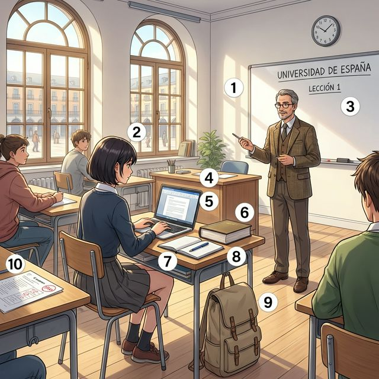
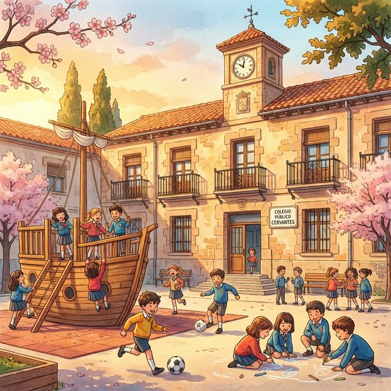

# Chapter 7: En la escuela (A1)

Cervantes: §6 Educación: 학교 시설, 학용품 및 수업 관련 기초 표현 및 규칙

## 1. Opener
**Aprender es una aventura (배움은 모험입니다)**  
학교는 단순히 지식을 습득하는 곳을 넘어 친구들과 교류하고 새로운 세상을 만나는 설레는 공간입니다. 이번 장에서는 학교의 다양한 시설과 수업 시간에 사용하는 학용품들의 이름을 배웁니다. 또한 스페인어의 가장 기본이 되는 규칙 동사(-ar, -er, -ir)의 현재 변화를 익혀 "말하고, 먹고, 사는" 일상적인 활동을 표현해 봅니다. 마지막으로 스페인의 초등 교육 시스템과 따뜻한 학교 분위기에 대해서도 알아봅시다.

**학습 목표**
- 학교 시설 및 학용품 명칭 15개 이상 습득
- 규칙 동사(-ar, -er, -ir)의 현재 시제 변화 완벽 이해 및 활용
- 'saber'와 'poder'의 기초 용법 구분
- 스페인의 공교육 체계와 학교 생활의 특징 이해

> [!TIP]
> **¿Sabías que...?** 스페인의 학교 이름 중에는 'Cervantes'가 아주 많습니다. <돈키호테>를 쓴 대문호 미겔 데 세르반테스를 기리기 위함이죠. 여러분이 지금 보고 있는 이 'Cervantes' 참조 라인도 스페인어 교육의 국제 표준인 세르반테스 연구소의 지침을 따르고 있답니다!

---

## 2. Vocabulario Esencial: La Escuela y la Clase
활기찬 스페인 대학교의 강의실 풍경입니다. 번호와 매칭되는 단어를 확인하며 수업 시간에 필요한 어휘들을 익혀보세요.

| # | Spanish | English Bridge | Korean Tip |
| :--- | :--- | :--- | :--- |
| 1 | **el profesor** | **Professor** ✅ | 교수님 (선생님) |
| 2 | **el estudiante** | **Student** ✅ | 학생 |
| 3 | **la pizarra** | — | 칠판 (화이트보드) |
| 4 | **el pupitre** | — | 학생용 책상 |
| 5 | **el ordenador portátil** | — | 노트북 컴퓨터 |
| 6 | **el libro** | **Library** (place for books) | 책 |
| 7 | **el cuaderno** | — | 공책 (노트) |
| 8 | **el bolígrafo / el boli** | — | 볼펜 |
| 9 | **la mochila** | — | 배낭 (책가방) |
| 10 | **el examen** | **Exam** ✅ | 시험 |

✅ 표시된 단어는 영어와 어원의 뿌리가 같은 'Cognates'입니다.

---

## 3. Expresiones Útiles
학교에서 선생님이나 친구들과 대화할 때 자주 사용하는 표현입니다.

**A. 수업 시간의 질문과 대답**
- **¿Puedo entrar?** (May I come in? / 들어가도 될까요?)
- **¿Qué significa 이 대목?** (What does this part mean? / 이 부분은 무슨 뜻인가요?)
- **No entiendo la pregunta.** (I don't understand the question. / 질문을 이해하지 못하겠어요.)
- **¿Puedes repetir, por favor?** (Can you repeat, please? / 다시 한번 말씀해 주시겠어요?)

**B. 공부와 능력 표현하기**
- **Estudio español los lunes.** (I study Spanish on Mondays. / 나는 월요일마다 스페인어를 공부해.)
- **No sé la respuesta.** (I don't know the answer. / 정답을 모르겠어요.)
- **¿Sabes hablar inglés?** (Do you know how to speak English? / 너 영어 할 줄 아니?)
- **Hablamos mucho en clase.** (We talk a lot in class. / 우리는 수업 시간에 이야기를 많이 해.)

---

## 4. Gramática Esencial
스페인어 문장의 뼈대가 되는 규칙 동사의 변화와 능력/지식을 나타내는 동사를 기초부터 다져봅시다.

### A. 규칙 동사 현재형 (Presente de Indicativo)
동사 원형의 끝부분(-ar, -er, -ir)에 따라 어미가 규칙적으로 변합니다.

| 인칭 | **-AR (Hablar)** | **-ER (Comer)** | **-IR (Vivir)** |
| :--- | :--- | :--- | :--- |
| **Yo** | habl**o** | com**o** | viv**o** |
| **Tú** | habl**as** | com**es** | viv**es** |
| **Él/Ella/Ud.** | habl**a** | com**e** | viv**e** |
| **Nosotros/as** | habl**amos** | com**emos** | viv**imos** |
| **Vosotros/as** | habl**áis** | com**éis** | viv**ís** |
| **Ellos/Ellas/Uds.** | habl**an** | com**en** | viv**en** |

**Korean Tip!**
스페인어는 동사 변화만으로 주어를 알 수 있는 경우가 많아 주어 대명사(Yo, Tú 등)를 자주 생략합니다. 동사 꼬리(어미)를 정확히 익히는 것이 핵심입니다!

### B. Saber vs Poder (기초)
- **Saber**: '지식'이나 '학습을 통해 익힌 능력'을 나타냅니다. (~할 줄 안다, 알다)
  - 예: *Yo **sé** cocinar.* (나는 요리할 줄 안다.)
- **Poder**: '허락'이나 '물리적 가능성'을 나타냅니다. (~할 수 있다)
  - 예: *No **puedo** ir hoy.* (나는 오늘 갈 수 없다.)

---

## 5. Cultura Viva: El Colegio Público en España
스페인의 아이들은 어떤 환경에서 공부할까요?

En España, la educación es obligatoria y gratuita desde los 6 hasta los 16 años. El sistema se divide en **Educación Primaria** (6-12 años) y **Educación Secundaria** (ESO, 12-16 años). Los colegios públicos suelen ser lugares muy coloridos y alegres, con patios grandes para jugar al fútbol o al baloncesto durante el recreo.

A diferencia de otros países, en muchos colegios españoles los niños no llevan **uniforme**, aunque esto depende de cada centro. Los profesores suelen ser muy cercanos y los estudiantes los llaman por su nombre de pila (Manuel, Carmen...), lo que crea un ambiente de confianza. Además, las actividades al aire libre y los proyectos en grupo son fundamentales para fomentar la creatividad y el compañerismo desde pequeños.

**[한국어 번역]**
스페인에서 교육은 6세부터 16세까지 의무이자 무상입니다. 시스템은 **초등 교육(Primaria)**(6-12세)과 **중등 교육(ESO)**(12-16세)으로 나뉩니다. 공립학교들은 보통 매우 알록달록하고 즐거운 곳이며, 쉬는 시간 동안 축구나 농구를 할 수 있는 큰 운동장(patio)을 갖추고 있습니다.

다른 나라들과 달리, 많은 스페인 학교에서 아이들은 **교복**을 입지 않지만, 이는 학교마다 다릅니다. 선생님들은 보통 매우 친근하며 학생들은 선생님의 이름(Manuel, Carmen...)을 직접 부르는데, 이는 신뢰의 분위기를 조성합니다. 또한, 야외 활동과 그룹 프로젝트는 어릴 때부터 창의성과 동료애를 기르는 데 필수적입니다.

---

## 6. Práctica

**A. Choose the correct verb ending (알맞은 동사 어미를 고르세요)**

1. Yo habl(o / as) español en casa.
2. Nosotros viv(emos / imos) en Madrid.
3. ¿Tú com(es / e) una manzana?
4. Ellos estudi(an / amos) mucho para el examen.
5. Vosotros escrib(ís / éis) en el cuaderno.

**B. Saber vs Poder (알맞은 동사를 활용해 문장을 완성하세요)**

1. Yo 안다 (..........) hablar español un poco. (Knowledge)
2. ¿너는 할 수 있니 (..........) abrir la ventana, por favor? (Possibility/Request)
3. Ella 안다 (..........) la respuesta del ejercicio. (Information)
4. Nosotros 못 한다 (no ..........) entrar ahora. está cerrado. (Permission/Possibility)
5. ¿너네들은 할 줄 아니 (..........) tocar la guitarra? (Skill)

**C. 번역 연습 (주어진 상황에 맞게 번역하세요)**

1. 나는 매일 스페인어 책을 읽어요. (leer - er동사)
   (............................................................)
2. 우리는 선생님과 이야기를 많이 해요.
   (............................................................)
3. 가방 안에 볼펜이 하나 있어요.
   (............................................................)
4. 너는 어디에 사니?
   (............................................................)
5. 그들은 도서관에서 공부해요. (en la biblioteca)
   (............................................................)

---

## 7. Lectura 📖
**Mi primer día de clase (나의 첫 수업 날)**

Hoy es mi primer día en la Universidad de Salamanca. Estoy un poco nervioso, pero muy contento. En mi mochila tengo tres cuadernos, un bolígrafo azul y mi ordenador portátil. Entro en el aula y veo a muchos estudiantes. El profesor se llama Javier y es muy simpático. En clase, escuchamos al profesor y escribimos notas. No entiendo todo, pero pregunto cuando tengo dudas. Después de la clase, vamos a la cafetería para comer algo y hablar con los nuevos amigos. ¡Va a ser un año fantástico!

**Questions:**
1. 주인공의 가방 안에는 무엇이 있나요? (What is in the protagonist's backpack?)
   - ............................................................
2. 수업이 끝난 후 학생들은 어디로 가나요? (Where do students go after class?)
   - ............................................................

**[한국어 번역]**
오늘은 살라망카 대학교에서의 저의 첫날입니다. 조금 긴장되지만 매우 기쁩니다. 제 배낭 속에는 공책 세 권, 파란색 볼펜 하나, 그리고 노트북 컴퓨터가 있습니다. 저는 강의실에 들어가서 많은 학생들을 봅니다. 교수님 이름은 하비에르이고 매우 친절하십니다. 수업 시간에 우리는 교수님의 말씀을 듣고 필기를 합니다. 모든 것을 이해하지는 못하지만, 궁금한 점이 있을 때 질문을 합니다. 수업이 끝난 후, 우리는 무언가를 먹고 새로운 친구들과 이야기하기 위해 카페테리아로 갑니다. 환상적인 한 해가 될 거예요!

---

## 8. Diálogo
**En la biblioteca (도서관에서)**

**Situación:** Lucía le pregunta a Diego sobre el examen de mañana mientras estudian en la biblioteca.
**상황:** 루시아가 도서관에서 공부하던 중 디에고에게 내일 시험에 대해 물어봅니다.

| Spanish | Korean |
| :--- | :--- |
| **Lucía:** Hola Diego, ¿sabes dónde está el libro de historia? | **루시아:** 안녕 디에고, 역사 책이 어디에 있는지 아니? |
| **Diego:** Sí, está encima de aquella mesa. ¿Lo necesitas? | **디에고:** 응, 저쪽 테이블 위에 있어. 필요해? |
| **Lucía:** Sí, gracias. No puedo encontrar mis notas y mañana tenemos un examen. | **루시아:** 응, 고마워. 내 노트를 못 찾겠어. 그런데 우리 내일 시험이잖아. |
| **Diego:** ¿De verdad? Yo estudio ahora, pero no entiendo bien el tema 3. | **디에고:** 정말? 나 지금 공부 중인데, 3단원이 잘 이해가 안 돼. |
| **Lucía:** Yo sé la respuesta. Es muy fácil, si quieres hablamos después. | **루시아:** 내가 정답을 알아. 아주 쉬워, 원한다면 나중에 이야기하자. |
| **Diego:** ¡Genial! ¿Podemos estudiar juntos en la cafetería? | **디에고:** 멋지다! 카페테리아에서 같이 공부할 수 있을까? |
| **Lucía:** Vale. Pero primero vamos a terminar este capítulo. | **루시아:** 좋아. 하지만 먼저 이 단원을 끝내자. |

---

## 9. Repaso
이번 장의 핵심 내용을 복습해 보세요.
- [ ] 학교 시설과 학용품 단어 10개 이상을 외웠나요?
- [ ] -ar, -er, -ir 규칙 동사의 현재형을 주어에 맞게 변형할 수 있나요?
- [ ] Saber와 Poder의 의미 차이를 구별할 수 있나요?
- [ ] 스페인 학교의 특징(교복, 선생님 호칭 등)을 이해했나요?

---

## 10. Cierre
¡Excelente trabajo! 이번 장에서 여러분은 스페인어의 가장 중요한 기초 중 하나인 규칙 동사의 변화를 배웠습니다. "나는 공부한다(Yo estudio)", "우리는 산다(Vivimos)"와 같은 표현들은 모든 대화의 시작입니다. 이제 여러분은 학교 생활을 묘사하고 자신의 능력을 표현할 수 있게 되었습니다. 잊지 마세요, 언어는 반복입니다! 다음 장에서는 우리의 지적 지평을 더욱 넓혀줄 '대학 생활과 미래 계획(A2)'에 대해 더 깊이 있게 다뤄보겠습니다. ¡Ánimo!

---

## 11. Soluciones

**6. Práctica - A. Choose the correct verb ending**
1. o / 2. imos / 3. es / 4. an / 5. ís

**6. Práctica - B. Saber vs Poder**
1. sé / 2. puedes / 3. sabe / 4. podemos / 5. sabéis

**6. Práctica - C. 번역 연습**
1. Leo un libro de español todos los días.
2. Hablamos mucho con el profesor.
3. Hay un bolígrafo en la mochila.
4. ¿Dónde vives?
5. Ellos estudian en la biblioteca.

**7. Lectura Questions**
1. 공책 3권, 파란 볼펜, 노트북 컴퓨터 (Tres cuadernos, un bolígrafo azul y un ordenador portátil).
2. 카페테리아 (A la cafetería).
