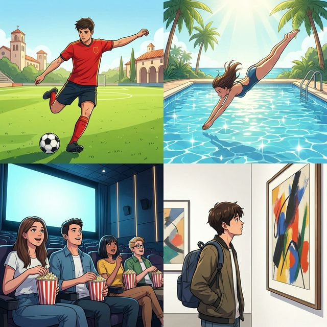
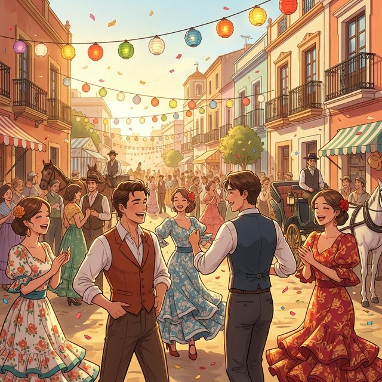

# Chapter 9: Ocio y arte (A1)

Cervantes: §8 Ocio: 여가 취미, 스포츠 및 §18 예술적 활동 기초

## 1. Opener
**Disfrutar el tiempo libre (여가를 즐기다)**  
열심히 공부하고 일한 뒤에 찾아오는 휴식은 달콤합니다. 스페인 사람들은 여가 시간을 어떻게 보낼까요? 어떤 사람은 탁 트인 공원에서 축구를 즐기고, 어떤 사람은 세련된 갤러리에서 예술 작품을 감상합니다. 이번 장에서는 다양한 취미 생활과 스포츠 어휘를 배우고, 이동을 나타내는 핵심 동사인 'ir(가다)'와 'venir(오다)'를 익힙니다. 또한 스페인의 화려하고 열정적인 축제 문화를 통해 삶의 즐거움을 표현하는 법을 배워봅시다.

**학습 목표**
- 여가 활동, 스포츠, 예술 관련 어휘 15개 이상 습득
- 'ir(가다)'와 'venir(오다)' 동사의 불규칙 변화 및 활용
- 'ir a + 동사원형'을 이용한 가까운 미래 표현 기초
- 스페인의 주요 축제와 예술적 분위기 이해

> [!TIP]
> **¿Sabías que...?** 스페인에서 축구(el fútbol)는 단순한 스포츠 이상의 의미를 갖습니다. 레알 마드리드나 FC 바르셀로나 같은 클럽의 경기가 있는 날이면 도시 전체가 들썩이죠. 친구들과 함께 "Vamos a ver el fútbol(축구 보러 가자)"이라고 말하는 것은 스페인에서 가장 흔한 여가 제안 중 하나입니다.

---

## 2. Vocabulario Esencial: Tiempo Libre y Ocio
다양한 방식으로 여가를 즐기는 청춘들의 모습입니다. 번호와 매칭되는 단어를 확인하며 필수 어휘들을 익혀보세요.

| # | Spanish | English Bridge | Korean Tip |
| :--- | :--- | :--- | :--- |
| 1 | **el fútbol** | **Football** ✅ | 축구 |
| 2 | **la natación** | — (To swim) | 수영 |
| 3 | **el cine** | **Cinema** ✅ | 영화관 / 영화 |
| 4 | **el museo** | **Museum** ✅ | 박물관 / 미술관 |
| 5 | **el parque** | **Park** ✅ | 공원 |
| 6 | **la música** | **Music** ✅ | 음악 |
| 7 | **bailar** | **Ball** (dance hall) | 춤추다 |
| 8 | **leer** | **Lecture** (reading) | 읽다 |
| 9 | **el arte** | **Art** ✅ | 예술 |
| 10 | **el deporte** | **Sport** (near cognate) | 스포츠 / 운동 |

✅ 표시된 단어는 영어와 어원의 뿌리가 같은 'Cognates'입니다.

---

## 3. Expresiones Útiles
취미와 여가에 대해 대화할 때 자주 사용하는 패턴입니다.

**A. 취미 묻고 답하기**
- **¿Qué haces 인 네 타임 리브레?** (What do you do in your free time? / 여가 시간에 무엇을 하나요?)
- **Me gusta mucho leer.** (I like reading very much. / 나는 독서를 아주 좋아해.)
- **Mi hobby es la música.** (My hobby is music. / 제 취미는 음악입니다.)
- **No tengo tiempo hoy.** (I don't have time today. / 오늘은 시간이 없어요.)

**B. 제안하고 이동하기**
- **¿Quieres ir al cine?** (Do you want to go to the cinema? / 영화 보러 갈래?)
- **Vamos al parque.** (Let's go to the park. / 공원에 가자.)
- **Viene mi amigo a casa.** (My friend is coming to my house. / 내 친구가 집에 와.)
- **Voy a estudiar ahora.** (I am going to study now. / 나는 이제 공부할 거야.)

---

## 4. Gramática Esencial
이동을 갈 때 가장 중요한 두 동사와 미래 계획을 세우는 법을 배워봅시다.

### A. Ir (가다) & Venir (오다)
두 동사는 매우 중요한 불규칙 동사입니다.
| 인칭 | **Ir** (To Go) | **Venir** (To Come) |
| :--- | :--- | :--- |
| **Yo** | voy | vengo |
| **Tú** | vas | vienes |
| **Él/Ella/Ud.** | va | viene |
| **Nosotros/as** | vamos | venimos |
| **Vosotros/as** | vais | venís |
| **Ellos/Ellas/Uds.** | van | vienen |

**Korean Tip!**
'Ir'는 말하는 사람에게서 멀어지는 방향으로 가다, 'Venir'는 말하는 사람 쪽으로 오는 방향일 때 씁니다. 만약 친구가 "우리 집에 올래?"라고 물을 때 "응, 갈게!"라고 답하려면 (내가 친구 쪽으로 가는 것이므로) "Sí, **voy**"라고 답하는 것이 자연스럽습니다.

### B. Ir a + 동사원형 (가까운 미래)
'~할 것이다'라는 가까운 미래의 계획을 표현할 때 씁니다. 영어의 `be going to`와 매우 흡사합니다.
- **Voy a comer** (I am going to eat / 나는 먹을 것이다)
- **¿Qué vas a hacer mañana?** (What are you going to do tomorrow? / 너 내일 뭐 할 거니?)

---

## 5. Cultura Viva: ¡Fiesta y Arte en España!
스페인의 거리를 수놓는 축제와 예술의 열기를 느껴보세요.

España es famosa en todo el mundo por sus festivales vibrantes. Uno de los más conocidos es la **Feria de Abril** en Sevilla, donde la gente baila flamenco y lleva trajes tradicionales muy coloridos. También están las **Fallas** de Valencia, con esculturas gigantes que se queman al final de la fiesta.

El arte también está en el ADN de España. El Triángulo del Arte en Madrid, con los museos del **Prado**, **Reina Sofía** y **Thyssen-Bornemisza**, es un destino esencial. A los españoles les encanta salir a la calle, disfrutar de un concierto al aire libre o simplemente pasear por las plazas llenas de gente. El ocio en España siempre se comparte con amigos y familia.

**[한국어 번역]**
스페인은 활기찬 축제로 전 세계적으로 유명합니다. 가장 잘 알려진 것 중 하나는 세비야의 **페리아 데 아브릴(4월 축제)**인데, 사람들이 플라멩코를 추고 아주 알록달록한 전통 의상을 입습니다. 또한 발렌시아의 **파야스(불꽃 축제)**는 축제의 마지막에 거대한 조각상들을 태우는 것으로 유명합니다.

예술 또한 스페인의 DNA 속에 있습니다. 마드리드의 '예술의 삼각형'이라 불리는 **프라도**, **레이나 소피아**, **티센 보르네미사** 미술관은 필수 코스입니다. 스페인 사람들은 거리에 나가 야외 콘서트를 즐기거나 단순히 사람들로 붐비는 광장을 산책하는 것을 매우 좋아합니다. 스페인에서 여가는 항상 친구나 가족과 함께 나눕니다.

---

## 6. Práctica

**A. Choose the correct word (알맞은 단어를 선택하세요)**

| Spanish | Option | Korean |
| :--- | :--- | :--- |
| 1. El fútbol | a. 스포츠 | a. (..........) |
| 2. El cine | b. 음악 | b. (..........) |
| 3. La música | c. 영화 | c. (..........) |
| 4. El parque | d. 독서 | d. (..........) |
| 5. Leer | e. 공원 | e. (..........) |

**B. 동사 변형 연습 (괄호 안의 주어에 맞게 'ir' 또는 'venir'를 변형하세요)**

1. Yo (..........) al museo hoy. (ir)
2. ¿Tú (..........) a mi fiesta el sábado? (venir)
3. Nosotros (..........) a jugar al fútbol. (ir)
4. Ellos (..........) de la escuela ahora. (venir)
5. Ella (..........) a leer en la biblioteca. (ir)

**C. 번역 연습 (미래 표현 'ir a'를 활용해 문장을 완성하세요)**

1. 나는 내일 영화를 볼 거야. (ver una película)
   (............................................................)
2. 우리는 공원에서 산책할 거야. (pasear)
   (............................................................)
3. 너는 무엇을 공부할 거니?
   (............................................................)
4. 친구들이 우리 집에 올 거야. (venir a mi casa)
   (............................................................)
5. 그녀는 춤을 출 거야. (bailar)
   (............................................................)

---

## 7. Lectura 📖
**Mis planes de fin de semana (나의 주말 계획)**

Este fin de semana es muy especial porque voy a visitar a mi abuela en Valencia. Voy a ir en tren el sábado por la mañana. Por la tarde, vamos a pasear por el centro de la ciudad. El domingo, vamos a ver las Fallas. ¡Son unas fiestas increíbles! Mi hermano no viene con nosotros porque tiene un examen de música el lunes. Él va a estudiar todo el fin de semana en casa. Después de la fiesta, voy a comprar un regalo para él. ¡Va a ser muy divertido!

**Questions:**
1. 주인공은 토요일에 어떻게 발렌시아에 가나요? (How does the protagonist go to Valencia?)
   - ............................................................
2. 남동생/형은 왜 같이 가지 않나요? (Why is the brother not coming?)
   - ............................................................

**[한국어 번역]**
이번 주말은 매우 특별합니다. 발렌시아에 계신 할머니를 방문할 예정이기 때문이죠. 토요일 아침에 기차를 타고 갈 것입니다. 오후에는 도시 중심가를 산책할 거예요. 일요일에는 '파야스' 축제를 볼 예정입니다. 정말 믿기지 않을 정도로 멋진 축제예요! 제 남동생(형)은 월요일에 음악 시험이 있어서 우리와 함께 오지 못합니다. 그는 주말 내내 집에서 공부할 거예요. 축제 후에 저는 그를 위한 선물을 살 것입니다. 정말 재미있을 거예요!

---

## 8. Diálogo
**¿Qué planes tienes? (무슨 계획이 있니?)**

**Situación:** Mateo y Sara hablan sobre qué hacer el viernes por la tarde.
**상황:** 마테오와 사라가 금요일 오후에 무엇을 할지 이야기합니다.

| Spanish | Korean |
| :--- | :--- |
| **Mateo:** Hola Sara, ¿qué vas a hacer el viernes? | **마테오:** 안녕 사라, 금요일에 뭐 할 거니? |
| **Sara:** No sé. No tengo planes todavía. ¿Por qué? | **사라:** 모르겠어. 아직 계획이 없어. 왜? |
| **Mateo:** Voy a ir al cine para ver una película nueva. ¿Quieres venir? | **마테오:** 난 새 영화를 보러 영화관에 갈 거야. 같이 갈래? |
| **Sara:** ¡Me encantaría! ¿A qué hora empieza? | **사라:** 정말 좋아! 몇 시에 시작하는데? |
| **Mateo:** A las siete. Pero primero vamos a comer algo. | **마테오:** 7시에. 하지만 먼저 무언가 좀 먹자. |
| **Sara:** Vale. ¿Vamos a la pizzería de la plaza? | **사라:** 좋아. 광장에 있는 피자집으로 갈까? |
| **Mateo:** Perfecto. Mi amigo Luis también viene. | **마테오:** 완벽해. 내 친구 루이스도 올 거야. |

---

## 9. Repaso
이번 장의 핵심 내용을 복습해 보세요.
- [ ] 여가 활동과 스포츠 관련 단어 10개 이상을 외웠나요?
- [ ] 'Ir'와 'Venir' 동사의 변화를 주어에 맞게 할 수 있나요?
- [ ] 'Ir a + 동사원형'으로 미래 계획을 말할 수 있나요?
- [ ] 스페인의 대표적인 축제와 예술적 특징을 이해했나요?

---

## 10. Cierre
¡Fantástico! 이번 장에서 여러분은 단순한 생존을 넘어 삶을 즐기는 법을 스페인어로 배웠습니다. "Voy a ir al cine", "Me gusta la música"와 같은 표현들은 친구를 사귀고 풍성한 대화를 나누는 데 필수적입니다. 여가는 언어를 실생활에 적용해 볼 수 있는 가장 멋진 기회입니다. 다음 장에서는 우리의 문화적 안목을 더욱 높여줄 '영화, 음악 및 예술 심화(A2)'에 대해 더 깊이 있게 다뤄보겠습니다. ¡Disfruta del español!

---

## 11. Soluciones

**6. Práctica - A. Choose the correct word**
1-a / 2-c / 3-b / 4-e / 5-d

**6. Práctica - B. 동사 변형 연습**
1. voy / 2. vienes / 3. vamos / 4. vienen / 5. va

**6. Práctica - C. 번역 연습**
1. Voy a ver una película mañana.
2. Vamos a pasear por el parque.
3. ¿Qué vas a estudiar?
4. Los amigos van a venir a mi casa.
5. Ella va a bailar.

**7. Lectura Questions**
1. 기차 (En tren).
2. 월요일에 음악 시험이 있어서 (Porque tiene un examen de música el lunes).
