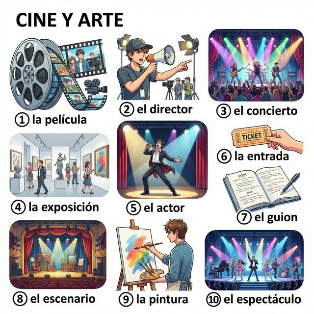
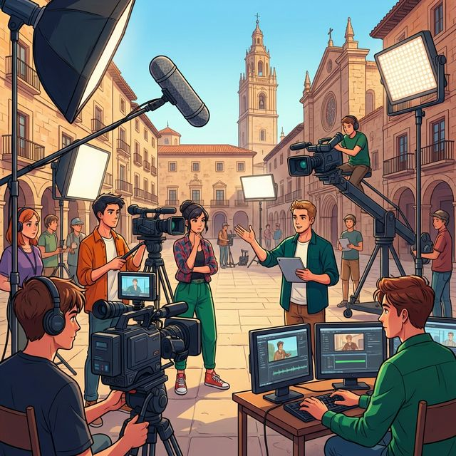

# Chapter 9: Ocio y arte (A2)

Cervantes: §8 Ocio: 여가 활동 심화 및 §18 예술적 활동: 영화, 음악, 미술 실전

## 1. Opener
**El arte de vivir (삶의 예술)**  
A2 단계에서는 단순한 취미를 넘어, 예술적 취향을 공유하고 미래의 여가 계획을 구체적으로 세우는 법을 배웁니다. 어떤 영화를 좋아하는지, 가장 인상 깊었던 예술가는 누구인지 깊이 있는 대화를 나눌 준비가 되셨나요? 이번 장에서는 영화, 음악, 시각 예술 관련 고급 어휘를 익히고, 미래를 나타내는 'Futuro Simple'과 'Si(만약)'를 활용한 가정문을 배웁니다. 스페인어라는 도구를 통해 여러분의 문화적 지평을 한 단계 더 넓혀봅시다.

**학습 목표**
- 영화, 음악, 연극 등 예술 장르 및 비평 관련 어휘 15개 이상 습득
- 단순 미래 시제(Futuro Simple)의 규칙/불규칙 변화 및 활용
- 'Si(만약)'를 활용한 1종 가정문(가능성 있는 미래) 구성
- 스페인의 현대 영화 산업과 세계적인 예술가들의 지문 이해

> [!TIP]
> **¿Sabías que...?** 스페인은 세계적인 영화 거장인 페드로 알모도바르(Pedro Almodóvar)의 나라입니다. 그의 영화들은 스페인 특유의 강렬한 색감과 인간 관계에 대한 통찰로 유명하죠. 스페인 친구들과 영화 이야기를 할 때 "Me encanta la estética de Almodóvar(알모도바르의 미학을 정말 좋아해)"라고 말해보세요. 대화가 훨씬 풍성해질 것입니다.

---

## 2. Vocabulario Esencial: Cine, Música y Arte
감각적인 예술의 세계로 초대합니다. 번호와 매칭되는 단어를 확인하며 분야별 핵심 어휘들을 익혀보세요.

<table style="width: 100%; border-collapse: collapse; border: 1px solid #ddd; text-align: center;">
  <thead style="background-color: #f2f2f2;">
    <tr>
      <th style="padding: 10px; border: 1px solid #ddd;">#</th>
      <th style="padding: 10px; border: 1px solid #ddd;">Spanish</th>
      <th style="padding: 10px; border: 1px solid #ddd;">English Bridge</th>
      <th style="padding: 10px; border: 1px solid #ddd;">Korean Tip</th>
    </tr>
  </thead>
  <tbody>
    <tr><td>1</td><td><strong>la película</strong></td><td>—</td><td>영화</td></tr>
    <tr><td>2</td><td><strong>el director / la directora</strong></td><td><strong>Director</strong> ✅</td><td>감독</td></tr>
    <tr><td>3</td><td><strong>el concierto</strong></td><td><strong>Concert</strong> ✅</td><td>콘서트 / 연주회</td></tr>
    <tr><td>4</td><td><strong>la exposición</strong></td><td><strong>Exposition</strong> ✅</td><td>전시회</td></tr>
    <tr><td>5</td><td><strong>el actor / la actriz</strong></td><td><strong>Actor / Actress</strong> ✅</td><td>배우 (남/여)</td></tr>
    <tr><td>6</td><td><strong>la entrada</strong></td><td><strong>Entry</strong> (ticket to enter)</td><td>입장권 / 티켓</td></tr>
    <tr><td>7</td><td><strong>el guion</strong></td><td>—</td><td>시나리오 / 대본</td></tr>
    <tr><td>8</td><td><strong>el escenario</strong></td><td><strong>Scenery</strong> (related)</td><td>무대</td></tr>
    <tr><td>9</td><td><strong>la pintura</strong></td><td><strong>Painting</strong> (near cognate)</td><td>그림 / 회화</td></tr>
    <tr><td>10</td><td><strong>el espectáculo</strong></td><td><strong>Spectacle</strong> ✅</td><td>공연 / 볼거리</td></tr>
  </tbody>
</table>

✅ 표시된 단어는 영어와 어원의 뿌리가 같은 'Cognates'입니다.

---

## 3. Expresiones Útiles
예술적 취향을 표현하고 계획을 세울 때 유용한 실전 패턴입니다.

**A. 영화 및 공연 비평하기**
- **¿Qué te ha parecido la película?** (What did you think of the movie? / 영화 어땠어?)
- **La actuación fue increíble.** (The acting was incredible. / 연기가 정말 대단했어.)
- **Prefiero el cine independiente.** (I prefer independent cinema. / 나는 독립 영화를 선호해.)
- **Me ha conmovido mucho.** (It moved me a lot. / 정말 감동적이었어.)

**B. 미래 계획과 가정 (Futuro y Condición)**
- **Iré al concierto si tengo dinero.** (I will go to the concert if I have money. / 돈이 있으면 콘서트에 갈 거야.)
- **¿Qué harás este verano?** (What will you do this summer? / 이번 여름에 뭐 할 거니?)
- **Será una experiencia única.** (It will be a unique experience. / 유일무이한 경험이 될 거야.)
- **Si vienes, nos divertiremos.** (If you come, we will have fun. / 네가 오면 우리는 즐거운 시간을 보낼 거야.)

---

## 4. Gramática Esencial
확신이 있는 미래와 가능성 있는 가정을 표현하는 법을 심층적으로 다뤄봅시다.

### A. 단순 미래 (Futuro Simple)
미래 시제는 동사 원형 뒤에 어미를 붙이는 방식으로, -ar, -er, -ir 동사의 어미가 모두 동일합니다.

<table style="width: 100%; border-collapse: collapse; border: 1px solid #ddd; text-align: center;">
  <thead style="background-color: #f2f2f2;">
    <tr>
      <th style="padding: 10px; border: 1px solid #ddd;">Subject</th>
      <th style="padding: 10px; border: 1px solid #ddd;">Hablar / Comer / Vivir</th>
      <th style="padding: 10px; border: 1px solid #ddd;">Ending</th>
    </tr>
  </thead>
  <tbody>
    <tr><td>yo</td><td>hablar<strong>é</strong></td><td>-é</td></tr>
    <tr><td>tú</td><td>hablar<strong>ás</strong></td><td>-ás</td></tr>
    <tr><td>él/ella/ud.</td><td>hablar<strong>á</strong></td><td>-á</td></tr>
    <tr><td>nosotros/as</td><td>hablar<strong>emos</strong></td><td>-emos</td></tr>
    <tr><td>vosotros/as</td><td>hablar<strong>éis</strong></td><td>-éis</td></tr>
    <tr><td>ellos/ellas/uds.</td><td>hablar<strong>án</strong></td><td>-án</td></tr>
  </tbody>
</table>

#### 필수 불규칙 동사 (Mandatory Irregular Verbs - Futuro)
미래 시제에서 불규칙한 어간(Stem)을 가지는 필수 동사들입니다. 어미 변화는 규칙 동사와 동일하게 적용됩니다.

<table style="width: 100%; border-collapse: collapse; border: 1px solid #ddd; text-align: center;">
  <thead style="background-color: #f2f2f2;">
    <tr>
      <th style="padding: 10px; border: 1px solid #ddd;">Infinitivo</th>
      <th style="padding: 10px; border: 1px solid #ddd;">Stem (Future)</th>
      <th style="padding: 10px; border: 1px solid #ddd;">yo (Example)</th>
    </tr>
  </thead>
  <tbody>
    <tr><td><strong>poder</strong> (to be able to)</td><td>podr-</td><td>podr<strong>é</strong></td></tr>
    <tr><td><strong>salir</strong> (to go out)</td><td>saldr-</td><td>saldr<strong>é</strong></td></tr>
    <tr><td><strong>poner</strong> (to put)</td><td>pondr-</td><td>pondr<strong>é</strong></td></tr>
    <tr><td><strong>haber</strong> (to have/exist)</td><td>habr-</td><td>habr<strong>é</strong></td></tr>
    <tr><td><strong>decir</strong> (to say)</td><td>dir-</td><td>dir<strong>é</strong></td></tr>
    <tr><td><strong>hacer</strong> (to do/make)</td><td>har-</td><td>har<strong>é</strong></td></tr>
    <tr><td><strong>tener</strong> (to have)</td><td>tendr-</td><td>tendr<strong>é</strong></td></tr>
    <tr><td><strong>querer</strong> (to want)</td><td>querr-</td><td>querr<strong>é</strong></td></tr>
    <tr><td><strong>saber</strong> (to know)</td><td>sabr-</td><td>sabr<strong>é</strong></td></tr>
  </tbody>
</table>

### B. Si + 현재, 미래 (현실적 가정)
'만약 ~하면, ~할 것이다'라는 조건문을 만드는 가장 기초적인 방법입니다.
- **Si llueve, no iré al parque.** (만약 비가 오면, 공원에 가지 않을 것이다.)
- **Si estudias mucho, sabrás la respuesta.** (공부를 열심히 하면 정답을 알게 될 것이다.)

---

## 5. Cultura Viva: El Cine y la Música en la España de Hoy
현대 스페인의 예술적 성취와 매력을 알아봅시다.

España no solo vive de su glorioso pasado (Goya, Velázquez, Picasso), sino que también tiene una industria cultural muy potente hoy en día. El cine español es reconocido internacionalmente por su originalidad. Los **Premios Goya** son el evento más importante del año, comparables a los Oscar de Hollywood. Directores como **Pedro Almodóvar** y actores como **Penélope Cruz** o **Javier Bardem** son embajadores del arte español en el mundo.

En cuanto a la música, España ofrece una mezcla fascinante de tradición y modernidad. Mientras que el **flamenco** sigue siendo una seña de identidad única (especialmente en Andalucía), artistas contemporáneos como **Rosalía** han llevado estos sonidos tradicionales a la música pop global. Los festivales de música de verano, como el **Primavera Sound** en Barcelona, colocan a España en el centro del mapa musical internacional.

**[한국어 번역]**
스페인은 단순히 과거의 영광(고야, 벨라스케스, 피카소)에만 머무르지 않고, 오늘날 매우 강력한 문화 산업을 보유하고 있습니다. 스페인 영화는 독창성으로 국제적인 인정을 받고 있습니다. **고야상(Premios Goya)**은 할리우드의 오스카에 비견되는 스페인 최대의 연례 영화 행사입니다. **페드로 알모도바르**와 같은 감독들과 **페넬로페 크루즈**, **하비에르 바르뎀** 같은 배우들은 전 세계 스페인 예술의 홍사대사들입니다.

음악 측면에서 스페인은 전통과 현대의 매혹적인 조화를 보여줍니다. **플라멩코**가 여전히 독특한 정체성의 상징(특히 안달루시아에서)으로 남아있는 한편, **로살리아** 같은 현대 아티스트들은 이러한 전통 사운드를 글로벌 팝 음악으로 이끌어냈습니다. 바르셀로나의 **프리마베라 사운드(Primavera Sound)**와 같은 여름 음악 축제들은 스페인을 국제 음악 지도의 중심에 놓았습니다.

---

## 6. Práctica

**A. Match the art form with the description (예술 장르와 설명을 연결하세요)**

<table style="width: 100%; border-collapse: collapse; border: 1px solid #ddd; text-align: left;">
  <thead style="background-color: #f2f2f2;">
    <tr>
      <th style="padding: 10px; border: 1px solid #ddd;">Spanish</th>
      <th style="padding: 10px; border: 1px solid #ddd;">Description</th>
    </tr>
  </thead>
  <tbody>
    <tr><td style="padding: 10px; border: 1px solid #ddd;">1. El cine</td><td style="padding: 10px; border: 1px solid #ddd;">a. Ver actores en un escenario físico.</td></tr>
    <tr><td style="padding: 10px; border: 1px solid #ddd;">2. La pintura</td><td style="padding: 10px; border: 1px solid #ddd;">b. Escuchar canciones y melodías.</td></tr>
    <tr><td style="padding: 10px; border: 1px solid #ddd;">3. La música</td><td style="padding: 10px; border: 1px solid #ddd;">c. Ver imágenes en una pantalla grande.</td></tr>
    <tr><td style="padding: 10px; border: 1px solid #ddd;">4. El teatro</td><td style="padding: 10px; border: 1px solid #ddd;">d. Exposición de cuadros en un museo.</td></tr>
    <tr><td style="padding: 10px; border: 1px solid #ddd;">5. La literatura</td><td style="padding: 10px; border: 1px solid #ddd;">e. Leer libros y novelas.</td></tr>
  </tbody>
</table>

**B. 미래 시제 연습 (괄호 안의 동사를 미래형으로 변형하세요)**

1. Mañana, nosotros (..........) al Prado. (ir)
2. El director (..........) una película nueva el próximo año. (hacer)
3. Si tengo tiempo, (..........) un libro. (leer)
4. Mis amigos (..........) a la fiesta a las diez. (venir)
5. ¿Qué (..........) tú en tus vacaciones? (hacer)

**C. 번역 연습 (미래 시제와 Si 가정문을 활용하세요)**

1. 만약 네가 원한다면, 나는 너와 함께 갈 거야. (si quieres, iré contigo)
   (............................................................)
2. 우리는 주말에 티켓을 살 것입니다. (comprar las entradas)
   (............................................................)
3. 내일은 날씨가 좋을 것입니다. (hacer buen tiempo)
   (............................................................)
4. 그녀가 오면, 나는 아주 행복할 것이다. (estar muy feliz)
   (............................................................)
5. 그들은 미술관에서 그림을 감상할 것입니다. (mirar los cuadros)
   (............................................................)

---

## 7. Lectura 📖
**La Noche en Blanco de Madrid (마드리드의 백야 축제)**

La "Noche en Blanco" es una iniciativa cultural que ocurre en muchas capitales europeas, y en Madrid es un evento espectacular. Durante una noche de otoño, los museos, bibliotecas y teatros abren sus puertas de forma gratuita. Los madrileños y turistas salen a la calle para disfrutar de conciertos al aire libre y exposiciones de arte moderno sobre las paredes de los edificios históricos. "Si vives esta experiencia, nunca la olvidarás", dicen los participantes. El próximo año, el ayuntamiento organizará más actividades para los jóvenes. Iré con mis amigos y, si tenemos energía, caminaremos por la castellana hasta el amanecer.

**Questions:**
1. 'Noche en Blanco'의 장점 중 하나는 무엇인가요? (What is one advantage of this event?)
   - ............................................................
2. 필자는 내년에 누구와 무엇을 할 계획인가요? (With whom and what does the actor plan to do next year?)
   - ............................................................

**[한국어 번역]**
'백야 축제(Noche en Blanco)'는 많은 유럽 수도들에서 일어나는 문화적 이니셔티브이며, 마드리드에서는 장관을 이루는 행사입니다. 가을의 어느 하룻밤 동안, 박물관, 도서관, 극장들이 문을 무료로 개방합니다. 마드리드 시민들과 관광객들은 야외 콘서트를 즐기고 역사적인 건물 벽면에 투사되는 현대 미술 전시를 보기 위해 거리로 나옵니다. 참가자들은 "만약 이 경험을 하신다면, 절대 잊지 못할 것입니다"라고 말합니다. 내년에 시청은 젊은이들을 위한 더 많은 활동을 조직할 것입니다. 저는 친구들과 함께 갈 것이고, 에너지가 있다면 새벽까지 카스테야나 거리를 걸을 것입니다.

---

## 8. Diálogo
**En el estreno de cine (영화 시사회에서)**

**Situación:** Ana y David acaban de ver el estreno de una película de Almodóvar en la Gran Vía.
**상황:** 아나와 다비드가 그란 비아에서 알모도바르 영화의 시사회를 막 보고 나왔습니다.

<table style="width: 100%; border-collapse: collapse; border: 1px solid #ddd; text-align: left;">
  <thead style="background-color: #f2f2f2;">
    <tr>
      <th style="padding: 10px; border: 1px solid #ddd;">🇪🇸 Español</th>
      <th style="padding: 10px; border: 1px solid #ddd;">🇰🇷 한국어</th>
    </tr>
  </thead>
  <tbody>
    <tr><td style="padding: 10px; border: 1px solid #ddd;"><strong>Ana:</strong> ¡Qué fuerte! La película ha sido increíble, ¿no crees?</td><td style="padding: 10px; border: 1px solid #ddd;"><strong>아나:</strong> 대단해! 영화가 정말 믿기지 않을 정도였어, 그렇지 않니?</td></tr>
    <tr><td style="padding: 10px; border: 1px solid #ddd;"><strong>David:</strong> Sí, me ha gustado mucho el guion. Los actores estuvieron estupendos.</td><td style="padding: 10px; border: 1px solid #ddd;"><strong>다비드:</strong> 응, 시나리오가 아주 마음에 들었어. 배우들도 훌륭했고.</td></tr>
    <tr><td style="padding: 10px; border: 1px solid #ddd;"><strong>Ana:</strong> Si gana el Goya, el director hará una gran fiesta.</td><td style="padding: 10px; border: 1px solid #ddd;"><strong>아나:</strong> 만약 고야상을 받으면, 감독님이 큰 파티를 열 거야.</td></tr>
    <tr><td style="padding: 10px; border: 1px solid #ddd;"><strong>David:</strong> Seguro. ¿Irás tú a la exposición de arte moderno mañana?</td><td style="padding: 10px; border: 1px solid #ddd;"><strong>다비드:</strong> 확실해. 너 내일 현대 미술 전시회에 갈 거니?</td></tr>
    <tr><td style="padding: 10px; border: 1px solid #ddd;"><strong>Ana:</strong> No podré, tendré que trabajar. Pero si terminas pronto, llámame.</td><td style="padding: 10px; border: 1px solid #ddd;"><strong>아나:</strong> 못 갈 거야, 일해야 하거든. 하지만 네가 일찍 끝나면 나한테 전화해.</td></tr>
    <tr><td style="padding: 10px; border: 1px solid #ddd;"><strong>David:</strong> De acuerdo. Te llamaré y cenaremos juntos.</td><td style="padding: 10px; border: 1px solid #ddd;"><strong>다비드:</strong> 알았어. 전화할게 그리고 같이 저녁 먹자.</td></tr>
  </tbody>
</table>

---

## 9. Repaso
이번 장의 핵심 내용을 복습해 보세요.
- [ ] 영화, 음악, 예술 관련 고급 어휘 10개 이상을 익혔나요?
- [ ] 단순 미래(Futuro Simple)의 규칙 및 주요 불규칙 변화를 할 수 있나요?
- [ ] 'Si'를 활용한 가능성 있는 미래의 조건문을 구성할 수 있나요?
- [ ] 스페인의 고야상과 현대 예술적 위상을 이해했나요?

---

## 10. Cierre
¡Excelente trabajo! 예술은 언어의 장벽을 넘는 가장 강력한 소통 수단입니다. 이번 장에서 배운 미래 시제와 예술 어휘를 통해 여러분은 자신의 꿈과 취향을 더욱 구체적이고 세련되게 표현할 수 있게 되었습니다. 단순히 문법을 익히는 것을 넘어, 스페인 문화의 깊이 있는 열정을 느끼셨기를 바랍니다. 다음 장에서는 우리의 일상과 밀접한 '현명한 소비와 유행(A2)' 섹션으로 이어가겠습니다. ¡Viva el arte!

---

## 11. Soluciones

**6. Práctica - A. Match the art form with the description**
1-c / 2-d / 3-b / 4-a / 5-e

**6. Práctica - B. 미래 시제 연습**
1. iremos / 2. hará / 3. leeré / 4. vendrán / 5. harás

**6. Práctica - C. 번역 연습**
1. Si quieres, iré contigo.
2. Compraremos las entradas el fin de semana.
3. Mañana hará buen tiempo.
4. Si ella viene, estaré muy feliz.
5. Ellos mirarán los cuadros en el museo (또는 disfrutarán de...).

**7. Lectura Questions**
1. 무료 개방 (Entrada gratuita).
2. 친구들과 함께 밤새도록 걷기 (Caminar con amigos hasta el amanecer).
