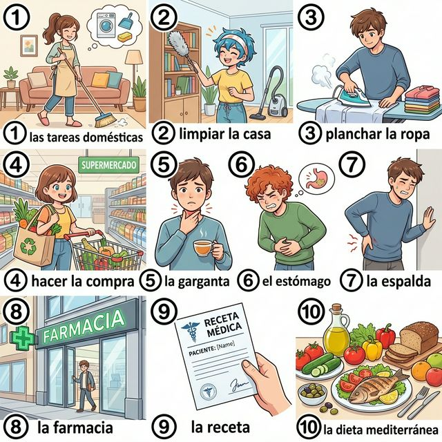
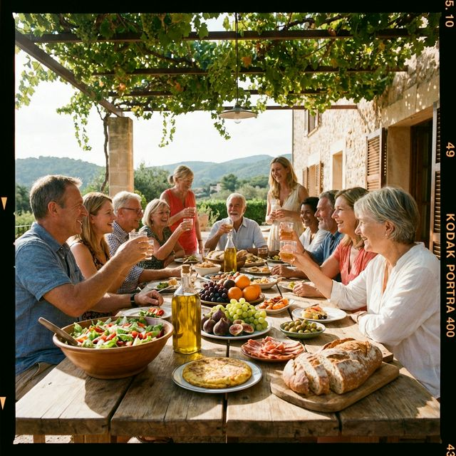

# Chapter 13: Rutina y salud (A2)

Cervantes: §11 일상생활 심화: 가사 노동 및 §15 신체 및 건강 심화: 질병 증상 및 약국

## 1. Opener
**Equilibrio y bienestar (균형과 웰빙)**  
A2 단계에서는 매일의 루틴을 넘어, 우리가 머무는 공간을 관리하고(집안일) 신체적, 정신적 건강을 돌보는 방법에 대해 더 깊이 있게 다룹니다. 집안일을 분담하거나, 몸의 어디가 어떻게 아픈지 구체적으로 설명하고, 건강한 생활 습관에 대해 조언할 수 있을까요? 이번 장에서는 가사 노동 관련 어휘, 신체 부위 및 증상 표현, 그리고 세계적으로 인정받는 '지중해 식단'의 건강 비결을 배웁니다. 더 건강하고 활기찬 스페인어 생활을 시작해 봅시다.

**학습 목표**
- 가사 노동(Tareas domésticas), 신체 부위 심화 및 질병 증상 어휘 15개 이상 습득
- 'Doler(~가 아프다)' 동사의 특수 구조와 활용법
- 건강한 생활 습관에 대한 제안과 조언 표현 (Debería, Hay que 등)
- 지중해 식단(Dieta mediterránea)과 스페인의 건강한 삶의 방식 이해

> [!TIP]
> **¿Sabías que...?** 스페인어로 "내 머리가 아파"를 직역하면 "Mi cabeza me duele"가 될 것 같지만, 실제로는 "**Me duele la cabeza**"라고 말합니다. 주어와 동사의 순서가 바뀌는 'Doler' 동사만의 독특한 매력을 이번 장에서 확실히 익혀보세요!

---

## 2. Vocabulario Esencial: La Salud y el Hogar
건강한 삶을 유지하기 위한 활동과 관리입니다. 평화로운 웰빙의 이미지를 확인하며 어휘를 익혀보세요.

| # | Spanish | English Bridge | Korean Tip |
| :--- | :--- | :--- | :--- |
| 1 | **las tareas domésticas** | **Domestic Tasks** ✅ | 집안일 / 가사 |
| 2 | **limpiar la casa** | — | 집을 청소하다 |
| 3 | **planchar la ropa** | — | 옷을 다리다 |
| 4 | **hacer la compra** | — | 장을 보다 |
| 5 | **la garganta** | **Gargle** (related) | 목 (구멍) |
| 6 | **el estómago** | **Stomach** ✅ | 배 / 위 |
| 7 | **la espalda** | — | 등 / 허리 |
| 8 | **la farmacia** | **Pharmacy** ✅ (Perfect Cognate) | 약국 |
| 9 | **la receta** | **Recipe / Receipt** (related) | 처방전 (또는 요리법) |
| 10 | **la dieta mediterránea** | **Mediterranean Diet** ✅ | 지중해 식단 |

✅ 표시된 단어는 영어와 어원의 뿌리가 같은 'Cognates'입니다.

---

## 3. Expresiones Útiles
몸의 상태를 설명하고 도움을 요청할 때 유용한 패턴입니다.

**A. 증상 설명하기 (Síntomas)**
- **Me duele mucho la espalda.** (My back hurts a lot. / 허리가 너무 아파요.)
- **Tengo fiebre y tos.** (I have a fever and a cough. / 열이 나고 기침을 해요.)
- **Estoy resfriado / resfriada.** (I have a cold. / 감기에 걸렸어요.)
- **Me siento mareado / mareada.** (I feel dizzy. / 어지러워요.)

**B. 제안과 조언 (Consejos)**
- **Tienes que descansar más.** (You have to rest more. / 더 쉬어야 해요.)
- **Deberías ir al médico.** (You should go to the doctor. / 병원에 가보는 게 좋겠어요.)
- **Es importante comer sano.** (It is important to eat healthy. / 건강하게 먹는 것이 중요합니다.)
- **Hay que beber mucha agua.** (One must drink a lot of water. / 물을 많이 마셔야 해요.)

---

## 4. Gramática Esencial
통증을 표현하는 'Doler' 동사의 구조는 'Gustar' 동사와 매우 비슷합니다.

### Doler (아프다) - 역구조 동사
주어는 '아픈 부위'가 되며, '나에게'에 해당하는 대명사를 동사 앞에 씁니다.
| 인칭 | **Doler** (부위에 따라 달라짐) | 예시 |
| :--- | :--- | :--- |
| **A mí** | **me duele / duelen** | Me duele el pie. / Me duelen los ojos. |
| **A ti** | **te duele / duelen** | ¿Te duele algo? |
| **A él/ella/Ud.** | **le duele / duelen** | Le duele la cabeza. |
| **A nosotros/as** | **nos duele / duelen** | Nos duele el estómago. |
| **A ellos/as/Uds.** | **les duele / duelen** | Les duelen las piernas. |

**Important!**
아픈 부위가 하나면 `duele`(단수), 여러 곳이거나 복수 명사면 `duelen`(복수)를 씁니다.

---

## 5. Culture Viva: La Dieta Mediterránea - El Secreto de la Longevidad
스페인 사람들이 건강하게 오래 사는 비결은 무엇일까요?

La **dieta mediterránea** es considerada una de las más saludables del mundo y es Patrimonio Cultural Inmaterial de la Humanidad. Se basa en el consumo de productos frescos y locales. El ingrediente estrella es el **aceite de oliva** (oro líquido), que se usa para cocinar y aliñar ensaladas.

Además, los españoles consumen mucha fruta, verdura, legumbres, pescado y frutos secos. La carne roja se consume con moderación. Pero la salud no es solo comida; también es socialización. Comer con amigos y familia, disfrutar de la comida sin prisas (la sobremesa) y caminar mucho son pilares del estilo de vida español. Este equilibrio entre dieta, ejercicio moderado와 사회적 관계가 스페인을 세계 최고의 기대 수명을 가진 나라 중 하나로 만듭니다.

**[한국어 번역]**
**지중해 식단**은 세계에서 가장 건강한 식단 중 하나로 여겨지며 유네스코 인류 무형문화유산으로 등재되어 있습니다. 신선하고 지역적인 식재료 소비를 바탕으로 하죠. 주인공은 바로 '액체 금'이라 불리는 **올리브 오일**인데, 요리할 때나 샐러드 드레싱으로 항상 사용됩니다.

또한 스페인 사람들은 많은 과일, 채소, 콩류, 생선, 견과류를 섭취합니다. 붉은 고기는 적당히 먹고요. 하지만 건강은 단순히 음식만이 아닙니다. 사회적 관계도 중요하죠. 친구나 가족과 함께 식사하고, 서두르지 않고 식후 대화(**소브레메사**)를 즐기며, 많이 걷는 것이 스페인 라이프스타일의 기둥입니다. 식단, 적당한 운동, 그리고 사회적 관계 사이의 이러한 균형이 스페인을 세계 최고의 기대 수명을 가진 나라 중 하나로 만드는 비결입니다.

---

## 6. Práctica

**A. Match the symptom with the body part (증상과 신체 부위를 연결하세요)**

| Symptom | Body Part |
| :--- | :--- |
| 1. Me duele (아프다) | a. La garganta (목구몽) |
| 2. Tengo tos (기침나다) | b. La cabeza (머리) |
| 3. Tengo fiebre (열나다) | c. Todo el cuerpo (전신) |
| 4. No puedo caminar | d. El estómago (배) |
| 5. Tengo náuseas | e. Los pies (발) |

**B. Doler 동사 변형 연습 (알맞은 대명사와 duele/duelen을 쓰세요)**

1. (나에게) (..........) la pierna.
2. (너에게) ¿(..........) los oídos?
3. (그녀에게) (..........) la espalda.
4. (우리에게) (..........) las muelas (치아).
5. (그들에게) (..........) el brazo.

**C. 번역 연습 (의무 및 조언 표현을 활용하세요)**

1. 너는 약국에 가야 해. (Deber 활용)
   (............................................................)
2. 물을 많이 마시는 것이 중요합니다.
   (............................................................)
3. 저는 감기에 걸려서 열이 나요.
   (............................................................)
4. 당신은 채소를 더 많이 먹어야 합니다. (Tener que 활용)
   (............................................................)
5. 어제부터 머리가 계속 아파요.
   (............................................................)

---

## 7. Lectura 📖
**Consejos para una vida sana (건강한 삶을 위한 조언)**

Mucha gente me pregunta: "¿Cómo puedo estar sano?". Mi respuesta siempre es la misma: "Escucha a tu cuerpo". Yo, por ejemplo, siempre trato de dormir ocho horas para no estar cansado. Por la mañana, hago un poco de ejercicio. Pero lo más importante es la alimentación. Sigo la dieta mediterránea: uso mucho aceite de oliva y como pescado tres veces a la semana. Cuando me duele la garganta, bebo té con miel y limón. Si tengo fiebre, voy al médico enseguida. También es fundamental el bienestar mental: paso tiempo con mis amigos y trato de no estresarme con las tareas domésticas. ¡La salud empieza en la cocina y termina en el corazón!

**Questions:**
1. 주인공은 왜 아침에 운동을 하나요? (Why does the protagonist exercise in the morning?)
   - ............................................................
2. 주인공은 목이 아플 때 무엇을 마시나요? (What does the protagonist drink when their throat hurts?)
   - ............................................................

**[한국어 번역]**
많은 사람이 저에게 묻습니다. "어떻게 하면 건강할 수 있나요?". 제 대답은 항상 같습니다. "몸의 소리에 귀 기울이세요." 저를 예로 들면, 피곤하지 않기 위해 항상 8시간을 자려고 노력합니다. 아침에는 약간의 운동을 하죠. 하지만 가장 중요한 것은 식습관입니다. 저는 지중해 식단을 따릅니다. 올리브 오일을 많이 사용하고 일주일에 세 번 생선을 먹습니다. 목이 아플 때는 꿀과 레몬을 넣은 차를 마셔요. 열이 나면 바로 병원에 갑니다. 정신적인 웰빙도 필수적입니다. 친구들과 시간을 보내고 집안일로 스트레스받지 않으려 노력합니다. 건강은 주방에서 시작해서 심장에서 완성됩니다!

---

## 8. Diálogo
**En la farmacia (약국에서)**

**Situación:** Juan va a la farmacia porque se siente mal y tiene gripe.
**상황:** 후안이 몸이 안 좋고 독기 기운이 있어 약국에 갑니다.

| Spanish | Korean |
| :--- | :--- |
| **Farmacéutico:** Buenos días, ¿en qué puedo ayudarle? | **약사:** 안녕하세요, 무엇을 도와드릴까요? |
| **Juan:** Buenos días. Me siento muy mal. Tengo fiebre y me duele todo el cuerpo. | **후안:** 안녕하세요. 몸이 너무 안 좋아요. 열이 나고 온몸이 아파요. |
| **Farmacéutico:** Entiendo. ¿Tiene tos o dolor de garganta? | **약사:** 그렇군요. 기침이나 목 통증도 있으신가요? |
| **Juan:** Sí, me duele mucho la garganta al tragar. | **후안:** 네, 침 삼킬 때 목이 너무 아파요. |
| **Farmacéutico:** Parece una gripe. Debería tomar este jarabe y descansar. | **약사:** 독감(감기) 같네요. 이 시럽을 드시고 쉬셔야 해요. |
| **Juan:** Gracias. ¿Cuántas veces al día lo tomo? | **후안:** 감사합니다. 하루에 몇 번 먹나요? |
| **Farmacéutico:** Tres veces al día, después de las comidas. | **약사:** 하루 세 번, 식후에 드세요. |

---

## 9. Repaso
이번 장의 핵심 내용을 복습해 보세요.
- [ ] 집안일 및 건강 관련 고급 어휘 10개 이상을 이해하나요?
- [ ] 'Doler' 동사의 독특한 구조와 대명사 사용법을 익혔나요?
- [ ] 다른 사람에게 건강 조언(제안)을 스페인어로 할 수 있나요?
- [ ] 지중해 식단의 특징과 스페인 습관의 장점을 이해했나요?

---

## 10. Cierre
¡Muy bien! 오늘 여러분은 자신의 몸과 마음, 그리고 주거 환경을 돌보는 법을 스페인어로 배웠습니다. 'Doler' 동사를 통해 자신의 상태를 정확히 말할 수 있게 되었고, 건강한 식단과 라이프스타일에 대해 이야기할 수 있게 되었습니다. 건강은 모든 배움의 기초입니다. 다음 장에서는 우리의 삶을 더욱 즐겁게 만들어 줄 '축제, 전통 및 여가 활동 심화(A2)' 섹션으로 이어가겠습니다. ¡Mucha salud para todos!

---

## 11. Soluciones

**6. Práctica - A. Match the symptom with the body part**
1-b / 2-a / 3-c / 4-e / 5-d

**6. Práctica - B. Doler 동사 변형 연습**
1. me duele / 2. te duelen / 3. le duele / 4. nos duelen / 5. les duele

**6. Práctica - C. 번역 연습**
1. Debes (또는 Deberías) ir a la farmacia.
2. Es importante beber mucha agua.
3. Estoy resfriado/a y tengo fiebre.
4. Usted tiene que comer más verduras.
5. Me duele la cabeza desde ayer.

**7. Lectura Questions**
1. 피곤하지 않기 위해 (Para no estar cansado).
2. 꿀과 레몬을 넣은 차 (Té con miel y limón).
