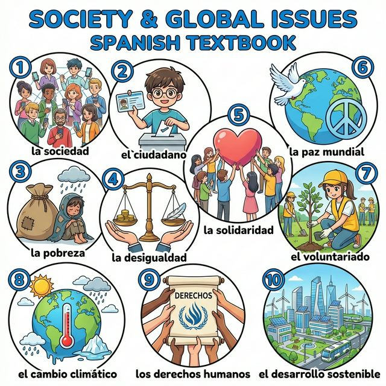
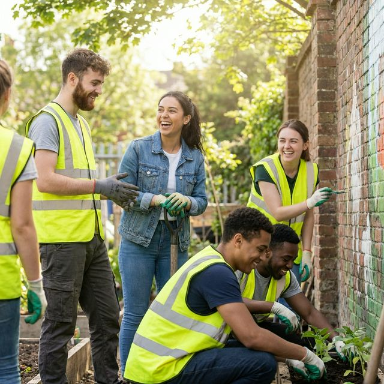

# Chapter 15: Mi futuro y el mundo (A2)

Cervantes: §15 미래 계획 심화: 미래 시제 및 §16 사회 문제와 국제 사회

## 1. Opener
**Compromiso y visión (약속과 비전)**  
A2 단계의 마지막인 이번 장에서는 단순히 개인적인 계획을 넘어, 우리가 직면한 사회적 과제와 세계 시민으로서의 역할에 대해 스페인어로 심도 있게 이야기해 봅니다. 조만간 일어날 일(Ir a)뿐만 아니라, 조금 더 먼 미래에 일어날 일들을 '미래 시제(Futuro Simple)'를 통해 확실하게 표현하는 방법을 배웁니다. 빈곤, 불평등, 환경 위기 같은 사회적 문제들을 어떻게 정의하고, 스페인과 세계의 청년들이 이에 어떻게 대응하고 있는지 함께 알아볼까요? 여러분의 스페인어는 이제 세상을 바꾸는 도구가 될 것입니다.

**학습 목표**
- 사회 문제(Problemas sociales), 국제 협력 및 미래 비전 어휘 15개 이상 습득
- 미래 시제(Futuro Simple)의 변화와 활용 (의지, 추측, 먼 미래)
- 사회적 의견 표명하기 (Creo que, Es necesario 등)
- 스페인의 사회 연대 문화와 글로벌 이슈에 대한 인식 이해

> [!TIP]
> **¿Sabías que...?** 스페인어의 미래 시제는 아주 특별합니다. 동사원형 뒤에 어미를 바로 붙이기 때문이죠! 또한 이 시제는 단순한 미래뿐만 아니라, 현재에 대한 '추측'을 할 때도 쓰입니다. "¿Qué hora será? (지금 몇 시쯤일까?)"처럼 말이죠. 미래 시제의 다재다능함을 이번 장에서 발견해 보세요!

---

## 2. Vocabulario Esencial: Sociedad y Desafíos
우리가 함께 고민하고 해결해야 할 사회적 과제들입니다. 협력과 전진의 이미지를 보며 어휘를 익혀보세요.

| # | Spanish | English Bridge | Korean Tip |
| :--- | :--- | :--- | :--- |
| 1 | **la sociedad** | **Society** ✅ (Perfect Cognate) | 사회 |
| 2 | **el ciudadano / la ciudadana** | **Citizen** ✅ | 시민 |
| 3 | **la pobreza** | — | 가난 / 빈곤 |
| 4 | **la desigualdad** | **Inequality** ✅ | 불평등 |
| 5 | **la solidaridad** | **Solidarity** ✅ | 연대 / 결속 |
| 6 | **la paz mundial** | **World Peace** ✅ | 세계 평화 |
| 7 | **el voluntariado** | **Volunteer** ✅ | 자원봉사 |
| 8 | **el cambio climático** | **Climatic Change** ✅ | 기후 변화 |
| 9 | **los derechos humanos** | **Human Rights** ✅ | 인권 |
| 10 | **el desarrollo sostenible** | **Sustainable Development** ✅ | 지속 가능한 발전 |

✅ 표시된 단어는 영어와 어원의 뿌리가 같은 'Cognates'입니다.

---

## 3. Expresiones Útiles
사회 문제에 대한 의견을 나누고 미래의 비전을 제시할 때 유용한 패턴입니다.

**A. 미래 시제 활용 (Futuro)**
- **El mundo cambiará mucho en diez años.** (The world will change a lot in ten years. / 세상은 10년 뒤에 많이 변할 거예요.)
- **Seré un ciudadano responsable.** (I will be a responsible citizen. / 나는 책임감 있는 시민이 될 것입니다.)
- **¿Qué pasará con el planeta?** (What will happen to the planet? / 지구는 어떻게 될까요?)
- **Trabajaremos juntos por la paz.** (We will work together for peace. / 우리는 평화를 위해 함께 일할 것입니다.)

**B. 의견 및 필요성 표현 (Opinión y Necesidad)**
- **Creo que es necesario ayudar a los demás.** (I believe it is necessary to help others. / 타인을 돕는 것이 필요하다고 생각합니다.)
- **Es importante luchar contra la pobreza.** (It is important to fight against poverty. / 빈곤에 맞서 싸우는 것은 중요합니다.)
- **Debemos proteger los derechos humanos.** (We must protect human rights. / 우리는 인권을 보호해야 합니다.)
- **Me importa mucho el futuro del mundo.** (I care a lot about the future of the world. / 나는 세상의 미래가 매우 중요하다고 생각해요(관심이 있어요).)

---

## 4. Gramática Esencial
동사의 원형을 그대로 두고 꼬리만 붙이는 규칙적인 미래 시제를 배워봅시다.

### Futuro Simple (단순 미래) - 규칙형
모든 -ar, -er, -ir 동사의 끝에 동일한 어미를 붙입니다.
| 인칭 | **Estudiar / Comer / Vivir** | 어미 (끝부분) | 영어 매핑 (will) |
| :--- | :--- | :--- | :--- |
| **Yo** | estudi**aré** / com**eré** / viv**iré** | **-é** | I will |
| **Tú** | estudi**arás** / com**erás** / viv**irás** | **-ás** | You will |
| **Él/Ella/Ud.** | estudi**ará** / com**erá** / viv**irá** | **-á** | He/She/You will |
| **Nosotros/as** | estudi**aremos** / com**eremos** / viv**iremos** | **-emos** | We will |
| **Vosotros/as** | estudi**aréis** / com**eréis** / viv**iréis** | **-éis** | You all will |
| **Ellos/Ellas/Uds.** | estudi**arán** / com**erán** / viv**irán** | **-án** | They/You all will |

**Important!** 1인칭 복수(`-emos`)를 제외한 모든 어미에 강세(Acceso)가 있다는 점을 꼭 기억하세요!

---

## 5. Culture Viva: Los Jóvenes Españoles y el Compromiso Social
스페인 청년들은 오늘날의 사회 문제에 어떻게 대응하고 있을까요?

España es un país con una fuerte cultura de **solidaridad**. Según las estadísticas, muchos jóvenes participan en programas de **voluntariado**, tanto en España como en el extranjero. Les interesan temas como la protección de los océanos, la integración de inmigrantes와 사회적 불평등 해소입니다.

Además, España ha sido pionera en leyes de derechos sociales. Los ciudadanos suelen salir a la calle para manifestarse y pedir un futuro mejor. No es solo política; es un sentimiento de comunidad. 스페인 청년들은 "El futuro es nuestro(미래는 우리의 것이다)"라고 믿으며, 디지털 기술을 통해 전 세계와 연결되어 함께 목소리를 냅니다. 이들의 열정적인 태도는 스페인을 더욱 역동적이고 희망찬 나라로 만드는 원동력입니다.

**[한국어 번역]**
스페인은 강한 **연대(solidarity)** 문화를 가진 나라입니다. 통계에 따르면, 많은 청년이 스페인 국내외에서 자원봉사 프로그램에 참여하고 있습니다. 이들은 해양 보호, 이민자 통합, 사회적 불평등 해소와 같은 주제에 관심이 많습니다.

또한, 스페인은 사회적 권리 법안에서 선구적인 역할을 해왔습니다. 시민들은 더 나은 미래를 요구하기 위해 거리로 나와 의사를 표현하곤 합니다. 이것은 단순한 정치가 아니라 공동체 의식입니다. 스페인 청년들은 "미래는 우리의 것이다"라고 믿으며, 디지털 기술을 통해 전 세계와 연결되어 함께 목소리를 냅니다. 이들의 열정적인 태도는 스페인을 더욱 역동적이고 희망찬 나라로 만드는 원동력입니다.

---

## 6. Práctica

**A. Conjugate markers for the future tense (미래 시제 어미를 알맞게 붙이세요)**

1. Mañana yo habl (..........) con el director.
2. Nosotros com (..........) paella el domingo.
3. El mundo ser (..........) más verde en el futuro.
4. ¿Tú estudi (..........) español el próximo año?
5. Ellos viaj (..........) por toda América Latina.

**B. Choose between Saber, Conocer, and the Future Tense (문맥에 맞는 동사를 고르세요)**

1. Yo (..........) que mañana vas a viajar. (sé / conozco)
2. ¿(..........) tú a ese voluntario? (Sabes / Conoces)
3. En el año 2040, todos (..........) coches eléctricos. (usaremos / usamos)
4. Ella (..........) hablar tres idiomas. (sabe / conoce)
5. Algún día (..........) la paz en el mundo. (habrá / hay) - *Note: habrá is irregular future of hay*

**C. 번역 연습 (미래 시제 및 사회적 표현을 활용하세요)**

1. 우리는 더 나은 세상을 만들 것입니다. (만들다: crear / 미래 시제 사용)
   (............................................................)
2. 인권을 보호하는 것은 매우 중요합니다.
   (............................................................)
3. 나는 미래에 자원봉사자가 될 거예요. (되다: ser / 미래 시제 사용)
   (............................................................)
4. 사람들은 기후 변화에 대해 걱정합니다 (사용: preocuparse por).
   (............................................................)
5. 10년 뒤에 당신은 어디에 있을까요? (있다: estar / 미래 시제 사용)
   (............................................................)

---

## 7. Lectura 📖
**Una carta a mi yo del futuro (미래의 나에게 보내는 편지)**

Querido "yo" del futuro:
Te escribo desde el año 2025. Hoy he terminado mi curso de español A2. Estoy muy feliz. Sé 스페인어가 내 삶을 바꿀 거라는 걸 알아요. En el futuro, ¿hablarás español perfectamente? Espero que sí. También espero que vivas en un mundo con más solidaridad y menos pobreza. Sé que lucharás por los derechos humanos y que ayudarás a proteger el medio ambiente. ¿Seguirás haciendo voluntariado? El camino no será fácil, 하지만 estoy seguro de que serás una persona valiente. Recuerda: el desarrollo sostenible es la clave. ¡Nos vemos en el futuro!

**Questions:**
1. 주인공은 미래의 자신이 어떤 세상에서 살기를 바라나요? (In what kind of world does the protagonist hope his future self lives?)
   - ............................................................
2. 주인공은 미래의 자신이 무엇을 위해 싸울 것이라고 믿나요? (What does the protagonist believe his future self will fight for?)
   - ............................................................

**[한국어 번역]**
미래의 "나"에게:
2025년에서 너에게 편지를 써. 오늘 내 스페인어 A2 과정을 마쳤어. 정말 행복해. 스페인어가 내 삶을 바꿀 거라는 걸 알아. 미래에 너는 스페인어를 완벽하게 하고 있을까? 그러길 바라. 또한 네가 더 많은 연대가 있고 가난이 적은 세상에서 살기를 바라. 네가 인권을 위해 싸우고 환경을 보호하는 일을 도울 거라는 걸 알아. 계속 자원봉사를 하고 있을까? 길이 쉽지는 않겠지만, 네가 용기 있는 사람이 될 거라고 확신해. 기억해. 지속 가능한 발전이 핵심이야. 미래에서 만나자!

---

## 8. Diálogo
**El mundo que queremos (우리가 원하는 세상)**

**Situación:** Dos estudiantes, Elena와 Mateo, discuten sobre los desafíos del futuro.
**상황:** 두 학생 엘레나와 마테오가 미래의 과제에 대해 토론합니다.

| Spanish | Korean |
| :--- | :--- |
| **Elena:** Mateo, ¿crees que el mundo cambiará a mejor? | **엘레나:** 마테오, 세상이 더 좋게 변할 거라 생각하니? |
| **Mateo:** Sí, creo que la tecnología nos ayudará a resolver muchos problemas. | **마테오:** 응, 기술이 많은 문제를 해결하도록 도와줄 거라 믿어. |
| **Elena:** Pero también es necesaria la solidaridad. Hay mucha desigualdad todavía. | **엘레나:** 하지만 연대도 필요해. 아직 불평등이 아주 많거든. |
| **Mateo:** Tienes razón. Debemos trabajar juntos por el desarrollo sostenible. | **마테오:** 맞아. 우리는 지속 가능한 발전을 위해 함께 일해야 해. |
| **Elena:** Exacto. Yo seré voluntaria en África el próximo verano. | **엘레나:** 정확해. 나는 내년 여름에 아프리카에서 자원봉사를 할 거야. |
| **Mateo:** ¡Qué bien! El futuro estará en nuestras manos. | **마테오:** 멋지다! 미래는 우리 손에 달려 있을 거야. |

---

## 9. Repaso
이번 장의 핵심 내용을 복습해 보세요.
- [ ] 사회 문제, 미래, 연대와 관련된 심화 어휘 10개 이상을 이해하나요?
- [ ] 단순 미래(Futuro Simple) 시제의 규칙적인 변화를 완벽히 익혔나요?
- [ ] 'Creo que'와 'Es necesario'를 사용하여 자신의 사회적 의견을 말할 수 있나요?
- [ ] 글로벌 이슈에 대한 스페인 사회의 관심과 태도를 이해했나요?

---

## 10. Cierre
¡Enhorabuena! 드디어 대장정의 마지막 마침표를 찍었습니다. 여러분은 1장부터 15장까지 오면서 단순히 단어를 외운 것이 아니라, 스페인어라는 렌즈를 통해 세상을 보는 법을 배웠습니다. 이제 여러분은 미래를 꿈꾸고, 사회를 걱정하며, 더 나은 세상을 위해 대화할 수 있는 당당한 스페인어 구사자입니다. 이 책의 마지막 장이 여러분의 실제 모험을 위한 첫 장이 되기를 바랍니다. ¡El mundo es vuestro! ¡Muchas felicidades y hasta siempre!

---

## 11. Soluciones

**6. Práctica - A. Conjugate markers for the future tense**
1. hablaré / 2. comeremos / 3. será / 4. estudiarás / 5. viajarán

**6. Práctica - B. Choose between Saber, Conocer, and the Future Tense**
1. sé / 2. Conoces / 3. usaremos / 4. sabe / 5. habrá

**6. Práctica - C. 번역 연습**
1. Crearemos un mundo mejor.
2. Es muy importante proteger los derechos humanos.
3. Seré voluntario/a en el futuro.
4. La gente se preocupa por el cambio climático.
5. ¿Dónde estarás en diez años? (또는 ¿Dóne estará usted en diez años?)

**7. Lectura Questions**
1. 더 많은 연대가 있고 가난이 적은 세상 (Un mundo con más solidaridad y menos pobreza).
2. 인권과 환경 보호 (Los derechos humanos y la protección del medio ambiente).
